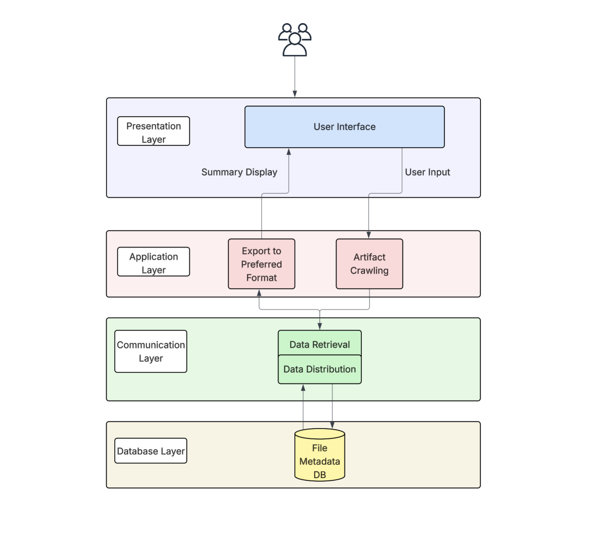

#  Team 20

## Work Breakdown Structure

### Milestone #1 (October - December 7th)

---

## System Architecture Diagram

This diagram shows how our system's components will be organized into layers, and the responsibility each layer has.

### Presentation Layer

The Presentation Layer manages interactions with the user. It allows the user to input a .ZIP folder containing their files and displays any summaries or reports that the user requests. 

### Application Layer

The Application Layer performs the system's main processing tasks. The Artifact Crawling component scans selected files, applies filters and gathers metadata. While the Export to Preferred Format component generates any report that the user requests and passes it up to the Presentation Layer.

### Communication Layer

The Communication Layer acts as a link between the Application Layer and the Database Layer. The Data Distribution component ensures that any relevant file data, metadata and any analysis the system produces is served to the Database Layer for storage. The Data Retrieval component passes any relevant stored data from previous scans to the Application Layer.

### Database Layer

The Database Layer provides persistent storage through the File Metadata DB, which collects the information that the system gathers about the user's files, as well as previously produced reports and summaries, and stores them for later use. 

## DFD Level 1

[lucidchart](https://lucid.app/lucidchart/13a08813-0a92-4798-84d0-2930be2d6aab/edit?page=0_0&invitationId=inv_bf1a126c-f925-4868-bae1-2bdfacdd4bf7#)

This diagram shows how data moves through the system — from user actions to file analysis and reporting.

- User selects files, sets filters, and generates reports.

- Permission & Privacy Logic ensures user consent before processing data.

- File Selection and Exclude Logic handle which files are included or ignored.

- Validation & Scan Logic check and scan files to collect type, size, and metadata.

- The Database stores all scanned data for later use.

- Filter and Aggregation Logic organize and summarize the data.

- User Analytics calculates metrics and insights.

- Display Logic shows charts, tables, and summaries.

- Finally, the user can Generate Reports and export them as PDF or CSV.