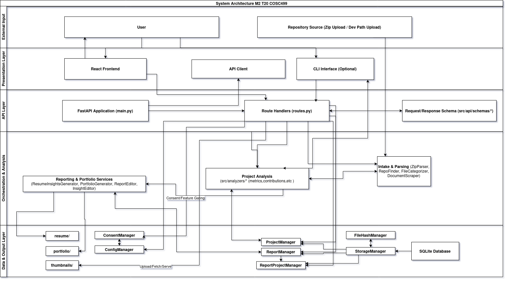
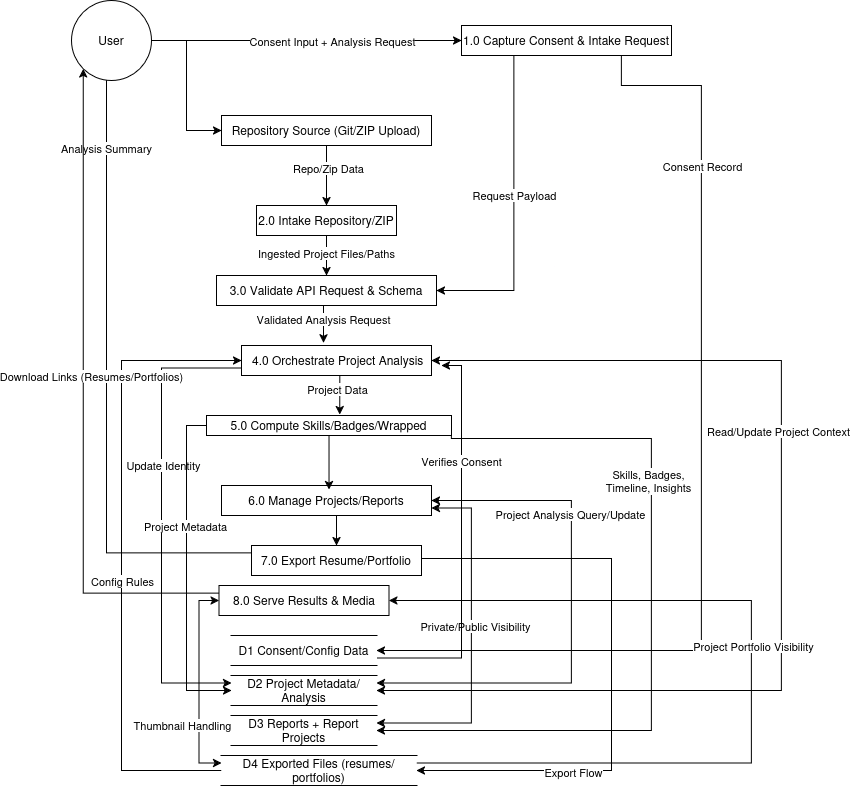
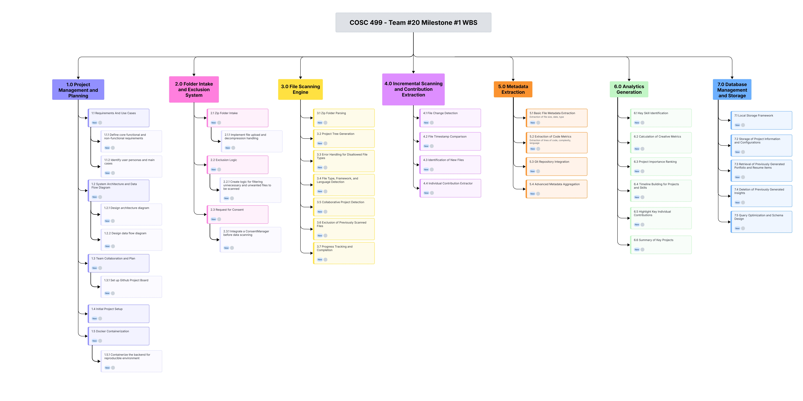

# Team 20: Project Code Analyzer

## Project Description

This project is a software analysis tool designed to process and evaluate coding projects. The system analyzes a project's structure, file metadata, and content to assess the developer's technical skills, identify code quality attributes, and generate a comprehensive analysis report. This allows for a deeper understanding of the project's complexity and the skills demonstrated by the developer.

Key features include:
- Securely uploading and analyzing local or Git repositories.
- Analyzing file structures, dependencies, and project characteristics.
- Evaluating code to identify demonstrated technical skills.
- Evalating badges associated with contributions.
- Generating and displaying detailed analysis reports and skill summaries.
- Storing analysis results for future reference.

---

## Built With

This project is built with Python and utilizes the following packages:

*   [pytest](https://docs.pytest.org/en/stable/): For writing and running tests.
*   [GitPython](https://gitpython.readthedocs.io/en/stable/): For interacting with Git repositories.
*   [PyYAML](https://pyyaml.org/wiki/PyYAMLDocumentation): For reading and writing YAML files.
*   [python-docx](https://python-docx.readthedocs.io/en/latest/): For creating and updating Microsoft Word (.docx) files.
*   [pypdf](https://pypdf.readthedocs.io/en/stable/): For extracting text from PDF files.
*   [reportlab](https://www.reportlab.com/docs/reportlab-userguide.pdf): For generating PDF documents.

---

## Getting Started

Follow these instructions to get a copy of the project up and running on your local machine.

### Prerequisites

You will need Python 3.9+ and pip installed on your machine.

### Installation

1.  Clone the repository to your local machine:
    ```sh
    git clone https://github.com/COSC-499-W2025/capstone-project-team-20.git
    ```
2.  Navigate to the project directory:
    ```sh
    cd capstone-project-team-20
    ```
3.  Create and activate a virtual environment. This keeps your project dependencies isolated.

    **For Windows:**
    ```sh
    python -m venv .venv
    .venv\Scripts\activate
    ```

    **For macOS/Linux:**
    ```sh
    python3 -m venv .venv
    source .venv/bin/activate
    ```

4.  Install the required packages using pip:
    ```sh
    pip install -r requirements.txt
    ```

---

## Usage

To start the application, run the `main` module from the root directory.

**On Windows:**
```sh
py -m src.main
```

**On macOS/Linux:**
```sh
python -m src.main
```

Once running, the command-line interface will present you with several analysis options:
```
========================
Project Analyzer
========================
Choose an option:
1. Analyze Git Repository & Contributions
2. Extract Metadata & File Statistics
3. Categorize Files by Type
4. Print Project Folder Structure
5. Analyze Languages Detected
6. Run All Analyses
7. Analyze New Folder
8. Change Selected Users
9. Analyze Skills (Calculates Resume Score)
10. Generate Resume Insights
11. Retrieve Previous Resume Insights
12. Delete Previous Resume Insights
13. Display Previous Results
14. Show Project Timeline (Projects & Skills)
15. Analyze Badges
16. Exit
```

---

## System Architecture



This diagram shows how our system's components will be organized into layers, and the responsibility each layer has.

### Presentation Layer
This layer is responsible for all user-facing interactions and outputs.
- CLI Menu: Entry point for users to select analysis actions.
- Reports & Views: Displays generated results such as resume insights, skill badges, rankings, and timelines.

Purpose:
- Provide a simple interface for users to trigger analyses and view results without exposing internal complexity.

### Orchestration Layer

This layer acts as the “conductor” of the system, managing how data flows between layers.
- ProjectAnalyzer / RepoProjectBuilder: Orchestrates analysis workflows and assembles project objects.
- ConfigManager: Loads and manages YAML/JSON configuration files (languages, categories, ignore rules).

Purpose:
- Coordinate components without performing heavy analysis itself, keeping logic centralized and readable.

### Analysis Engines Layer

This layer performs all intensive analysis and data transformations.
- Repo & Code Analysis: ZIP parsing, Git repository detection, metadata extraction, and file-level analysis.
- Project (dataclass): Central data model that aggregates all analysis results.
- Skill / Profile Analysis: Detects skills, generates timelines, badges, and rankings.
- ResumeInsightsGenerator: Produces resume-ready bullet points and summaries.

Purpose:
- Encapsulate analysis logic while keeping results structured and reusable through the Project model.

### Data & Integration Layer

This layer handles input sources and persistent storage.
- YAML / JSON Configs: Define languages, file categories, ignored directories, and detection rules.
- Git Repos & ZIP Files: Raw input data that has been stored.
- SQLite Database (ProjectManager): Stores and retrieves analyzed project records.

Purpose:
- Isolate external dependencies and storage concerns from analysis and orchestration logic.

---

## Data Flow Diagram (Level 1)



### Data Flow Overview

- **User Interaction**: The user initiates the workflow by providing consent and uploading a project zip file.
- **Data Ingestion**: The system captures user consent and receives the zip file, extracting its contents to identify the root folder for analysis.
- **Project Analysis**: The extracted project data is examined to parse file structures, dependencies, and project characteristics.
- **Skill Assessment**: The project data is evaluated to identify technical skills demonstrated, generate insights about code quality and complexity, and calculate an overall project score.
- **Data Display**: The complete analysis and skill summary are presented to the user. Users can also request previously stored analyses.
- **Persistence**: A central database stores user configurations, project data, and analysis results for future retrieval.

---

## Work Breakdown Structure

### Milestone #1 (October - December 7th)



---

## Team Resources
- [Team Contract (Google Doc)](https://docs.google.com/document/d/1DcXkmHYj8U9HkEnPPMSvHPCUEKag1lkZ32FaHIsgTeI/edit?usp=sharing)
- Also available in `/media/Team_20_Team_Contract.pdf`

---

## Contributors

<table>
  <tr>
    <td align="center">
      <a href="https://github.com/mr-sban">
        
        <br />
        <sub><b>mr-sban</b></sub>
      </a>
    </td>
    <td align="center">
      <a href="https://github.com/kaanspgl">
        
        <br />
        <sub><b>kaanspgl</b></sub>
      </a>
    </td>
    <td align="center">
      <a href="https://github.com/branden6">
        
        <br />
        <sub><b>branden6</b></sub>
      </a>
    </td>
    <td align="center">
      <a href="https://github.com/dylanstephenalexander">
        
        <br />
        <sub><b>dylanstephenalexander</b></sub>
      </a>
    </td>
    <td align="center">
      <a href="https://github.com/mewlic">
        
        <br />
        <sub><b>mewlic</b></sub>
      </a>
    </td>
  </tr>
</table>

---
