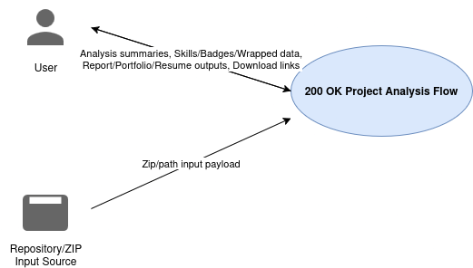

```markdown
# Team 20: Project Code Analyzer

## Project Description

This project is a software analysis tool designed to process and evaluate coding projects. The system analyzes a project's structure, file metadata, and content to assess the developer's technical skills, identify code quality attributes, and generate a comprehensive analysis report. This allows for a deeper understanding of the project's complexity and the skills demonstrated by the developer.

Key features include:
- Securely uploading and analyzing local or Git repositories.
- Analyzing file structures, dependencies, and project characteristics.
- Evaluating code to identify demonstrated technical skills.
- Evaluating badges associated with contributions.
- Generating and displaying detailed analysis reports and skill summaries.
- Storing analysis results for future reference.

---

## Built With

This project is built with Python and utilizes the following packages:

*   [pytest](https://docs.pytest.org/en/stable/): For writing and running tests.
*   [GitPython](https://gitpython.readthedocs.io/en/stable/): For interacting with Git repositories.
*   [PyYAML](https://pyyaml.org/wiki/PyYAMLDocumentation): For reading and writing YAML files.
*   [python-docx](https://python-docx.readthedocs.io/en/latest/): For creating and updating Microsoft Word (.docx) files.
*   [pypdf](https://pypdf.readthedocs.io/en/stable/): For extracting text from PDF files.
*   [reportlab](https://www.reportlab.com/docs/reportlab-userguide.pdf): For generating PDF documents.

---

## Installation Guide for Future Development Team

Follow these instructions to set up a local development environment.

### Prerequisites
- Python 3.10 or higher
- pip (Python package installer)
- Node.js 18+ and npm (for the React frontend)
- Git (for cloning the repository)

### Step 1: Clone the Repository
```bash
git clone https://github.com/COSC-499-W2025/capstone-project-team-20.git
cd capstone-project-team-20
```

### Step 2: Set Up Python Virtual Environment
Create and activate a virtual environment to isolate dependencies.

**Windows:**
```bash
python -m venv .venv
.venv\Scripts\activate
```

**macOS/Linux:**
```bash
python3 -m venv .venv
source .venv/bin/activate
```

### Step 3: Install Python Dependencies
```bash
pip install -r requirements.txt
```

### Step 4: Run the Backend (FastAPI)
Start the API server:
```bash
uvicorn src.api.api_main:app --reload
```
The server will be available at `http://127.0.0.1:8000`.  
API documentation (Swagger UI) is at `http://127.0.0.1:8000/docs`.

### Step 5: Run the React Frontend (Optional)
In a separate terminal, navigate to the frontend directory and install dependencies:
```bash
cd src/ui/react-app
npm install
npm run dev
```
The frontend development server will run at `http://localhost:5173`.

### Step 6: Run Tests (Optional)
To verify your setup, run the backend tests:
```bash
pytest
```
For frontend tests:
```bash
cd src/ui/react-app
npm test
```

### Environment Variables
No environment variables are required for local development. The backend uses a local SQLite database (`projects.db` by default) and file storage under the `data/` directory.

---

## Usage

To start the application, run the `main` module from the root directory.

**On Windows:**
```sh
py -m src.main
```

**On macOS/Linux:**
```sh
python -m src.main
```

Once running, the command-line interface will present this menu:
```
========================
Project Analyzer
========================
Choose an option:
1. Analyze Git Repository & Contributions
2. Extract Metadata & File Statistics
3. Categorize Files by Type
4. Print Project Folder Structure
5. Analyze Languages Detected
6. Run All Analyses
7. Analyze New Folder
8. Change Selected Users
9. Analyze Skills (Calculates Resume Score)
10. Generate Resume Insights
11. Retrieve Previous Resume Insights
12. Delete Previous Resume Insights
13. Display Previous Results
14. Show Project Timeline (Projects & Skills)
15. Analyze Badges
16. Retrieve Full Portfolio (Aggregated)
17. Exit
18. Enter Resume Personal Information
19. Create Report (For Use With Resume Generation)
20. Generate Resume (Export From Report as pdf)
21. Generate Portfolio (Export From Report as pdf)
22. Edit Report
23. Delete Report
24. Select Thumbnail for a Given Project
98. Compare projects
99. Edit project information (Scores & Dates)
100. Toggle skills to showcase
```

---

## API Documentation

This project provides an HTTP API built with **FastAPI**, which automatically generates OpenAPI documentation.

When the API server is running, interactive documentation is available at:

- **Swagger UI:** http://127.0.0.1:8000/docs
- **ReDoc:** http://127.0.0.1:8000/redoc
- **OpenAPI JSON:** http://127.0.0.1:8000/openapi.json

OpenAPI is the authoritative source for request and response schemas as well as interactive testing.

---

## Project Run Modes

The repository supports three workflows:

1. CLI application — menu-based analyzer
2. FastAPI backend — HTTP API with OpenAPI docs
3. React UI — frontend development server

---

## Running the CLI

```sh
python -m src.main
```

---

## Running the API Backend

```sh
uvicorn src.api.api_main:app --reload
```

Base URL:
http://127.0.0.1:8000

---

## Running the React Frontend

```sh
cd src/ui/react-app
npm install
npm run dev
```

The development server typically runs at:
http://localhost:5173

> **Note:** the Projects page now includes a **Clear Database** button that removes all stored projects. This is a development convenience and calls the backend `/projects/clear` endpoint.
---

## API Route Map

### Projects

| Method | Path | Description | Status |
|--------|------|-------------|--------|
| POST | /projects/upload | Upload a .zip file, analyze it, and store project records | Implemented |
| POST | /projects/upload-path | Dev-only: load ZIP from backend file path | Implemented |
| GET | /projects | List stored projects (grouped: current + previous) | Implemented |
| GET | /projects/{id} | Retrieve full details for a specific project | Implemented |
| DELETE | /projects/{id} | Delete a specific project | Implemented |
| POST | /projects/clear | Clear all stored projects (dev helper) | Implemented |
| POST | /projects/{id}/thumbnail | Upload a thumbnail image for a project | Implemented |

### Contributor Resolution

| Method | Path | Description | Status |
|--------|------|-------------|--------|
| POST | /projects/resolve-contributors | Resolve duplicate contributors for a single project | Implemented |
| POST | /projects/resolve-contributors-batch | Resolve contributors for multiple projects at once | Implemented |
| POST | /projects/set-identity | Add email(s) to user’s identity and re‑analyze affected projects | Implemented |

### Privacy

| Method | Path | Description | Status |
|--------|------|-------------|--------|
| GET | /privacy-consent | Retrieve the user’s current privacy consent status | Implemented |
| POST | /privacy-consent | Save the user's privacy consent choice | Implemented |

### Skills & Analytics

| Method | Path | Description | Status |
|--------|------|-------------|--------|
| GET | /skills | Return detected skills with project counts | Implemented |
| GET | /skills/usage | Return skills with project names where each appears | Implemented |
| GET | /badges/progress | Return badge progress analytics | Implemented |
| GET | /wrapped/yearly | Return yearly wrapped analytics | Implemented |

### Reports

| Method | Path | Description | Status |
|--------|------|-------------|--------|
| POST | /reports | Create a saved report from selected project IDs | Implemented |
| GET | /reports | List all saved reports | Implemented |
| GET | /reports/{id} | Retrieve report summary | Implemented |
| DELETE | /reports/{id} | Delete a report | Implemented |
| POST | /reports/{id}/portfolio-details/generate | Generate portfolio details for report projects | Implemented |
| PATCH | /reports/{id}/projects/{project_name} | Update editable fields on a single report project | Implemented |

### Portfolio

| Method | Path | Description | Status |
|--------|------|-------------|--------|
| GET | /portfolio/{id} | Retrieve portfolio view of a report | Implemented |
| POST | /portfolio/{id}/edit | Edit portfolio title and notes | Implemented |
| POST | /portfolio/export | Export portfolio PDF from a report | Implemented |
| GET | /portfolio/exports/{export_id}/download | Download exported portfolio | Implemented |
| PATCH | /portfolio/{id}/mode | Change portfolio visibility (private/public) | Implemented |
| PATCH | /portfolio/{id}/projects/{project_name} | Customise a project inside a portfolio (title, overview, achievements, hide) | Implemented |
| POST | /portfolio/{id}/publish | Publish a portfolio (sets mode to public and timestamp) | Implemented |
| POST | /portfolio/{id}/unpublish | Unpublish a portfolio (reverts to private) | Implemented |

### Resume

| Method | Path | Description | Status |
|--------|------|-------------|--------|
| POST | /resume/export | Export resume PDF from a report | Implemented |
| GET | /resume/exports/{export_id}/download | Download exported resume | Implemented |
| DELETE | /resume/exports/{export_id} | Delete an exported resume PDF | Implemented |
| GET | /resume/context/{id} | Return resume template context as JSON (used for live preview) | Implemented |

### Thumbnails

| Method | Path | Description | Status |
|--------|------|-------------|--------|
| GET | /thumbnails/{filename} | Serve a project thumbnail image | Implemented |

### Config

| Method | Path | Description | Status |
|--------|------|-------------|--------|
| GET | /config | Retrieve stored profile configuration | Implemented |
| POST | /config | Save or update profile configuration | Implemented |
| POST | /config/set | Set a single config value (supports nested objects) | Implemented |
| PUT | /config/usernames | Replace the full list of user email identities | Implemented |

---

## Example Requests

Upload a Project Archive:

```bash
curl -X POST "http://127.0.0.1:8000/projects/upload" \
  -H "accept: application/json" \
  -H "Content-Type: multipart/form-data" \
  -F "zip_file=@/path/to/project.zip;type=application/zip"
```

Save Privacy Consent:

```bash
curl -X POST "http://127.0.0.1:8000/privacy-consent?consent=true"
```

List Projects:

```bash
curl "http://127.0.0.1:8000/projects"
```

Get Project Details by ID:

```bash
curl "http://127.0.0.1:8000/projects/1"
```

Get Skills Summary:

```bash
curl "http://127.0.0.1:8000/skills"
```

---

## Test Report

We maintain a comprehensive test suite that runs automatically on every push and pull request via **GitHub Actions**. The suite covers:

- **Backend unit & integration tests** – using `pytest` (over 40 test files).
- **API endpoint tests** – verifying HTTP responses, schemas, and error handling.
- **Frontend unit tests** – React components tested with Jest and React Testing Library.
- **End‑to‑end tests** – Playwright tests for critical user workflows (upload, portfolio creation, etc.).

**Run the tests locally:**

- Backend & API:
  ```bash
  pytest
  ```
- Frontend unit:
  ```bash
  cd src/ui/react-app
  npm test
  ```
- Frontend E2E (requires backend running):
  ```bash
  cd src/ui/react-app
  npx playwright test
  ```

For the latest test results and coverage reports, see the **Actions** tab on our GitHub repository.

---

## Known Bugs

This section documents cases where implemented features do not behave as expected. The team tracks issues in GitHub.

The team is actively addressing these issues. For a complete and up‑to‑date list, see the [GitHub Issues](https://github.com/COSC-499-W2025/capstone-project-team-20/issues) page.

---

## System Architecture


The system is organized into five layers to enforce separation of concerns and support maintainability, testability, and extensibility.

### 1) External Input
- **User**
- **Uploaded ZIP / Repository source**

Purpose:
- Represents all external actors and project inputs entering the system.

### 2) Presentation Layer
- **Front End (React)**
- **API Client**
- **CLI Interface (Optional)**

Purpose:
- Provides user interaction surfaces for triggering analysis and viewing outputs.

### 3) API Layer
- **FastAPI Application**
- **API Routes/Endpoints**
- **Request/Response Schema**

Purpose:
- Defines the backend contract, validates request/response data, and dispatches calls to orchestration logic.

### 4) Orchestration & Analysis Layer
- **Primary orchestrators:** `ProjectAnalyzer`, `RepoProjectBuilder`
- **Input processing:** `ZipParser`, `RepoFinder`, `FileCategorizer`, `DocumentScraper`
- **Analysis engines:** code metrics, contribution analysis, language detection, role inference, skill analysis, badge engine
- **Insight/report services:** `ResumeInsightsGenerator`, `InsightEditor`, `ReportEditor`
- **User configuration access**

Purpose:
- Coordinates end-to-end analysis workflow while keeping modules focused on specific responsibilities.

### 5) Data & Output Layer
- **Data management classes:** `ProjectManager`, `ReportManager`, `ReportProjectManager`, `ConsentManager`, `StorageManager`, `FileHashManager`
- **SQLite Database**
- **Exporters**
- **Outputs:** badges, timelines, resume insights, portfolio/resume artifacts

Purpose:
- Isolates persistence and export concerns from orchestration and analysis logic.

### Architectural Rationale

This architecture was selected to:
- Keep interfaces stable between frontend and backend (API-first boundary)
- Encapsulate analysis logic in modular engines
- Isolate persistence concerns in manager classes
- Improve testing granularity through clear responsibility boundaries
- Support both CLI and web-driven workflows without duplicating core analysis logic

---

## Data Flow Diagram (Level 0 – Context Diagram)



The context diagram shows the system as a single process interacting with external entities:
- **User**: provides consent, profile settings, and project requests; receives analysis summaries, skills/badges/wrapped data, reports, portfolios, resumes, and download links.
- **Repository/ZIP Input Source**: supplies the input payload (ZIP file or Git URL) for analysis.

This high-level view emphasizes the boundaries of the system and its main inputs and outputs.

---

## Data Flow Diagram (Level 1 – As-Built)


The Level 1 DFD decomposes the system into eight processes and four data stores, illustrating the runtime data movement:

**Processes:**
1. **Capture Consent & Config** – Stores user consent and configuration.
2. **Intake Repository/ZIP** – Ingests and extracts project files.
3. **Validate API Request & Schema** – Ensures incoming data conforms to expected schemas.
4. **Orchestrate Project Analysis** – Coordinates analysis workflow, referencing config rules.
5. **Compute Skills/Badges/Wrapped** – Runs analysis engines to generate skill badges and yearly summaries.
6. **Manage Projects/Reports** – Persists and retrieves project metadata and analysis results.
7. **Export Resume/Portfolio** – Generates PDF outputs from reports.
8. **Serve Results & Media** – Handles public/private visibility and serves thumbnails and exported files.

**Data Stores:**
- **D1 Consent/Config Data** – Stores user consent choices and profile configuration.
- **D2 Project Metadata/Analysis** – Holds project information, analysis results, and contributor identities.
- **D3 Reports + Report Projects** – Stores saved reports and their associated projects.
- **D4 Exported Files** – Contains generated resume, portfolio, and thumbnail files.

**Key Data Flows:**
- Consent‑gated operations (e.g., analysis may be skipped if consent is missing).
- Contributor resolution and identity updates (updating project contributor roles).
- Portfolio publish/private mode updates (visibility toggles).
- Thumbnail retrieval (for serving images in the frontend).

These flows and stores support reproducibility, retrieval of previous analyses, and stable processing behavior across runs.

---

## Work Breakdown Structure

### Milestone #1 (October - December 7th)


---

## Team Resources
- [Team Contract (Google Doc)](https://docs.google.com/document/d/1DcXkmHYj8U9HkEnPPMSvHPCUEKag1lkZ32FaHIsgTeI/edit?usp=sharing)
- Also available in `/media/Team_20_Team_Contract.pdf`

---

## Contributors

| [<br><sub>Sven Annist (mr-sban)</sub>](https://github.com/mr-sban) | [<br><sub>Kaan Sapoglu (kaanspgl)</sub>](https://github.com/kaanspgl) | [<br><sub>Branden Kennedy (branden6)</sub>](https://github.com/branden6) | [<br><sub>Dylan Alexander (dylanstephenalexander)</sub>](https://github.com/dylanstephenalexander) | [<br><sub>Lex Nash (mewlic)</sub>](https://github.com/mewlic) |
| --- | --- | --- | --- | --- |
```
