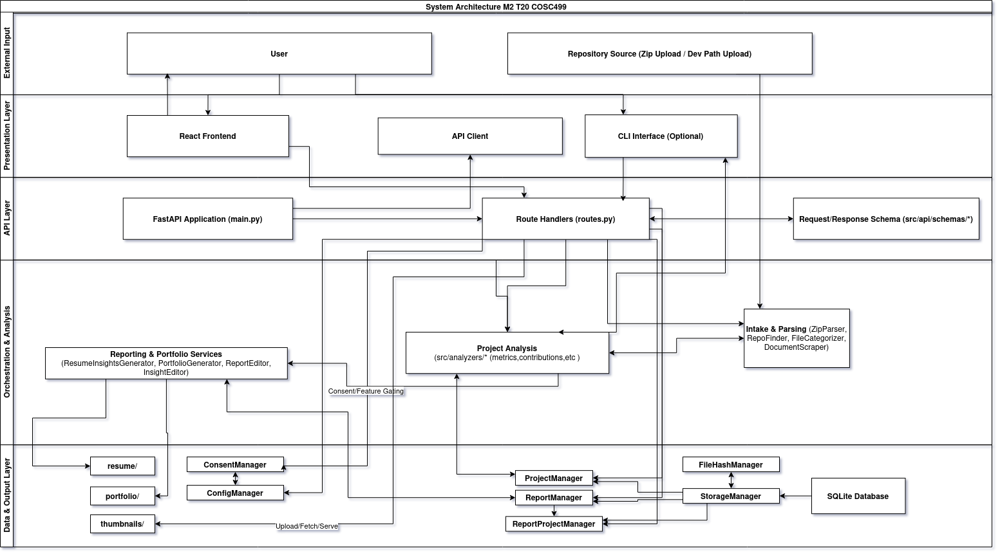
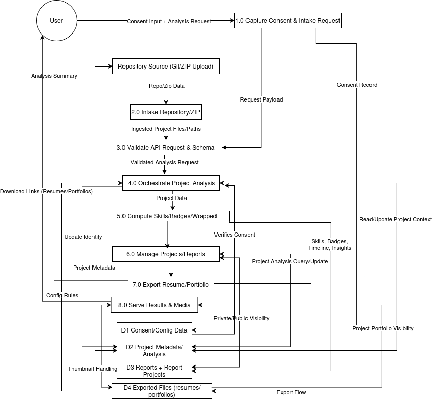
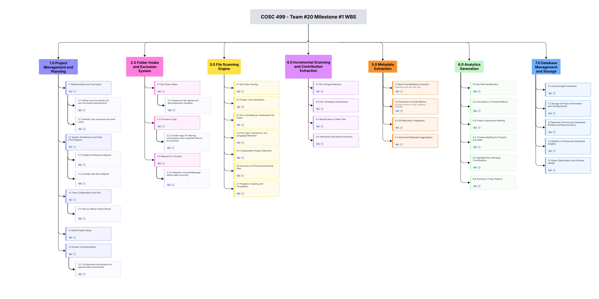

# Team 20: Project Code Analyzer

## Project Description

This project is a software analysis tool designed to process and evaluate coding projects. The system analyzes a project's structure, file metadata, and content to assess the developer's technical skills, identify code quality attributes, and generate a comprehensive analysis report. This allows for a deeper understanding of the project's complexity and the skills demonstrated by the developer.

Key features include:
- Securely uploading and analyzing local or Git repositories.
- Analyzing file structures, dependencies, and project characteristics.
- Evaluating code to identify demonstrated technical skills.
- Evalating badges associated with contributions.
- Generating and displaying detailed analysis reports and skill summaries.
- Storing analysis results for future reference.

---

## Built With

This project is built with Python and utilizes the following packages:

*   [pytest](https://docs.pytest.org/en/stable/): For writing and running tests.
*   [GitPython](https://gitpython.readthedocs.io/en/stable/): For interacting with Git repositories.
*   [PyYAML](https://pyyaml.org/wiki/PyYAMLDocumentation): For reading and writing YAML files.
*   [python-docx](https://python-docx.readthedocs.io/en/latest/): For creating and updating Microsoft Word (.docx) files.
*   [pypdf](https://pypdf.readthedocs.io/en/stable/): For extracting text from PDF files.
*   [reportlab](https://www.reportlab.com/docs/reportlab-userguide.pdf): For generating PDF documents.

---

## Getting Started

Follow these instructions to get a copy of the project up and running on your local machine.

### Prerequisites

You will need Python 3.10+ and pip installed on your machine.

### Installation

1.  Clone the repository to your local machine:
    ```sh
    git clone https://github.com/COSC-499-W2025/capstone-project-team-20.git
    ```
2.  Navigate to the project directory:
    ```sh
    cd capstone-project-team-20
    ```
3.  Create and activate a virtual environment. This keeps your project dependencies isolated.

    **For Windows:**
    ```sh
    python -m venv .venv
    .venv\Scripts\activate
    ```

    **For macOS/Linux:**
    ```sh
    python3 -m venv .venv
    source .venv/bin/activate
    ```

4.  Install the required packages using pip:
    ```sh
    pip install -r requirements.txt
    ```

---

## Usage

To start the application, run the `main` module from the root directory.

**On Windows:**
```sh
py -m src.main
```

**On macOS/Linux:**
```sh
python -m src.main
```

Once running, the command-line interface will present this menu:
```
========================
Project Analyzer
========================
Choose an option:
1. Analyze Git Repository & Contributions
2. Extract Metadata & File Statistics
3. Categorize Files by Type
4. Print Project Folder Structure
5. Analyze Languages Detected
6. Run All Analyses
7. Analyze New Folder
8. Change Selected Users
9. Analyze Skills (Calculates Resume Score)
10. Generate Resume Insights
11. Retrieve Previous Resume Insights
12. Delete Previous Resume Insights
13. Display Previous Results
14. Show Project Timeline (Projects & Skills)
15. Analyze Badges
16. Retrieve Full Portfolio (Aggregated)
17. Exit
18. Enter Resume Personal Information
19. Create Report (For Use With Resume Generation)
20. Generate Resume (Export From Report as pdf)
21. Generate Portfolio (Export From Report as pdf)
22. Edit Report
23. Delete Report
24. Select Thumbnail for a Given Project
98. Compare projects
99. Edit project information (Scores & Dates)
100. Toggle skills to showcase
```

---

## API Documentation

This project provides an HTTP API built with **FastAPI**, which automatically generates OpenAPI documentation.

When the API server is running, interactive documentation is available at:

- **Swagger UI:** http://127.0.0.1:8000/docs
- **ReDoc:** http://127.0.0.1:8000/redoc
- **OpenAPI JSON:** http://127.0.0.1:8000/openapi.json

OpenAPI is the authoritative source for request and response schemas as well as interactive testing.

---

## Project Run Modes

The repository supports three workflows:

1. CLI application — menu-based analyzer
2. FastAPI backend — HTTP API with OpenAPI docs
3. React UI — frontend development server

---

## Running the CLI

```sh
python -m src.main
```

---

## Running the API Backend

```sh
uvicorn src.api.api_main:app --reload
```

Base URL:
http://127.0.0.1:8000

---

## Running the React Frontend

```sh
cd src/ui/react-app
npm install
npm run dev
```

The development server typically runs at:
http://localhost:5173

> **Note:** the Projects page now includes a **Clear Database** button that removes all stored projects. This is a development convenience and calls the backend `/projects/clear` endpoint.
---

## API Route Map

### Projects

| Method | Path | Description | Status |
|--------|------|-------------|--------|
| POST | /projects/upload | Upload a .zip file, analyze it, and store project records | Implemented |
| POST | /projects/upload-path | Dev-only: load ZIP from backend file path | Implemented |
| GET | /projects | List stored projects (grouped: current + previous) | Implemented |
| GET | /projects/{id} | Retrieve full details for a specific project | Implemented |
| DELETE | /projects/{id} | Delete a specific project | Implemented |
| POST | /projects/clear | Clear all stored projects (dev helper) | Implemented |

### Privacy

| Method | Path | Description | Status |
|--------|------|-------------|--------|
| POST | /privacy-consent | Save the user's privacy consent choice | Implemented |

### Skills & Analytics

| Method | Path | Description | Status |
|--------|------|-------------|--------|
| GET | /skills | Return detected skills with project counts | Implemented |
| GET | /badges/progress | Return badge progress analytics | Implemented |
| GET | /wrapped/yearly | Return yearly wrapped analytics | Implemented |

### Reports

| Method | Path | Description | Status |
|--------|------|-------------|--------|
| POST | /reports | Create a saved report from selected project IDs | Implemented |
| GET | /reports | List all saved reports | Implemented |
| GET | /reports/{id} | Retrieve report summary | Implemented |
| DELETE | /reports/{id} | Delete a report | Implemented |
| POST | /reports/{id}/portfolio-details/generate | Generate portfolio details for report projects | Implemented |

### Resume

| Method | Path | Description | Status |
|--------|------|-------------|--------|
| POST | /resume/export | Export resume PDF from a report | Implemented |
| GET | /resume/exports/{export_id}/download | Download exported resume | Implemented |

### Portfolio

| Method | Path | Description | Status |
|--------|------|-------------|--------|
| GET | /portfolio/{id} | Retrieve portfolio view of a report | Implemented |
| POST | /portfolio/{id}/edit | Edit portfolio title and notes | Implemented |
| POST | /portfolio/export | Export portfolio PDF from a report | Implemented |
| GET | /portfolio/exports/{export_id}/download | Download exported portfolio | Implemented |

### Config

| Method | Path | Description | Status |
|--------|------|-------------|--------|
| GET | /config | Retrieve stored profile configuration | Implemented |
| POST | /config | Save or update profile configuration | Implemented |

Note: `/projects/upload-path` is for developer use only and must not be exposed in production.

---

## Example Requests

Upload a Project Archive:

```bash
curl -X POST "http://127.0.0.1:8000/projects/upload" \
  -H "accept: application/json" \
  -H "Content-Type: multipart/form-data" \
  -F "zip_file=@/path/to/project.zip;type=application/zip"
```

Save Privacy Consent:

```bash
curl -X POST "http://127.0.0.1:8000/privacy-consent?consent=true"
```

List Projects:

```bash
curl "http://127.0.0.1:8000/projects"
```

Get Project Details by ID:

```bash
curl "http://127.0.0.1:8000/projects/1"
```

Get Skills Summary:

```bash
curl "http://127.0.0.1:8000/skills"
```

---

## Testing

We maintain a comprehensive automated test suite to ensure the stability and correctness of the Project Analyzer system across all major areas:

- **API endpoints are tested as if from the perspective of a real client (over HTTP)** using [FastAPI's TestClient](https://fastapi.tiangolo.com/advanced/testing/). This guarantees that response codes, payloads, and error handling reflect real-world use.
- **Backend/core logic and managers** are covered with unit and integration tests, validating essential data flows, edge cases, and correct database persistence.
- **CLI workflows** are verified where possible by mocking input/output and running through typical user scenarios.
- **Front-end components** are tested with Jest and React Testing Library for both component behavior and simulated user flows.
- **Database migrations and persistent storage logic** have end-to-end checks to ensure schema stability and upgrade safety.

**Testing Technologies:**
- [pytest](https://docs.pytest.org/en/stable/): main test runner and assertion library for our Python code.
- [FastAPI TestClient](https://fastapi.tiangolo.com/advanced/testing/): Used for making real HTTP requests to the in-memory FastAPI application. All API tests are executed via HTTP methods (`GET`, `POST`, `DELETE`, etc.) mirroring real usage.
- [Jest](https://jestjs.io/) & [React Testing Library](https://testing-library.com/docs/react-testing-library/intro/) for frontend.

### Running the Tests

**Backend & API:**
```sh
pytest
```
Runs all backend, database, and API endpoint tests.

**Frontend:**
```sh
cd src/ui/react-app
npm test
```

### Coverage

- All public API routes are covered by tests that use HTTP requests and check for correct status codes, payloads, and error handling.
- Backend logic and managers are tested for business rule correctness, persistence, and failure scenarios.
- Frontend tests verify rendering, user interactivity, and end-to-end flows where feasible.

---

## System Architecture



The system is organized into five layers to enforce separation of concerns and support maintainability, testability, and extensibility.

### 1) External Input
- **User**
- **Uploaded ZIP / Repository source**

Purpose:
- Represents all external actors and project inputs entering the system.

### 2) Presentation Layer
- **Front End (React)**
- **API Client**
- **CLI Interface (Optional)**

Purpose:
- Provides user interaction surfaces for triggering analysis and viewing outputs.

### 3) API Layer
- **FastAPI Application**
- **API Routes/Endpoints**
- **Request/Response Schema**

Purpose:
- Defines the backend contract, validates request/response data, and dispatches calls to orchestration logic.

### 4) Orchestration & Analysis Layer
- **Primary orchestrators:** `ProjectAnalyzer`, `RepoProjectBuilder`
- **Input processing:** `ZipParser`, `RepoFinder`, `FileCategorizer`, `DocumentScraper`
- **Analysis engines:** code metrics, contribution analysis, language detection, role inference, skill analysis, badge engine
- **Insight/report services:** `ResumeInsightsGenerator`, `InsightEditor`, `ReportEditor`
- **User configuration access**

Purpose:
- Coordinates end-to-end analysis workflow while keeping modules focused on specific responsibilities.

### 5) Data & Output Layer
- **Data management classes:** `ProjectManager`, `ReportManager`, `ReportProjectManager`, `ConsentManager`, `StorageManager`, `FileHashManager`
- **SQLite Database**
- **Exporters**
- **Outputs:** badges, timelines, resume insights, portfolio/resume artifacts

Purpose:
- Isolates persistence and export concerns from orchestration and analysis logic.

### Architectural Rationale

This architecture was selected to:
- Keep interfaces stable between frontend and backend (API-first boundary)
- Encapsulate analysis logic in modular engines
- Isolate persistence concerns in manager classes
- Improve testing granularity through clear responsibility boundaries
- Support both CLI and web-driven workflows without duplicating core analysis logic

---

## Data Flow Diagram (Level 1, As-Built)



The DFD describes the runtime data movement through the system:

1. **Capture consent and intake request** from the user.
2. **Ingest repository/ZIP input** and extract project files/paths.
3. **Validate API request and map schema** before orchestration.
4. **Orchestrate project analysis** using configured rules.
5. **Compute skills, badges, timeline, and insights** from normalized project data.
6. **Persist and retrieve analysis results** from managed data stores.
7. **Present results to the user** as analysis summaries and generated outputs.

### DFD Data Stores

- **Consent Records**
- **Project Metadata**
- **Analysis Results**
- **Configuration Data**

These stores support reproducibility, retrieval of previous analyses, and stable processing behavior across runs.

---

## Work Breakdown Structure

### Milestone #1 (October - December 7th)



---

## Team Resources
- [Team Contract (Google Doc)](https://docs.google.com/document/d/1DcXkmHYj8U9HkEnPPMSvHPCUEKag1lkZ32FaHIsgTeI/edit?usp=sharing)
- Also available in `/media/Team_20_Team_Contract.pdf`

---

## Contributors

<table>
  <tr>
    <td align="center">
      <a href="https://github.com/mr-sban">
        
        <br />
        <sub><b>Sven Annist (mr-sban)</b></sub>
      </a>
    </td>
    <td align="center">
      <a href="https://github.com/kaanspgl">
        
        <br />
        <sub><b>Kaan Sapoglu (kaanspgl)</b></sub>
      </a>
    </td>
    <td align="center">
      <a href="https://github.com/branden6">
        
        <br />
        <sub><b>Branden Kennedy (branden6)</b></sub>
      </a>
    </td>
    <td align="center">
      <a href="https://github.com/dylanstephenalexander">
        
        <br />
        <sub><b>Dylan Alexander (dylanstephenalexander)</b></sub>
      </a>
    </td>
    <td align="center">
      <a href="https://github.com/mewlic">
        
        <br />
        <sub><b>Lex Nash (mewlic)</b></sub>
      </a>
    </td>
  </tr>
</table>

---
