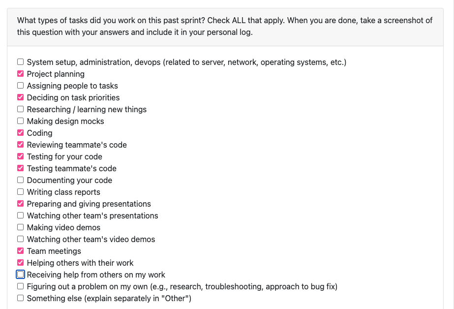
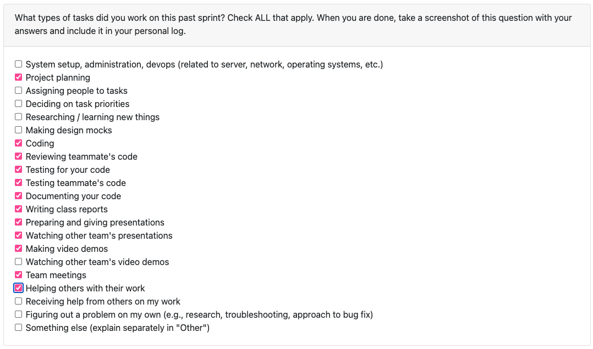
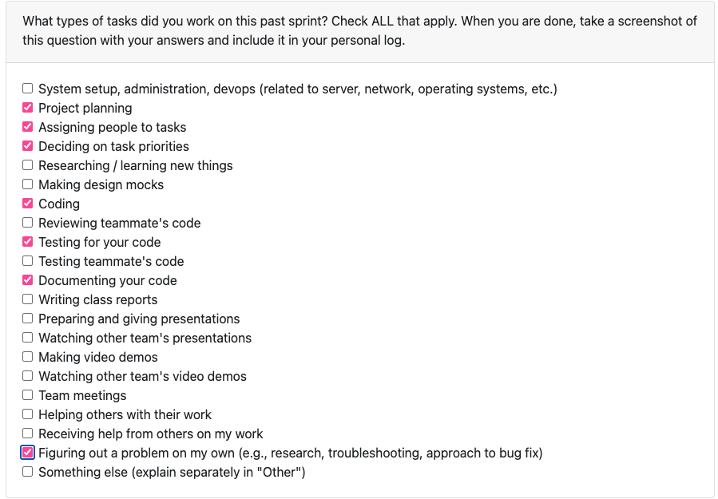

## **Branden Weekly Logs**
### **Table of contents:**

- [Term 2 Week 3](#term-2-week-3-january-19th-january-25th)
- [Term 2 Week 2](#term-2-week-2-january-12th-january-18th)
- [Term 1 Week 14](#week-14-december-1st---december-7th)
- [Term 1 Week 13](#week-13-november-24th---november-30th)
- [Term 1 Week 12](#week-12-november-17th---november-23rd)
- [Term 1 Week 11](#week-11-november-10th---16th)
- [Term 1 Week 9](#week-9-october-27th---november-2nd)
- [Term 1 Week 8](#week-8-october-20th---october-26th)
- [Term 1 Week 7](#week-7-october-13th---october-19th)
- [Term 1 Week 6](#week-6-october-6th---october-12th)
- [Term 1 Week 5](#week-5-september-29th---october-5th)
- [Term 1 Week 4](#week-4-september-22nd---september-28th)
- [Term 1 Week 3](#week-3-september-14th---september-21st)

### **Week 3: September 14th - September 21st**

 **Tasks worked on:**

**Weekly Goals Recap:**

This week, our team's main goal was to prepare functional and non-functional requirements based on our current understanding of the project. We accomplished this, created a draft, and gathered feedback from 3 other teams on areas that we could improve or change.

Using their feedback, we refined and clarified multiple requirements to ensure specificity and measurability. These activities both fit into Project Planning and Researching/learning new things. I also researched local data mining to try and strengthen my understanding and knowledge base of what the project was requiring.

We also collaborated as a team, in person and on a Google Doc, where we discussed multiple ideas, requirements, ethical considerations, and compared our requirements and understanding of the project relative to the other teams. This was my consideration for the "Something else" section that I had selected for tasks worked on.

Our last goal was to define more goals in our team's project board. We filled out a couple more issues, assigned people, and moved the tasks we already completed, to completed.

### **Week 4: September 22nd - September 28th**

**Tasks worked on:**

**Weekly Goals Recap:**

This week, our teams goal was to prepare a system architecture diagram based on our current understanding of the project. Our team collectively worked on it and we created the diagram between Monday and Wednesday and gathered feedback from 4 other teams during the Wednesday class.

We are also working on our Project Proposal. We are adding issues into our GitHub project (Issues #10, #11, #12, #13) to distribute workload among our team members for the different sections of the proposal. I am working on the "Proposed Solution" section of the proposal, Issue [COSC-499-W2025/capstone-project-team-20#11](https://github.com/COSC-499-W2025/capstone-project-team-20/issues/11)

All of this went into project planning, assigning people to tasks, deciding on task priorities, writing class reports, helping others and receiving help for work completed.  

 ### **Week 5: September 29th - October 5th**

 **Tasks worked on:**

 

 **Weekly Goals Recap:**

 This week, our team's goal was to prepare a Data Flow Diagram (DFD) for levels 0 and 1. Our team prepared a DFD Level 0 and DFD Level 1 for presentation and feedback on Wednesday. Our DFD's Level 0 and Level 1 were based off of our functional requirements from Week 1. We gathered feedback from and gave feedback to Teams 2, 5, and 10 for both levels of the DFD.
 
 No additional issues have needed to be added to our project board, so all that was included for the tasks worked on this week was writing class reports, preparing and giving presentations (for the DFD's), team meetings (in class and through discord), and collaborating together on DFD's level 0 and 1.

### **Week 6: October 6th - October 12th**

**Tasks worked on:

**Weekly Goals Recap:**

This week, our team created tasks in our project board and assigned them to members. We have started prioritizing what will need to be done first in order to have all of milestone 1 ready at the deadline. We also updated our DFD Level 1 and put it in our media folder in our repository. The README was also updated with our DFD Level 1. 

We have started some coding progress thus far, mainly skeletons of what will need to be done and collaborated on how our repository structure will be. 

### **Week 7: October 13th - October 19th**

 **Tasks worked on:**

**Weekly Goals Recap**

This week, I worked on implementing a ConsentManager into our software. The ConsentManager handles asking for consent prior to the software running on a user's system. It integrates with the ConfigManager to store the value for consent (boolean). This is a necessary first step as it will be one of the first things that the user interacts with when using our program. This included Issues #30, and its subissues #75 and #76. I have fully implemented these 3 issues (1 feature), and they have been reviewed, refactored, reviewed again, then merged. I also helped with the WBS for our repo's README. I used Lucidchart to convert our WBS into a proper diagram, and added some subtasks for areas 1.0 and 2.0. I have left 3.0-7.0's subtasks empty for now because we havent discussed exact implementation of them. This was for Issues [COSC-499-W2025/capstone-project-team-20#48](https://github.com/COSC-499-W2025/capstone-project-team-20/issues/48) and Issues #32. 

What I struggled with this week is true prioritizing of my time between classes. I had 4 midterms/quizzes this week so starting to code and work on this feature happened later in the week. In the upcoming weeks, I would like to prioritize having PR's ready earlier in the week, to give my teammates more time to review and change anything in my PR's if need be.

For the upcoming week, I will be starting to work on a new feature, possibly 2. I havent decided exactly which issues yet, but will be deciding by the end of the day monday. Another goal I have is that I would love to get the whole team on the same page for getting work done early in the week so that we all ahve ample time to refactor/change things if needed before the Sunday deadlines. 

### **Week 8: October 20th - October 26th**

**Tasks worked on:**

**Weekly Goals Recap:**

This week, I worked on implementing a feature for extracting project metadata. The ProjectMetadataExtractor analyzes project-level statistics, and collects all files from ProjectFolder tree, parses the file timestampes and sizes, computes the total file count, project duration, and average file size, then prints and returns the summary in a JSON-format. I also implemented unit tests for functionality, on basic extraction of metadata, empty project handling, nested folder recursion, and missing timestamps on files. Implementing this required some refactoring of the ZipParser file as well. This covered Issue [COSC-499-W2025/capstone-project-team-20#99](https://github.com/COSC-499-W2025/capstone-project-team-20/issues/99), which is a subissue of Issue #34.

This implementation correlates directly with our functional requirements of "The system shall extract metadata, such as file creation/modification date, file size, language usage breakdown, contributions per month, etc.)." It handles the file dates and file size.

The full Issue [COSC-499-W2025/capstone-project-team-20#34](https://github.com/COSC-499-W2025/capstone-project-team-20/issues/34) is now what I am working on to break into further subissues. I have created Issue #100 which is also a sub issue of #34, but issue #34 will need even further breaking down. 

I also completed multiple PR reviews this week, and created a when2meet scheduler so that we can all fill out our availability and schedule a second meeting time for our weeks, ensuring we are all properly aligned with everything were working on and can stay on top of coding early in the week.

What I struggled with this week is still real prioritization of time. Last week, I was having trouble with selecting the proper issue to work on next, right up until Wednesday during our meeting times. I talked with my group and Dr. Hui to decide on a new issue, and that is why I am currently working through Issue [COSC-499-W2025/capstone-project-team-20#34](https://github.com/COSC-499-W2025/capstone-project-team-20/issues/34). I want to make sure I can give my team ample time for review, and allow myself the weekend to focus on review/help of any other issues that my team may have.

For The upcoming week, I have issue [COSC-499-W2025/capstone-project-team-20#34](https://github.com/COSC-499-W2025/capstone-project-team-20/issues/34) to breakdown further and work on Issue #100, subissue of #34. So, I believe it should be one or two more subissues added for 34, and I should be able to implement all issues and fully complete issue #34 this week. I am going to try to have one of those pull requests up and ready for our wednesday meeting. 

### **Week 9: October 27th - November 2nd**

**Tasks worked on:**

Evaluation was unavailable to do this week. closed at 7:50 AM on November 2nd.

**Weekly Goals Recap:**

I have completed Issue [COSC-499-W2025/capstone-project-team-20#100](https://github.com/COSC-499-W2025/capstone-project-team-20/issues/100), which ended up being a larger undertaking than I had originally anticipated. That issue alone took up most of the time I had to work on it for the week. The FileCategorizer is responsible for classifying files into various categories. This is what ended up taking up a lot of time for the week, it was spent debugging and manually testing behavior. I ran tests on a 25 gb zipped folder to ensure proper classification across many file types. The FileCategorizer now classifies files into categories (code, design, docs, tests, data, media, archive, config, library, template, and many other categories) using YAML definitions for languages, markup languages, and categories. 

I also refactored the projectMetadataExtractor, which now calls the FileCategorizer to give a detailed summary. Additionally, I created an ignored_directories.yml file that became rather extensive as well, containing numerous files and extensions that our analyzers should automatically exclude during scanning. This includes common package/dependency directories, cache directories, build and output folders, etc. Alongside that, I refactored the ProjectMetadataExtractor to use the FileCategorizer, updating the tests for the ProjectMetadataExtractor and ensuring compatability.

While this implementation goes beyond our original functional requirements, it significantly enhances the project’s ability to categorize files and compute contribution metrics based on an extensive set of categories and file types.

I also completed several PR reviews this week and worked together with my teammates to decide on implementation details and next steps for our file crawler.
These PR reviews are:
#132
#138
#140
#141
#144
#150
Logs: #155, #157, #159

This week, I was better with time management and able to get my PR's up early, with requested changes (this is where the extensive yml files came from) on my PR also being implemented by saturday evening. The requested change from Dylan had me take a deeper dive into the FileCategorizer, making it robust for our project, as well as adding the ignored_directories yml. 

What I struggled with this week is finding a lot of time to put into the project. I managed my time well to get my PR up early, but I would have loved to complete more issues for the week, but I am happy with my contributions for the week, especially with how long the FileCategorizer ended up taking! One more thing is, I realized after that it was an extensive PR that I had put up (especially after finishing the requested changes). I must remember to create seperate issues for everything that I do. Right now, it seems as though i only did 1 issue, but i could/should have created multiple issues, especially when accounting for the requested changes. 

Next week, I am continuing on with the ProjectAnalyzer. I have only just started this issue on Sunday, so it is being carried on into the following week. The ProjectAnalyzer will use all of our analyzers (GitRepoAnalyzer, FileCategorizer, ProjectMetadataExtractor, etc.) in a single component. This will also allow me to cleanup our main file, so that it only needs to ask for consent and call the ProjectAnalyzer. Additionally, I plan on cleaning up the rest of our repository, with just simple housekeeping like creating a dedicated Managers folder, cleaning up main, and synthesizing analyzers. This will correlate with issue [COSC-499-W2025/capstone-project-team-20#142](https://github.com/COSC-499-W2025/capstone-project-team-20/issues/142)

### **Week 11: November 10th - 16th**

I did complete the week 10 **Tasks worked on** but, unfortunately i misunderstood and thought that last week was the one not to do, so i have this week's stuff, but can not screenshot my already completed week 10 **Tasks worked on** form. 

**Weekly Goals Recap:**

This week, I have completed Issue #142, a project analyzer and a cleanup of main. This issue/code has introduced the Project Analyzer. This analyzer synthesizes all of the other analyzers in one location. Its displayed in a menu where you can select which analyzer you would like to use, run all of them, switch the zipped folder being analyzed, or exit the app. Now, in main, we only need to call the Consent Manager and then the project analyzer. It greatly reduces clutter in main and is a major step to helping present our demonstration. I also completed a full test suite for the project analyzer. 

I also completed multiple PR reviews (which will continue into sunday night), and now that we have the project analyzer, we have an even better idea and visualization for the general direction that our project is moving.

This week, I was overall happy with my school progress and capstone progress. It was a well-deserved reading week, so i did take time to recouperate and get ready for the last stretch of this semester. Overall, I feel like we are in a great spot with our capstone project so I am happy with the overall progress this week!

Next week, I have a few options for next steps. I think I may work on refactoring the git repo analyzer to improve its efficiency. Its currently our slowest analyzer by a considerable amount. I believe paralellizing it could greatly improve its efficiency, or refactoring exactly how its implemented. I did not make the original git repository analyzer so there will be some learning to do with how its currently implemented in order to make decisions on what could be changed. 

### **Week 12: November 17th - November 23rd**

**Tasks worked on:**

**Weekly Goals Recap:**

This week, I worked on implementing a Resume Insights Generator. It uses our analyzers to take the project analysis data and generates resume bullet points, a project summary, and also a menu to navigate through the zipped folder if there are multiple repositories. This went along with a full test suite to ensure coverage. There were a few refactors that went into it as well, along with lots of debugging. The debugging took many hours, when I was getting numbers that werent matching between what my summary was generating vs what the metadata said was inside the zipped folder. This implementation enhances the project's ability to turn our analyzers into a useful, readable output. I also completed several PR reviews as the first and the second reviewer.
Issues closed: 
[COSC-499-W2025/capstone-project-team-20#202](https://github.com/COSC-499-W2025/capstone-project-team-20/issues/202)
#203
#204
#215

This week, it was difficult to get my PR out early, as there was many hours of debugging. I am happy that it is finished now as it will be a great addition for presenting our milestone and what our ZIP analyzer can produce. I was better with creating multiple issues for the main issue as they came up, allowing me to close 4 issues this week.

Next week, I will be going further into the resume insight generation and expanding/refactoring what I have done this week. As of right now, the git repository analyzer is still very slow so, time permitting, i will be working on refactoring that to improve efficiency as well. Mainly focusing on our outputs for presenting our demo!

### **Week 13: November 24th - November 30th**

**Tasks worked on:**

**Weekly Goals Recap:**

This week, I started by refactoring the ProjectMetadataExtractor and FileCategorizer to improve the accuracy, consistency, and output quality for the ResumeInsightsGenerator. I improved the metadata extraction flow to ensure category/metadata summaries are structured consistently. Also improving the handling of file collection and timestamp/size aggregation. The FileCategorizer received an update to classification rules, and a fix for innaccurate category assignments. The ResumeInsightsGenerator is also now aligned with thes updates, referencing all correct counts and categories. After this was done, I worked on full project storage to the database. Now, all project metadata is stored into the database. This allows ResumeInsightsGenerator and "Display Previous Results" to reuse cached results, improving efficiency. There is also faster repeated analyses for large ZIP archives and consistency between the analyzers and stored database objects now. I needed to expand our Project.py schema to support category counts, author_contributions, commit metadata, language lists, file categories, timestamps, and project status. Now, the ProjectAnalyzer writes all extracted metadata to the database, and ensures categories, language shares, author stats, and timestamps are saved. I also worked on code review, reviewing multiple PRs, as well as our team's google slides presentation.

Issues closed:
Issue [COSC-499-W2025/capstone-project-team-20#252](https://github.com/COSC-499-W2025/capstone-project-team-20/issues/252)
Issue [COSC-499-W2025/capstone-project-team-20#229](https://github.com/COSC-499-W2025/capstone-project-team-20/issues/229)
Issue [COSC-499-W2025/capstone-project-team-20#239](https://github.com/COSC-499-W2025/capstone-project-team-20/issues/239)

I was overall very happy with the progress we made this week, and we had our most productive team meeting yet! We finished our team contract and got on the same page about where our project analyzer is and exactly what else we need to do to get it to where we want it to be for this milestone. I dont have any regrets for this week or any wishes for what I could have improved on, I feel the week went exceedingly well (especially considering it was a 40 hour work week for me too!). Very happy overall with the progress.

Next week, I will ensure we have all basic criteria met for Milestone 1, with extra implementations as well! This week will be about finalizing our whole milestone and focusing on presenting the work on Wednesday and submitting our video submission for Friday. The main focus will just be finalizing that weve met all criteria for it, and exceeded with other features!

### **Week 14: December 1st - December 7th**

**Tasks worked on:**

**Weekly Goals Recap:**

This week, our main focus was preparing for the Milestone #1 demonstration for both video and in person. This took our top priority. I did code some small refactors that included adjusting our ProjectMetadataExtractor. The method that we were calling to extract the metadata (extract_metadata() method) was also printing the extracted metadata. This was giving us output that we didnt want when using it either in our other analyzers or in our generators. I created a new method for just the printing, and made extract_metadata() ONLY extract the metadata. We had additional methods in our ProjectAnalyzer.py to combat this output (a suppress_output method) that was being used just to suppress that output. I also added corresponding tests to ensure this was working as intended. 
For review, I do want to talk about PR #268. I did hours of manual testing on this PR. It was a major refactor, so it was giving us some big issues when i was testing. It went through multiple iterations (changes requested twice), until we finally got exactly what we were intending! Lastly, this week i worked on setting up the team presentation, working on my section of the presentation, developing a script that was (exactly!) 1 minute, and overall polish of our presentations. It was definitely a stressful final week and I'm very happy with my team for the close of milestone #1!

Issues closed: 
Issue #266

This week and semester, I have been very happy with my team! This week solidified all that, I felt our projects matched up very well against other team's. I think weve really come together as a team, and the effort has been consistent overall. Our team contract will really solidify the inefficiencies that we have had so far, so im also really looking forward to that!

**Goals for the Winter Break:**

Its possible that I do a couple small additions to our project. As of right now, I do not know what those may be, but I think I will work on it if i can for those bonus marks! I am going to be relaxing, recharging, spending time with my family, and working as much as I can to prepare for the second semester!

### **Term 2 Week 2: January 12th-January 18th**
**Screenshot of Tasks Worked On:**

**Coding Tasks:**
I setup a FastAPI by creating a new folder (api), and added in schemas with an API data model for each area (consent, portfolio, projects, resume, and skills). I also added in a routes.py file to setup all the endpoints with the required endpoints in Requirement 32 of Milestone 2. I had to minorly adjust a couple other files (requirements.txt, ProjectAnalyzer.py, and ConsentManager.py) just for some housekeeping and necessary adjustments for our API to work. Full context can be found in PR #311.

**Testing or Debugging Tasks:**
I added a full test suite for the API. it is under tests/test_api.py. it tests route wiring, HTTP status codes are proper, request/response shapes, some error handling branches, and that endpoints call their managers or analyzers correctly. This will be found under PR #314
As far as testing teammates code... No one else actually had done any coding this week. I did not get the opportunity to review code. I had reviewed in the previous week and tried to get my team going, but I hope this doesnt cause me receiving a 0 for testing. If there was literally anything to review/test, i would have. (This may also change by the end of the night sunday, but at the time of writing this on Sunday evening, no teammates have sent a PR.)

**Reviewing or Collaboration Tasks:**
I reviewed which tasks we have for Milestone 2, came up with a plan for myself for what will need to be prioritized, and also looked into what we'll need to have a successful peer review day.

**Brief Description of Last Week Connecting This Week:**
Last week, I was mainly focused on just rebooting to start the semester, I didnt get any coding done because I didnt realize it was immediately starting for contributions. I thought we would be discussing milestone 2 and the quizzes during class (which, we did discuss the quizzes), but I had missed that we were meant to start last week. So, this is my first week getting back into the full swing of things.

**Plan/Goals for Upcoming Week:**
In the upcoming week, I want to make sure that all of our milestone 1 goals are hashed out and very polished for the peer review coming up. This will include refactoring of any larger/sloppier files. I also want to look into finishing off a resume being built so that I can take out the placeholders for the API endpoints for all of our resume generation.

**Any issues or Blockers That I Encountered This Week and How I Addressed/Plan to Address Them:**
The main blocker was that the group wasnt very active this week... On Wednesday, only Sven and I had shown up to class, and I had tried to send a when2meet so that our group could schedule another meeting, but was getting very little replies in our discord server... I also didnt really have the opportunity to review code because the group was inactive for any other coding going on. Hopefully that flips around this week and we get back into full collaboration with eachother.

### **Term 2 Week 3: January 19th-January 25th**
**Screenshot of Tasks Worked On:**

**Coding Tasks:**
I setup a mini frontend for testing purposes for PR 1 and for our own testing. I used streamlit to re use our ProjectAnalyzer (our CLI) logic where I could, with just a couple implementation changes for input() prompts (Streamlit doesnt have input()). It ended up coming out really well and it works exactly as our CLI does, so now we have an option to test on our mini front end if we'd like! [PR #331] (https://github.com/COSC-499-W2025/capstone-project-team-20/pull/331). I also created test files to fulfill requirement 32 of Milestone 2. These test files are for testing multiple repositories in a ZIP, as well as testing multiple repositories, a pdf, and a word document. These two test files were created with my own projects over the years (COSC 111 assignments (Java), COSC 499 Project Analyzer (Python), COSC 310 Task management application (Java, React, SQL), and the 2025 Global Game Jam (Unity)). This is [PR #332] (https://github.com/COSC-499-W2025/capstone-project-team-20/pull/332)

**Testing or Debugging Tasks:**
All testing for the mini frontend that I created was needed to be done manually. I thoroughly went through the mini front end with our CLI pulled up side by side, testing and ensuring all options are represented the same, and everything outputs exactly as its supposed to. This took some time going through multiple zipped test files and all 16 options of our CLI/frontend, ensuring correctness. I also tested Kaans PR (See below) manually and thoroughly, ensuring correctness.

**Reviewing or Collaboration Tasks:**
I reviewed [kaan's PR #330](https://github.com/COSC-499-W2025/capstone-project-team-20/pull/330), as well as
[Dylan's PR #333](https://github.com/COSC-499-W2025/capstone-project-team-20/pull/333).
I attended our team meeting on Thursday, where we discussed our expectations for each milestone requirement and where we need clarification to ensure we are understanding all requirements properly. We created a google doc for that and will have questions for the ones we found we were uncertain on. Also created a plan of attack to really start digging into milestone 2 and what we needed to get done before Peer Testing.

**Brief Description of Last Week Connecting This Week:**
I wanted to refactor our code for this week to polish it all up and make sure everything was proper for peer testing, but we opted to go for progress over the refactoring i had originally planned. wanted to get back on schedule for milestone 2 before we went ahead and refactored what we have.

**Plan/Goals for Upcoming Week:**
This week, I do plan on doing the refactoring now before our Peer Testing (Wednesday). I also will take another milestone 2 requirement and start working away at that. I also will need to find what the class's rules are on git LFS, as requirement 33 needs two files from different times of the same repository. I had planned on using our COSC 499 project, but the zipped files are over 100 mb, so git LFS wouldnt allow me to push it.

**Any issues or Blockers That I Encountered This Week and How I Addressed/Plan to Address Them:**
We just have some issues for clarifying milestone 2 requirements. The team worked well, 4/5 of us were at our meeting and everyone showed up on wednesday so thats a step in the right direction. I have booked a meeting with Bowen on Wednesday morning as well for my clarifications needed.

