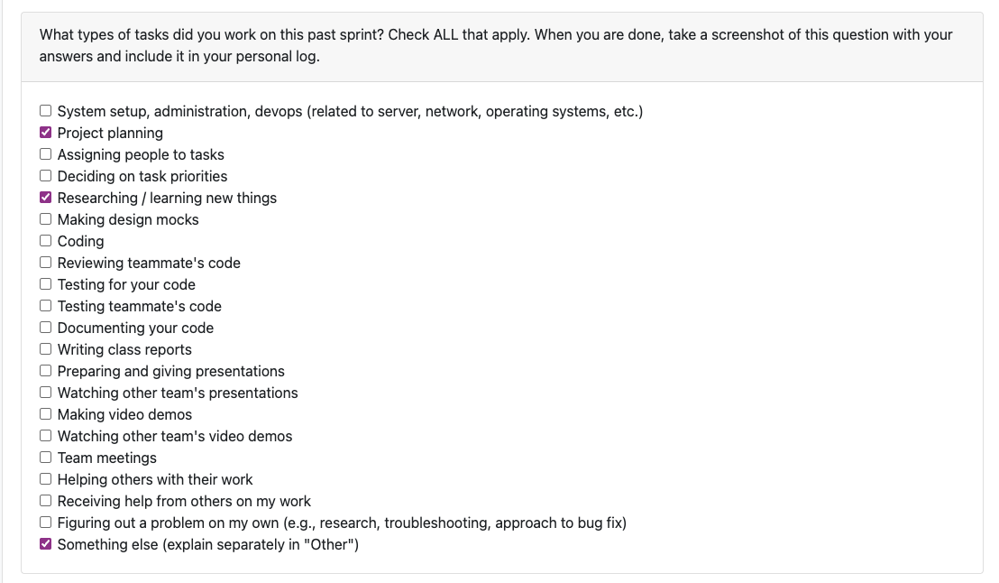
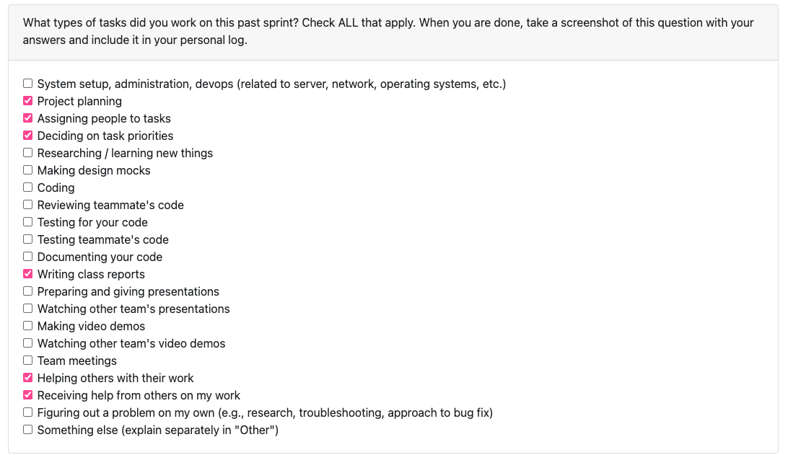
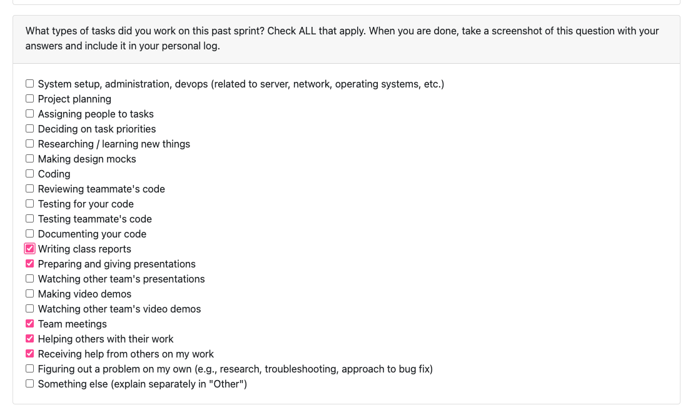
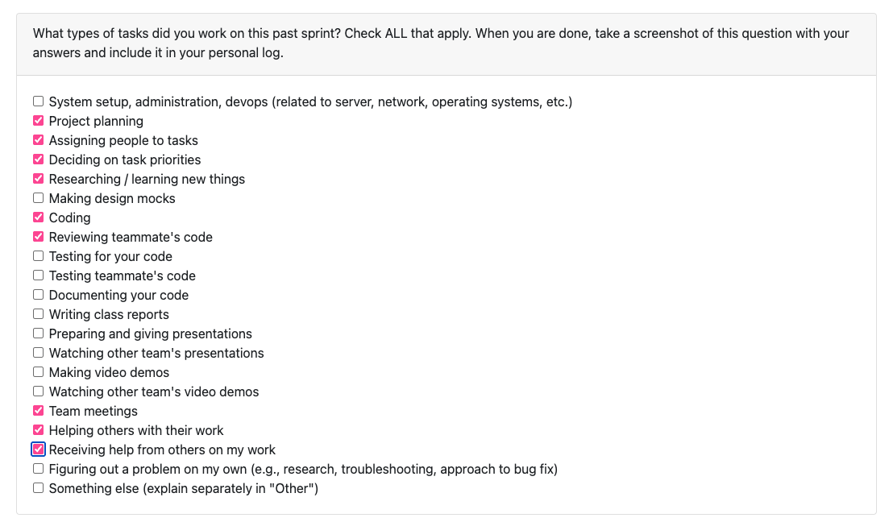
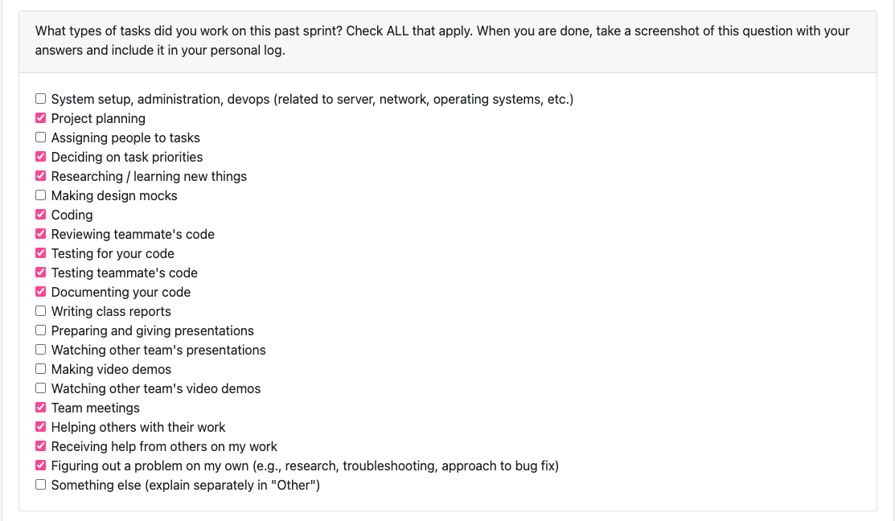
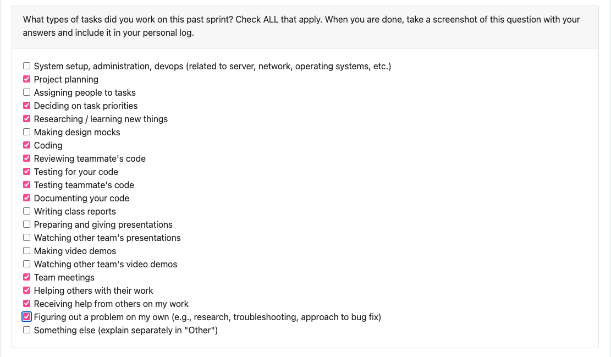

## **Branden Weekly Logs**

### **Week 3: September 14th - September 21st**

 **Tasks worked on:**

**Weekly Goals Recap:**

This week, our team's main goal was to prepare functional and non-functional requirements based on our current understanding of the project. We accomplished this, created a draft, and gathered feedback from 3 other teams on areas that we could improve or change.

Using their feedback, we refined and clarified multiple requirements to ensure specificity and measurability. These activities both fit into Project Planning and Researching/learning new things. I also researched local data mining to try and strengthen my understanding and knowledge base of what the project was requiring.

We also collaborated as a team, in person and on a Google Doc, where we discussed multiple ideas, requirements, ethical considerations, and compared our requirements and understanding of the project relative to the other teams. This was my consideration for the "Something else" section that I had selected for tasks worked on.

Our last goal was to define more goals in our team's project board. We filled out a couple more issues, assigned people, and moved the tasks we already completed, to completed.

### **Week 4: September 22nd - September 28th**

**Tasks worked on:**

**Weekly Goals Recap:**

This week, our teams goal was to prepare a system architecture diagram based on our current understanding of the project. Our team collectively worked on it and we created the diagram between Monday and Wednesday and gathered feedback from 4 other teams during the Wednesday class.

We are also working on our Project Proposal. We are adding issues into our GitHub project (Issues #10, #11, #12, #13) to distribute workload among our team members for the different sections of the proposal. I am working on the "Proposed Solution" section of the proposal, Issue [COSC-499-W2025/capstone-project-team-20#11](https://github.com/COSC-499-W2025/capstone-project-team-20/issues/11)

All of this went into project planning, assigning people to tasks, deciding on task priorities, writing class reports, helping others and receiving help for work completed.  

 ### **Week 5: September 29th - October 5th**

 **Tasks worked on:**

 

 **Weekly Goals Recap:**

 This week, our team's goal was to prepare a Data Flow Diagram (DFD) for levels 0 and 1. Our team prepared a DFD Level 0 and DFD Level 1 for presentation and feedback on Wednesday. Our DFD's Level 0 and Level 1 were based off of our functional requirements from Week 1. We gathered feedback from and gave feedback to Teams 2, 5, and 10 for both levels of the DFD.
 
 No additional issues have needed to be added to our project board, so all that was included for the tasks worked on this week was writing class reports, preparing and giving presentations (for the DFD's), team meetings (in class and through discord), and collaborating together on DFD's level 0 and 1.

### **Week 6: October 6th - October 12th**

**Tasks worked on:

**Weekly Goals Recap:**

This week, our team created tasks in our project board and assigned them to members. We have started prioritizing what will need to be done first in order to have all of milestone 1 ready at the deadline. We also updated our DFD Level 1 and put it in our media folder in our repository. The README was also updated with our DFD Level 1. 

We have started some coding progress thus far, mainly skeletons of what will need to be done and collaborated on how our repository structure will be. 

### **Week 7: October 13th - October 19th**

 **Tasks worked on:**

**Weekly Goals Recap**

This week, I worked on implementing a ConsentManager into our software. The ConsentManager handles asking for consent prior to the software running on a user's system. It integrates with the ConfigManager to store the value for consent (boolean). This is a necessary first step as it will be one of the first things that the user interacts with when using our program. This included Issues #30, and its subissues #75 and #76. I have fully implemented these 3 issues (1 feature), and they have been reviewed, refactored, reviewed again, then merged. I also helped with the WBS for our repo's README. I used Lucidchart to convert our WBS into a proper diagram, and added some subtasks for areas 1.0 and 2.0. I have left 3.0-7.0's subtasks empty for now because we havent discussed exact implementation of them. This was for Issues [COSC-499-W2025/capstone-project-team-20#48](https://github.com/COSC-499-W2025/capstone-project-team-20/issues/48) and Issues #32. 

What I struggled with this week is true prioritizing of my time between classes. I had 4 midterms/quizzes this week so starting to code and work on this feature happened later in the week. In the upcoming weeks, I would like to prioritize having PR's ready earlier in the week, to give my teammates more time to review and change anything in my PR's if need be.

For the upcoming week, I will be starting to work on a new feature, possibly 2. I havent decided exactly which issues yet, but will be deciding by the end of the day monday. Another goal I have is that I would love to get the whole team on the same page for getting work done early in the week so that we all ahve ample time to refactor/change things if needed before the Sunday deadlines. 

### **Week 8: October 20th - October 26th**

**Tasks worked on:**

**Weekly Goals Recap:**

This week, I worked on implementing a feature for extracting project metadata. The ProjectMetadataExtractor analyzes project-level statistics, and collects all files from ProjectFolder tree, parses the file timestampes and sizes, computes the total file count, project duration, and average file size, then prints and returns the summary in a JSON-format. I also implemented unit tests for functionality, on basic extraction of metadata, empty project handling, nested folder recursion, and missing timestamps on files. Implementing this required some refactoring of the ZipParser file as well. This covered Issue [COSC-499-W2025/capstone-project-team-20#99](https://github.com/COSC-499-W2025/capstone-project-team-20/issues/99), which is a subissue of Issue #34.

This implementation correlates directly with our functional requirements of "The system shall extract metadata, such as file creation/modification date, file size, language usage breakdown, contributions per month, etc.)." It handles the file dates and file size.

The full Issue [COSC-499-W2025/capstone-project-team-20#34](https://github.com/COSC-499-W2025/capstone-project-team-20/issues/34) is now what I am working on to break into further subissues. I have created Issue #100 which is also a sub issue of #34, but issue #34 will need even further breaking down. 

I also completed multiple PR reviews this week, and created a when2meet scheduler so that we can all fill out our availability and schedule a second meeting time for our weeks, ensuring we are all properly aligned with everything were working on and can stay on top of coding early in the week.

What I struggled with this week is still real prioritization of time. Last week, I was having trouble with selecting the proper issue to work on next, right up until Wednesday during our meeting times. I talked with my group and Dr. Hui to decide on a new issue, and that is why I am currently working through Issue [COSC-499-W2025/capstone-project-team-20#34](https://github.com/COSC-499-W2025/capstone-project-team-20/issues/34). I want to make sure I can give my team ample time for review, and allow myself the weekend to focus on review/help of any other issues that my team may have.

For The upcoming week, I have issue [COSC-499-W2025/capstone-project-team-20#34](https://github.com/COSC-499-W2025/capstone-project-team-20/issues/34) to breakdown further and work on Issue #100, subissue of #34. So, I believe it should be one or two more subissues added for 34, and I should be able to implement all issues and fully complete issue #34 this week. I am going to try to have one of those pull requests up and ready for our wednesday meeting. 

### **Week 9: October 27th - November 2nd**

**Tasks worked on:**

**Weekly Goals Recap:**

I have completed Issue [COSC-499-W2025/capstone-project-team-20#100](https://github.com/COSC-499-W2025/capstone-project-team-20/issues/100), which ended up being a larger undertaking than I had originally anticipated. That issue alone took up most of the time I had to work on it for the week. The FileCategorizer is responsible for classifying files into various categories. This is what ended up taking up a lot of time for the week, it was spent debugging and manually testing behavior. I ran tests on a 25 gb zipped folder to ensure proper classification across many file types. The FileCategorizer now classifies files into categories (code, design, docs, tests, data, media, archive, config, library, template, and many other categories) using YAML definitions for languages, markup languages, and categories. 

I also refactored the projectMetadataExtractor, which now calls the FileCategorizer to give a detailed summary. Additionally, I created an ignored_directories.yml file that became rather extensive as well, containing numerous files and extensions that our analyzers should automatically exclude during scanning. This includes common package/dependency directories, cache directories, build and output folders, etc. Alongside that, I refactored the ProjectMetadataExtractor to use the FileCategorizer, updating the tests for the ProjectMetadataExtractor and ensuring compatability.

While this implementation goes beyond our original functional requirements, it significantly enhances the project’s ability to categorize files and compute contribution metrics based on an extensive set of categories and file types.

I also completed several PR reviews this week and worked together with my teammates to decide on implementation details and next steps for our file crawler.

This week, I was better with time management and able to get my PR's up early, with requested changes (this is where the extensive yml files came from) on my PR also being implemented by saturday evening. The requested change from Dylan had me take a deeper dive into the FileCategorizer, making it robust for our project, as well as adding the ignored_directories yml. 

What I struggled with this week is finding a lot of time to put into the project. I managed my time well to get my PR up early, but I would have loved to complete more issues for the week, but I am happy with my contributions for the week, especially with how long the FileCategorizer ended up taking! One more thing is, I realized after that it was an extensive PR that I had put up (especially after finishing the requested changes). I must remember to create seperate issues for everything that I do. Right now, it seems as though i only did 1 issue, but i could/should have created multiple issues, especially when accounting for the requested changes. 

Next week, I am continuing on with the ProjectAnalyzer. I have only just started this issue on Sunday, so it is being carried on into the following week. The ProjectAnalyzer will use all of our analyzers (GitRepoAnalyzer, FileCategorizer, ProjectMetadataExtractor, etc.) in a single component. This will also allow me to cleanup our main file, so that it only needs to ask for consent and call the ProjectAnalyzer. Additionally, I plan on cleaning up the rest of our repository, with just simple housekeeping like creating a dedicated Managers folder, cleaning up main, and synthesizing analyzers. This will correlate with issue [COSC-499-W2025/capstone-project-team-20#142](https://github.com/COSC-499-W2025/capstone-project-team-20/issues/142)

