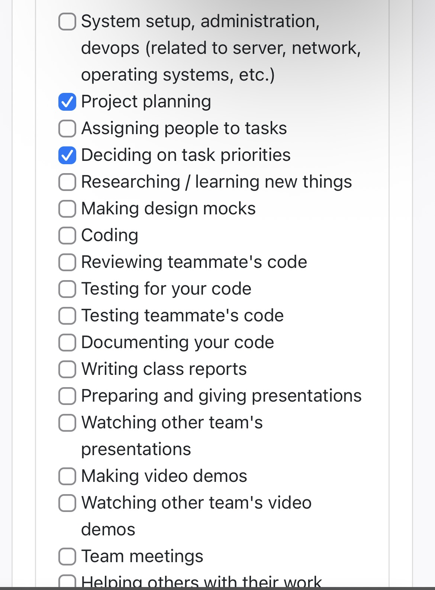
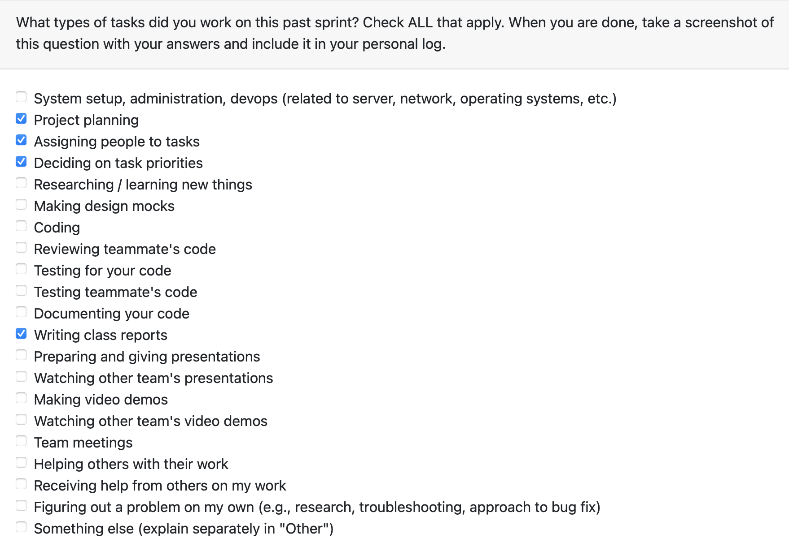
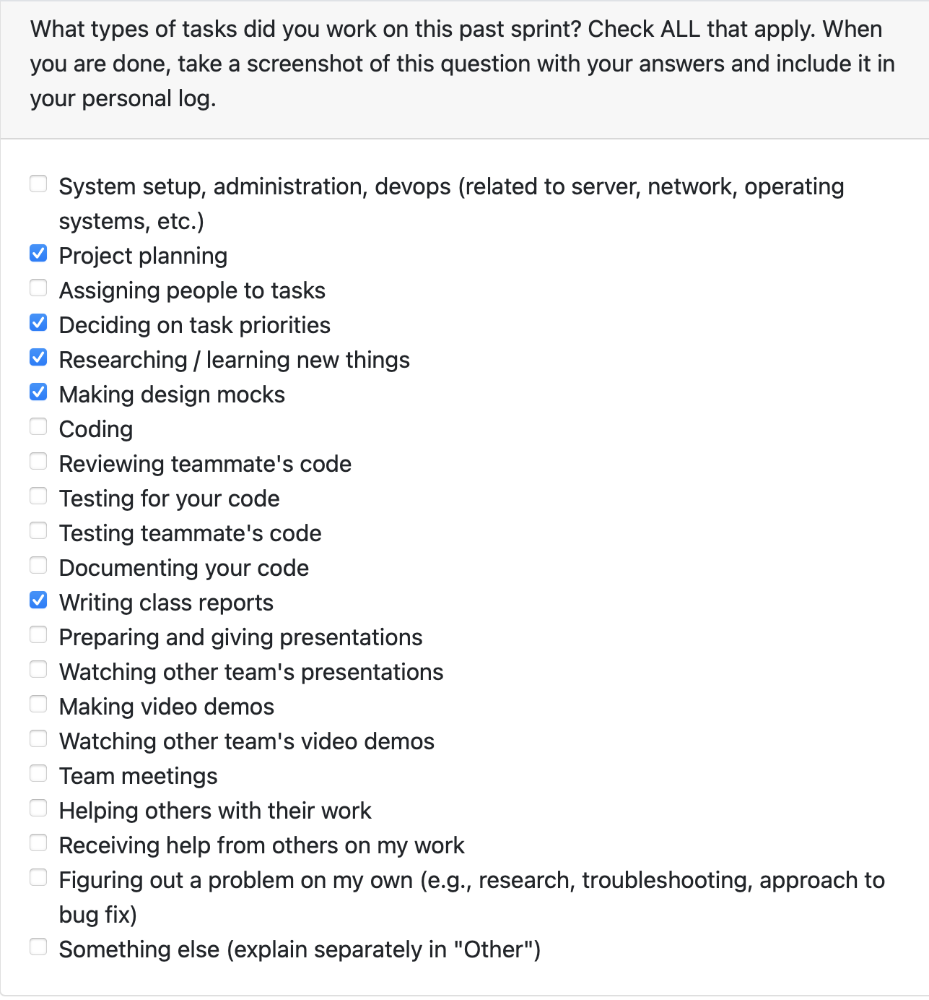
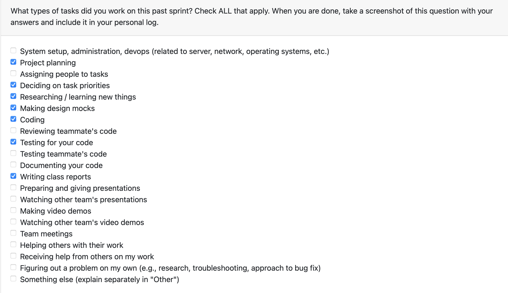
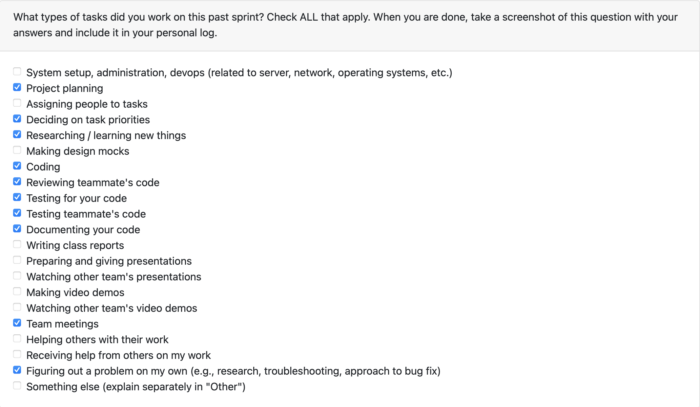

## **Dylan Weekly Log**

### **Week 3: September 14th - September 21st**

 **Tasks worked on:**

**Weekly Goals Recap**

This week, our team created a rough draft of functional and non-functional requirements for our project. We then shared what we had with other groups in class and exhanged ideas in order to refine and expand on our ideas. 

### **Week 4: September 22nd - September 28th**

 **Tasks worked on:**

**Weekly Goals Recap**

This week, our team produced a system architecture diagram and gathered feedback from other groups. Using this feedback, we've refined our ideas about the project. 

We've also been working on a project proposal document that clearly lays out the project scope, our proposed solution, use cases, requirements and testing. I will be working on drafting both positive and negative test cases for each requirement.

### **Week 5: September 29th - October 5th**

 **Tasks worked on:**

**Weekly Goals Recap**

This week, our team produced a data flow diagram and exchanged them with other groups in class. We offered feedback to the other groups, and they gave us feedback on our DFD diagram in return. We've taken this feedback and gained some valuable insights into how data will flow through our system and how different processes will interact.

### **Week 6: October 6th - October 12th**

 **Tasks worked on:**

**Weekly Goals Recap**

This week, our team held discussions over Discord in order to finalize our system architecture designs and will be providing links in our repositories README. 

As for myself, this week I made a PR establishing an initial skeleton setup and basic test framework for our project. This included making a comprehensive .gitignore, establishing the required folder structure, as well as initializing pytest. It's very basic, but it gives us a good place to start building.

### **Week 7: October 13th - October 19th**

 **Tasks worked on**

**Weekly Goals Recap**

My goal this week was to create a ConfigManager class to store user configurations. I began by subdividing this task into subissues, thinking through how this class should fit within our system. This was a bit tricky since we are still in the very early stages of development. 

I was able to complete the ConfigManager this week. I'm particularly happy that ConfigManager is capable of storing complex data types by using JSON serialization/deserialization. I was originally thinking I'd use pickling but using JSON made more sense.

[Link to PR: Implement ConfigManager for storing user configurations](https://github.com/COSC-499-W2025/capstone-project-team-20/pull/74)

I also did some code review on the following PRs

[Link to PR: Implement chronological list of skills exercised](https://github.com/COSC-499-W2025/capstone-project-team-20/pull/78)

[Link to PR: Feature/consent manager](https://github.com/COSC-499-W2025/capstone-project-team-20/pull/77)

**Goals for the Week Ahead**

Next week, I'm planning on working on storing project information in the database. I think this should be an achievable goal. I think the main problem I'll run into is trying to decide what information we need to store, but perfect is the enemy of progress.
