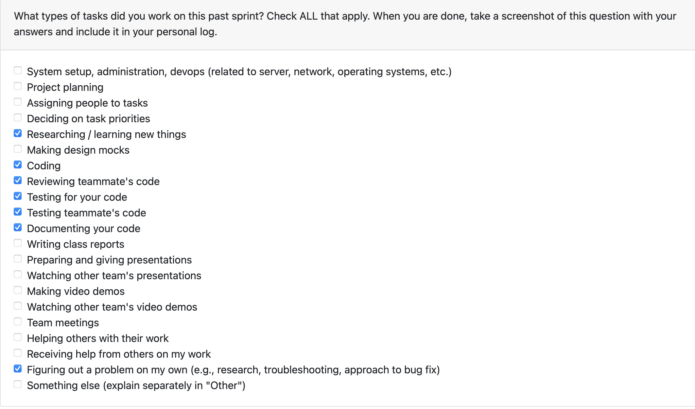
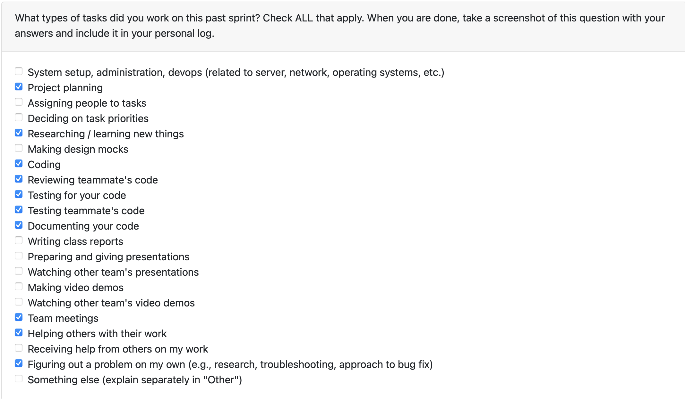
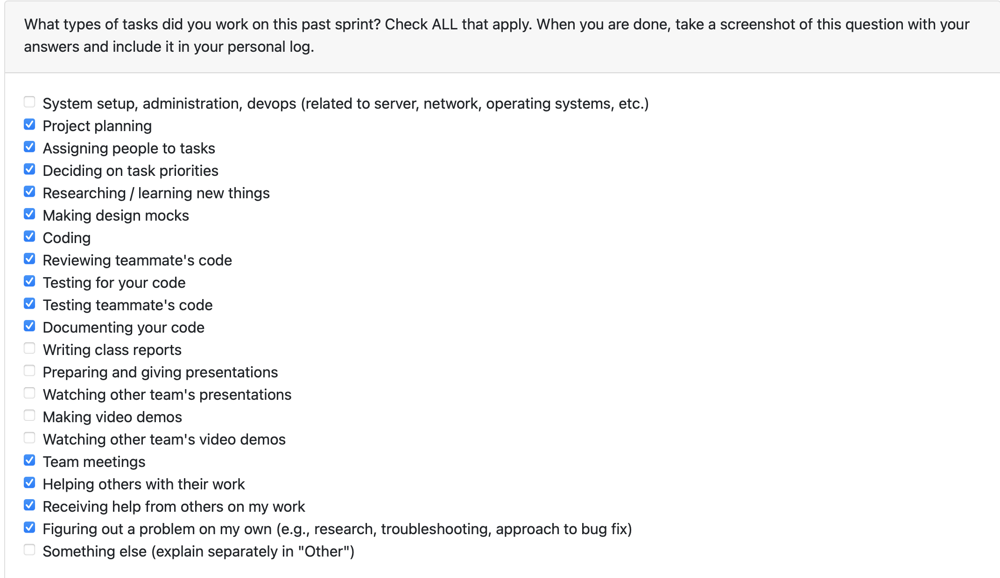
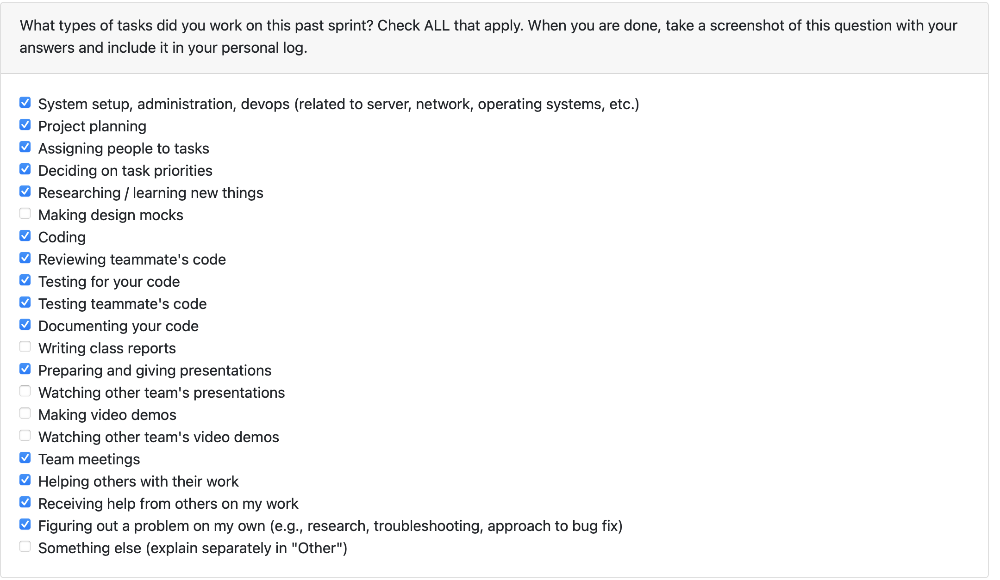

## **Dylan Weekly Log**

### **Week 3: September 14th - September 21st**

 **Tasks worked on:**

**Weekly Goals Recap**

This week, our team created a rough draft of functional and non-functional requirements for our project. We then shared what we had with other groups in class and exhanged ideas in order to refine and expand on our ideas. 

### **Week 4: September 22nd - September 28th**

 **Tasks worked on:**

**Weekly Goals Recap**

This week, our team produced a system architecture diagram and gathered feedback from other groups. Using this feedback, we've refined our ideas about the project. 

We've also been working on a project proposal document that clearly lays out the project scope, our proposed solution, use cases, requirements and testing. I will be working on drafting both positive and negative test cases for each requirement.

### **Week 5: September 29th - October 5th**

 **Tasks worked on:**

**Weekly Goals Recap**

This week, our team produced a data flow diagram and exchanged them with other groups in class. We offered feedback to the other groups, and they gave us feedback on our DFD diagram in return. We've taken this feedback and gained some valuable insights into how data will flow through our system and how different processes will interact.

### **Week 6: October 6th - October 12th**

 **Tasks worked on:**

**Weekly Goals Recap**

This week, our team held discussions over Discord in order to finalize our system architecture designs and will be providing links in our repositories README. 

As for myself, this week I made a PR establishing an initial skeleton setup and basic test framework for our project. This included making a comprehensive .gitignore, establishing the required folder structure, as well as initializing pytest. It's very basic, but it gives us a good place to start building.

### **Week 7: October 13th - October 19th**

 **Tasks worked on**

**Weekly Goals Recap**

My goal this week was to create a ConfigManager class to store user configurations. I began by subdividing this task into subissues, thinking through how this class should fit within our system. This was a bit tricky since we are still in the very early stages of development. 

I was able to complete the ConfigManager this week. I'm particularly happy that ConfigManager is capable of storing complex data types by using JSON serialization/deserialization. I was originally thinking I'd use pickling but using JSON made more sense.

[Link to PR: Implement ConfigManager for storing user configurations](https://github.com/COSC-499-W2025/capstone-project-team-20/pull/74)

I also did some code review on the following PRs

[Link to PR: Implement chronological list of skills exercised](https://github.com/COSC-499-W2025/capstone-project-team-20/pull/78)

[Link to PR: Feature/consent manager](https://github.com/COSC-499-W2025/capstone-project-team-20/pull/77)

**Goals for the Week Ahead**

Next week, I'm planning on working on storing project information in the database. I think this should be an achievable goal. I think the main problem I'll run into is trying to decide what information we need to store, but perfect is the enemy of progress.

### **Week 8: October 20th - October 26th**

**Tasks worked on** 

**Weekly Goals Recap**

My goal this week was to store a user’s project information into the database. In order to do that, I had to refactor ConfigManager into a StorageManager base class. This refactoring took me a significant amount of time, but I’m very happy with the results. After doing that, implementing the Project dataclass and ProjectManager was smooth sailing. It’s now completely trivial to store any JSON serializable fields into any schema we setup. 

**Pull Requests I made this week**

[Link to PR: Refactor ConfigManager to inherit from StorageManager](https://github.com/COSC-499-W2025/capstone-project-team-20/pull/93)

[Link to PR: Implement Project Dataclass](https://github.com/COSC-499-W2025/capstone-project-team-20/pull/105)

[Link to PR: Implement ProjectManager](https://github.com/COSC-499-W2025/capstone-project-team-20/pull/106)

[Link to PR: Add Docstrings to Database Manager Classes](https://github.com/COSC-499-W2025/capstone-project-team-20/pull/109)

**Code Review I did this week**

[Link to PR: Feature/project language detection](https://github.com/COSC-499-W2025/capstone-project-team-20/pull/84)

[Link to PR: Create ProjectFile Node Class](https://github.com/COSC-499-W2025/capstone-project-team-20/pull/85)

[Link to PR: Include ability to traverse git repos for authorship count](https://github.com/COSC-499-W2025/capstone-project-team-20/pull/101)

[Link to PR: Feature/chronological timeline](https://github.com/COSC-499-W2025/capstone-project-team-20/pull/107)

[Link to PR: Feature/extract project metadata](https://github.com/COSC-499-W2025/capstone-project-team-20/pull/102)

**Goals for the Week Ahead**

I’ve been doing some research on how using machine learning might help us fulfill all requirements for Milestone 1. For example we could utilise it to distinguish between different project types (web apps, Unity games, etc.). Next week I’d really like to try and start working on this. I have a feeling that running a random forest algorithm on detected projects would be promising. But I don’t want to get too ahead of myself. 

The first step would be gathering and storing the metadata in a format that a ML model could accept. I’ve devised a Project dataclass this week that would be perfect for storing this metadata, and the GitRepoAnalyzer Sven recently PR’d does a great job at grabbing some relevant metadata. Ditto for Branden’s contribution this week. We would just need to adjust the Project table schema, and instantiate and set the values for the Project objects once they’re found in the GitRepoAnalyzer. 

Here's an issue I've made as a first step for my week ahead: [Link to issue: Prepare project metadata for use with machine learning](https://github.com/orgs/COSC-499-W2025/projects/9/views/1?pane=issue&itemId=135645498&issue=COSC-499-W2025%7Ccapstone-project-team-20%7C120)

### **Week 9: October 27th - November 2nd**

**Tasks worked on** 

**Weekly Goals Recap**

My goals for this week shifted pretty drastically soon after my last log entry. Though I did still accomplish a task that will be relevant for it (restructuring Project schema). However, with Joy suddenly dropping out of our team, I took on her task of language detection. Since this is a non-negotiable to have before implementing ML in my view. I successfully implemented the language detector this week, and it gets pretty close to what GitHub detects from my manual testing! 

After that, I decided to look into making the ZIP Parser more robust. It was pretty particular about the ZIP files it would accept. Troubleshooting this took quite a bit of time since this was the first time I had interacted with that part of our system. After manually debugging by printing out the filepath of every file until it broke, I found the culprit. If a file appeared before its parent folder in the ZIP archive’s central directory, or the parent folder was missing entirely, the parser would break. To fix this, I added logic to synthetically create a folder, so that a file with a previously unseen directory in it's file path had somewhere to go, and no longer broke the parser. While I was there I also refactored some duplicated code into it's own method.

Besides that, I also made a small PR to take Kaan's advice to use streaming for the StorageManager's get_all method to improve the system's efficiency.

**Pull Requests I made this week**

[Restructured Project Schema](https://github.com/COSC-499-W2025/capstone-project-team-20/pull/132)
[Refactor language_detector and Extend Language Map](https://github.com/COSC-499-W2025/capstone-project-team-20/pull/138)
[Refactor StorageManager get_all() to return a Generator](https://github.com/COSC-499-W2025/capstone-project-team-20/pull/140)
[Add get_all() and get_all_as_dict() to ProjectManager](https://github.com/COSC-499-W2025/capstone-project-team-20/pull/141)
[Concrete Implementation of Language Detector](https://github.com/COSC-499-W2025/capstone-project-team-20/pull/144)
[Implement ZipParser Handling For Missing Parent Folders and Empty Directories](https://github.com/COSC-499-W2025/capstone-project-team-20/pull/150)

**Code Review I did this week**

[Feature/classify and compute contribution metrics](https://github.com/COSC-499-W2025/capstone-project-team-20/pull/145)
[feat: Basic document handling & extraction](https://github.com/COSC-499-W2025/capstone-project-team-20/pull/153)

**Goals for the Week Ahead**

I've got several midterms this upcoming week, so I'm aiming to be realistic in what I plan to accomplish. I've accounted for this by making sure to really pull my own weight and then some over the last few weeks. 

I think we're getting quite close to combining our individual modules into one comprehensive system. I know others in the team are taking a look at that this week, so in order not to step on their toes I think I'll compile some repositories to train the ML model on. I'm thinking I'll start on project classification (i.e. judging what a project is for). For now I'm just going to work on the initial steps to this and see how that goes.

### **Week 12: November 17th - November 23rd**

**Tasks worked on** 

**Weekly Goals Recap**

My goals for this week were to add a mechanism for batch analyzing repositories from my compiled CSV dataset. I ran into more problems with this than I thought I would. I hadn't really considered how much work it would take to get our system, which accepts one zip path at a time, to allow batch analysis. After individually downloading each repo onto my computer, I then found out that our system requires a .git folder to be present in the zip. So I wrote a script to clone each repository locally. Then another to delete each repo after analysis (as this would take up absurd amounts of space). Then I discovered I'd also need to zip each cloned repo for our system to accept it. This whole process ended up turning into a week-long ordeal. But by the end I created a 4-step workflow of 1. clone_repos 2. zip_repos 3. analyze_repos 4. wipe_repos. I'm very happy with the end result.

Besides that, I did some other work around the project, including making our load_zip logic much more robust and filtering out non-human readable files from project-tree output.

**Pull Requests I made this week**

[Add Repo Dataset](https://github.com/COSC-499-W2025/capstone-project-team-20/pull/191)

[Feature/clone and wipe repos ](https://github.com/COSC-499-W2025/capstone-project-team-20/pull/192)

[Filter Unwanted Files in ZipParser Tree Generation](https://github.com/COSC-499-W2025/capstone-project-team-20/pull/196)

[fix: make load_zip more robust](https://github.com/COSC-499-W2025/capstone-project-team-20/pull/201)

[Implement zip_repos and analyze_repos](https://github.com/COSC-499-W2025/capstone-project-team-20/pull/212)

**Code Review I did this week**

[Feature/code metrics analyzer](https://github.com/COSC-499-W2025/capstone-project-team-20/pull/206)

[feat: User Selection and Configuration from Git History](https://github.com/COSC-499-W2025/capstone-project-team-20/pull/208)

**Goals for the Week Ahead**

My main focus this week is still working on ML project classification (i.e. judging what a project is for). Earlier this week I got all of our analysis together and realized I didn't have as much as I thought we did. There's been quite a few PR's made so I could take a look at what we have now. But I am guessing it'll be a lot of running around the project, adding variables to the Project class, trying to gather the data I'll need for a model to be useful. 

Also, I realized my first implementation of the Repo dataset was extremely primitive (I didn't need to be selecting them by hand). I've since learned GitHub exposes a 'topics' API that I could use to make the process much more pain-free. I'll probably expand that dataset now that I know it doesn't need to take hours of manual data entry. 

### **Week 13: November 24th - November 30th**

**Tasks worked on** 

**Weekly Goals Recap**

This week, our whole team was pretty focused on making our project more cohesive as a unit. There was inevitably a lot of room for improvement in this area, which is only natural. I'm really very happy with the work that we put in as a team. Quite proud of what we've got going into this milestone. I think our system is quite robust for the development stage we're in. Looking forward to presenting what we've got to the class. 

My contributions to this big-push was adding mechanisms for the display, storage, retrieval, and deletion of generated resume insights. This needed to be done in order to satisfy 2 of the 20 requirements for Milestone #1, so that had to be prioritized for the time being. Additionally, I wrote a CI Github Actions script that automatically runs our pytest suite on every pull request. 

Besides the couple PRs I made, I think my main contribution to the team was in reviewing code. Due to the sheer number of pull requests that were made, I did my best to review as many as time allowed for. I felt that this is where I could be the most helpful, as my ML implementation would not be done by this Sunday either way.

**Pull Requests I made this week**

[Store, Print, Retrieve, Delete Resume Insights](https://github.com/COSC-499-W2025/capstone-project-team-20/pull/248)

[Add ci workflow for pytest ](https://github.com/COSC-499-W2025/capstone-project-team-20/pull/235)

**Code Review I did this week**

[Fixed new implementation for resume insights generator](https://github.com/COSC-499-W2025/capstone-project-team-20/pull/232)

[Feature/cli skill analysis](https://github.com/COSC-499-W2025/capstone-project-team-20/pull/210)

[feat: Aggregate users share of contribution based on LOC](https://github.com/COSC-499-W2025/capstone-project-team-20/pull/209)

[Feature/skill evidence analyzer](https://github.com/COSC-499-W2025/capstone-project-team-20/pull/207)

[auto assign workflow attempt](https://github.com/COSC-499-W2025/capstone-project-team-20/pull/255)

[Added in full project storage to database.](https://github.com/COSC-499-W2025/capstone-project-team-20/pull/254)

[feat: Project ranker + individual contrib store + summaries](https://github.com/COSC-499-W2025/capstone-project-team-20/pull/253)

[UPDATED: Fixed a bug where improper test counts were showing](https://github.com/COSC-499-W2025/capstone-project-team-20/pull/251)

[Feature/framework detection](https://github.com/COSC-499-W2025/capstone-project-team-20/pull/236)

[Bug/skill overanalysis](https://github.com/COSC-499-W2025/capstone-project-team-20/pull/243)

**Goals for the Week Ahead**

If time allows I'd like to get my ML project classification done by the end of next week. Of course, I will have to temper my expectations, as this last week of school is looking quite busy. Having at least a first pass in main would be nice, given how long I've devoted to this specific topic. The whole process has been a pretty entertaining cycle of working on that -> realize we're not storing enough analysis for it to be useful -> go help out elsewhere in the project to try and fix that problem -> repeat. But such is the nature of software development!