## **Dylan Weekly Log**

### **Table of Contents:**

- [Term 2 Week 12: March 23rd - March 29th](#term-2-week-12-march-23rd---march-29th)
- [Term 2 Week 11: March 16th - March 22nd](#term-2-week-11-march-16th---march-22nd)
- [Term 2 Week 10: March 9th - March 15th](#term-2-week-10-march-9th---march-15th)
- [Term 2 Week 9: March 2nd - March 8th](#term-2-week-9-march-2nd---march-8th)
- [Term 2 Week 8: February 23rd - March 1st](#term-2-week-8-february-23rd---march-1st)
- [Term 2 Week 7: February 16th - February 22nd](#term-2-week-7-february-16th---february-22nd)
- [Term 2 Week 6: February 9th - February 15th](#term-2-week-6-february-9th---february-15th)
- [Term 2 Week 5: February 2nd - February 8th](#term-2-week-5-february-2nd---february-8th)
- [Term 2 Week 4: January 26th - February 1st](#term-2-week-4-january-26th---february-1st)
- [Term 2 Week 3: January 19th - January 26th](#term-2-week-3-january-19th---january-25th)
- [Term 2 Week 2: January 12th - January 18th](#term-2-week-2-january-12th---january-18th)
- [Term 1 Week 14: December 1st - December 7th](#term-1-week-14-december-1st---december-7th)
- [Term 1 Week 13: November 24th - November 30th](#term-1-week-13-november-24th---november-30th)
- [Term 1 Week 12: November 17th - November 23rd](#term-1-week-12-november-17th---november-23rd)
- [Term 1 Week 9: October 27th - November 2nd](#term-1-week-9-october-27th---november-2nd)
- [Term 1 Week 8: October 20th - October 26th](#term-1-week-8-october-20th---october-26th)
- [Term 1 Week 7: October 13th - October 19th](#term-1-week-7-october-13th---october-19th)
- [Term 1 Week 6: October 6th - October 12th](#term-1-week-6-october-6th---october-12th)
- [Term 1 Week 5: September 29th - October 5th](#term-1-week-5-september-29th---october-5th)
- [Term 1 Week 4: September 22nd - September 28th](#term-1-week-4-september-22nd---september-28th)
- [Term 1 Week 3: September 14th - September 21st](#term-1-week-3-september-14th---september-21st)

### Term 1 Week 3: September 14th - September 21st

 **Tasks worked on:**

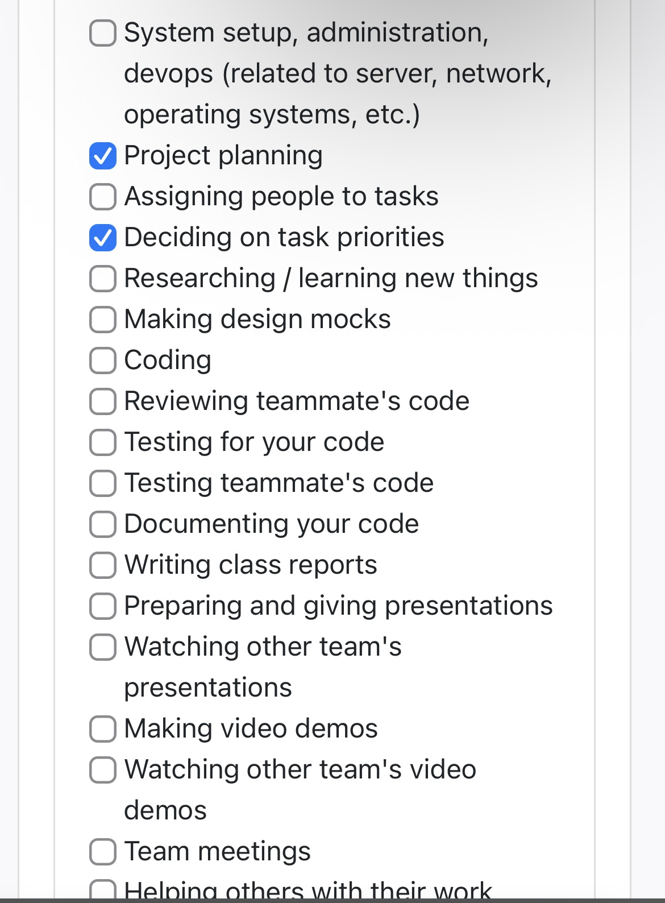

**Weekly Goals Recap**

This week, our team created a rough draft of functional and non-functional requirements for our project. We then shared what we had with other groups in class and exhanged ideas in order to refine and expand on our ideas. 

### Term 1 Week 4: September 22nd - September 28th

 **Tasks worked on:**

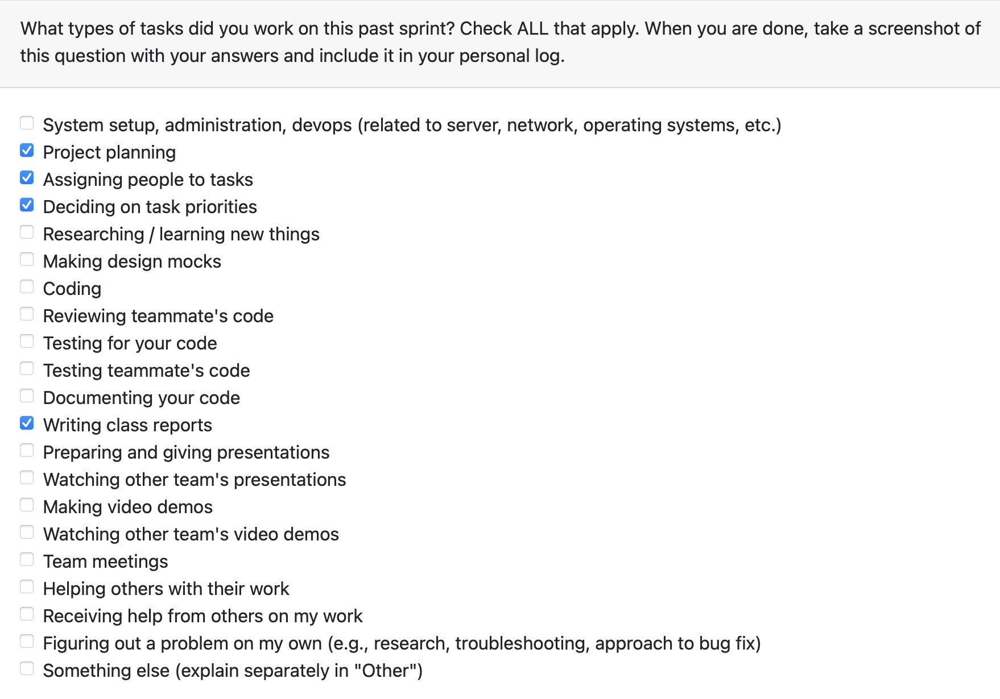

**Weekly Goals Recap**

This week, our team produced a system architecture diagram and gathered feedback from other groups. Using this feedback, we've refined our ideas about the project. 

We've also been working on a project proposal document that clearly lays out the project scope, our proposed solution, use cases, requirements and testing. I will be working on drafting both positive and negative test cases for each requirement.

### Term 1 Week 5: September 29th - October 5th

 **Tasks worked on:**

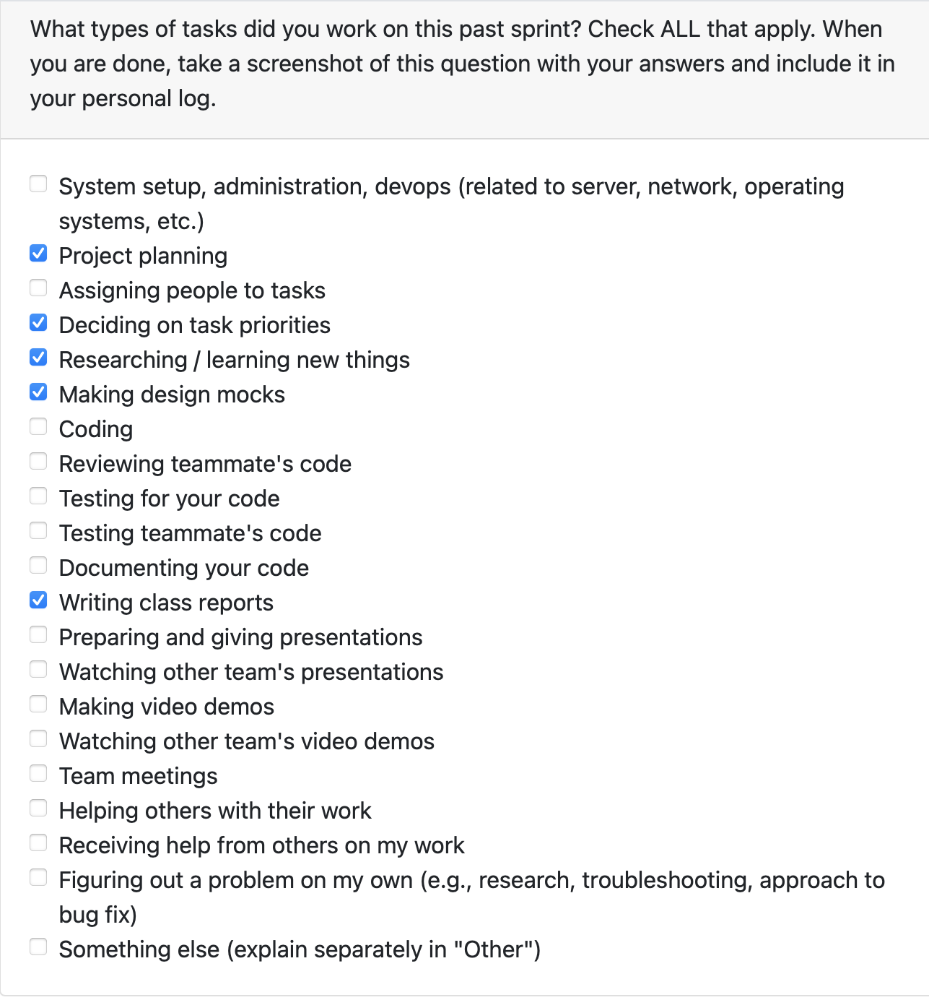

**Weekly Goals Recap**

This week, our team produced a data flow diagram and exchanged them with other groups in class. We offered feedback to the other groups, and they gave us feedback on our DFD diagram in return. We've taken this feedback and gained some valuable insights into how data will flow through our system and how different processes will interact.

### Term 1 Week 6: October 6th - October 12th

 **Tasks worked on:**

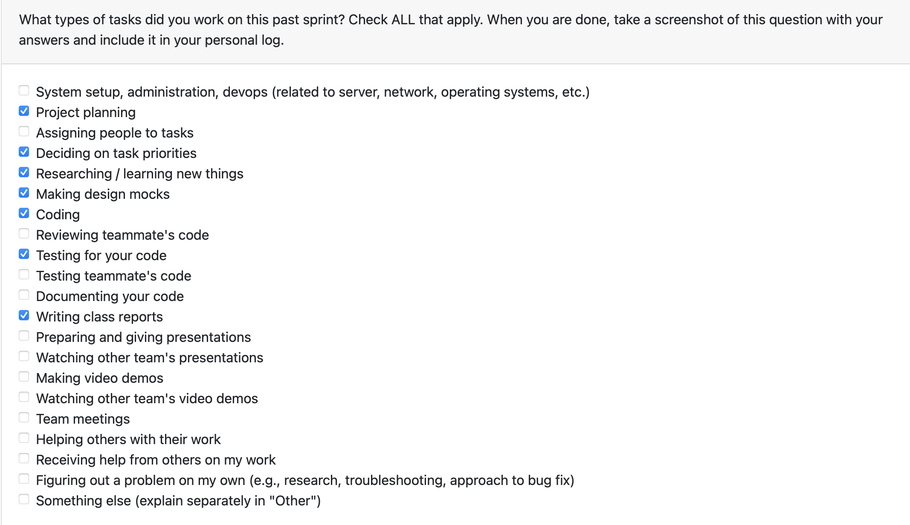

**Weekly Goals Recap**

This week, our team held discussions over Discord in order to finalize our system architecture designs and will be providing links in our repositories README. 

As for myself, this week I made a PR establishing an initial skeleton setup and basic test framework for our project. This included making a comprehensive .gitignore, establishing the required folder structure, as well as initializing pytest. It's very basic, but it gives us a good place to start building.

### Term 1 Week 7: October 13th - October 19th

 **Tasks worked on**

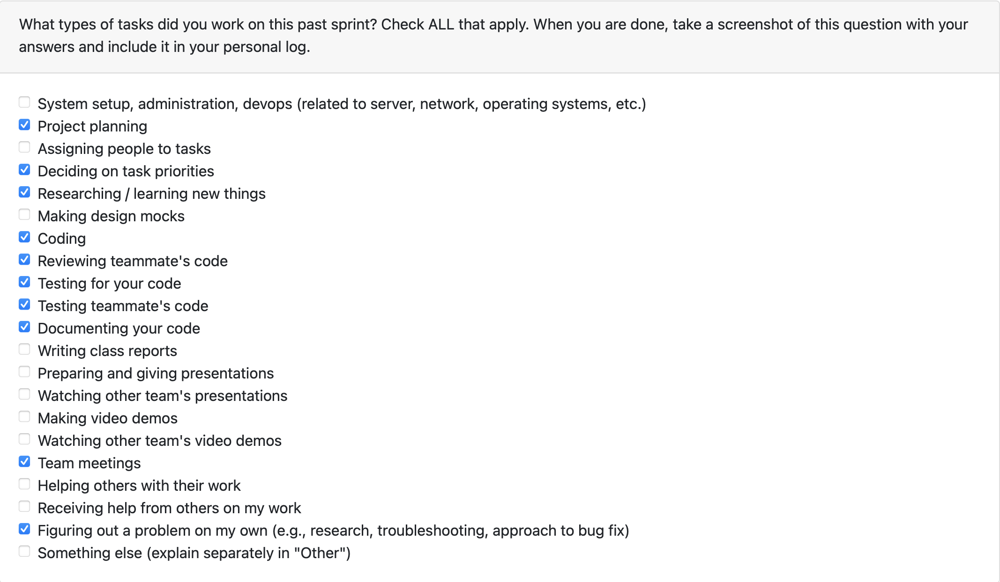

**Weekly Goals Recap**

My goal this week was to create a ConfigManager class to store user configurations. I began by subdividing this task into subissues, thinking through how this class should fit within our system. This was a bit tricky since we are still in the very early stages of development. 

I was able to complete the ConfigManager this week. I'm particularly happy that ConfigManager is capable of storing complex data types by using JSON serialization/deserialization. I was originally thinking I'd use pickling but using JSON made more sense.

[Link to PR: Implement ConfigManager for storing user configurations](https://github.com/COSC-499-W2025/capstone-project-team-20/pull/74)

I also did some code review on the following PRs

[Link to PR: Implement chronological list of skills exercised](https://github.com/COSC-499-W2025/capstone-project-team-20/pull/78)

[Link to PR: Feature/consent manager](https://github.com/COSC-499-W2025/capstone-project-team-20/pull/77)

**Goals for the Week Ahead**

Next week, I'm planning on working on storing project information in the database. I think this should be an achievable goal. I think the main problem I'll run into is trying to decide what information we need to store, but perfect is the enemy of progress.

### Term 1 Week 8: October 20th - October 26th

**Tasks worked on** 

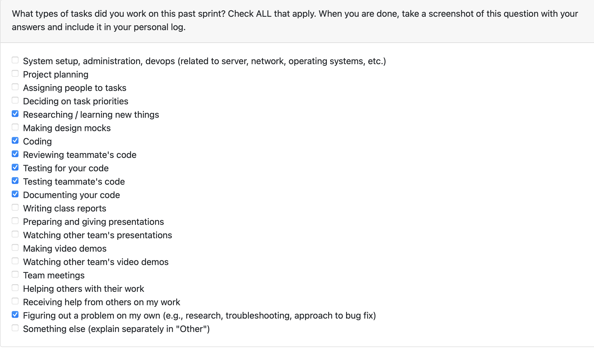

**Weekly Goals Recap**

My goal this week was to store a user’s project information into the database. In order to do that, I had to refactor ConfigManager into a StorageManager base class. This refactoring took me a significant amount of time, but I’m very happy with the results. After doing that, implementing the Project dataclass and ProjectManager was smooth sailing. It’s now completely trivial to store any JSON serializable fields into any schema we setup. 

**Pull Requests I made this week**

[Link to PR: Refactor ConfigManager to inherit from StorageManager](https://github.com/COSC-499-W2025/capstone-project-team-20/pull/93)

[Link to PR: Implement Project Dataclass](https://github.com/COSC-499-W2025/capstone-project-team-20/pull/105)

[Link to PR: Implement ProjectManager](https://github.com/COSC-499-W2025/capstone-project-team-20/pull/106)

[Link to PR: Add Docstrings to Database Manager Classes](https://github.com/COSC-499-W2025/capstone-project-team-20/pull/109)

**Code Review I did this week**

[Link to PR: Feature/project language detection](https://github.com/COSC-499-W2025/capstone-project-team-20/pull/84)

[Link to PR: Create ProjectFile Node Class](https://github.com/COSC-499-W2025/capstone-project-team-20/pull/85)

[Link to PR: Include ability to traverse git repos for authorship count](https://github.com/COSC-499-W2025/capstone-project-team-20/pull/101)

[Link to PR: Feature/chronological timeline](https://github.com/COSC-499-W2025/capstone-project-team-20/pull/107)

[Link to PR: Feature/extract project metadata](https://github.com/COSC-499-W2025/capstone-project-team-20/pull/102)

**Goals for the Week Ahead**

I’ve been doing some research on how using machine learning might help us fulfill all requirements for Milestone 1. For example we could utilise it to distinguish between different project types (web apps, Unity games, etc.). Next week I’d really like to try and start working on this. I have a feeling that running a random forest algorithm on detected projects would be promising. But I don’t want to get too ahead of myself. 

The first step would be gathering and storing the metadata in a format that a ML model could accept. I’ve devised a Project dataclass this week that would be perfect for storing this metadata, and the GitRepoAnalyzer Sven recently PR’d does a great job at grabbing some relevant metadata. Ditto for Branden’s contribution this week. We would just need to adjust the Project table schema, and instantiate and set the values for the Project objects once they’re found in the GitRepoAnalyzer. 

Here's an issue I've made as a first step for my week ahead: [Link to issue: Prepare project metadata for use with machine learning](https://github.com/orgs/COSC-499-W2025/projects/9/views/1?pane=issue&itemId=135645498&issue=COSC-499-W2025%7Ccapstone-project-team-20%7C120)

### Term 1 Week 9: October 27th - November 2nd

**Tasks worked on** 

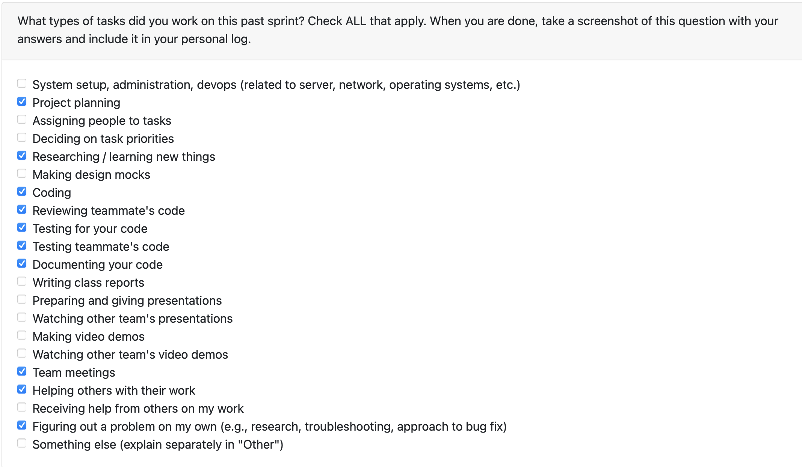

**Weekly Goals Recap**

My goals for this week shifted pretty drastically soon after my last log entry. Though I did still accomplish a task that will be relevant for it (restructuring Project schema). However, with Joy suddenly dropping out of our team, I took on her task of language detection. Since this is a non-negotiable to have before implementing ML in my view. I successfully implemented the language detector this week, and it gets pretty close to what GitHub detects from my manual testing! 

After that, I decided to look into making the ZIP Parser more robust. It was pretty particular about the ZIP files it would accept. Troubleshooting this took quite a bit of time since this was the first time I had interacted with that part of our system. After manually debugging by printing out the filepath of every file until it broke, I found the culprit. If a file appeared before its parent folder in the ZIP archive’s central directory, or the parent folder was missing entirely, the parser would break. To fix this, I added logic to synthetically create a folder, so that a file with a previously unseen directory in it's file path had somewhere to go, and no longer broke the parser. While I was there I also refactored some duplicated code into it's own method.

Besides that, I also made a small PR to take Kaan's advice to use streaming for the StorageManager's get_all method to improve the system's efficiency.

**Pull Requests I made this week**

[Restructured Project Schema](https://github.com/COSC-499-W2025/capstone-project-team-20/pull/132)
[Refactor language_detector and Extend Language Map](https://github.com/COSC-499-W2025/capstone-project-team-20/pull/138)
[Refactor StorageManager get_all() to return a Generator](https://github.com/COSC-499-W2025/capstone-project-team-20/pull/140)
[Add get_all() and get_all_as_dict() to ProjectManager](https://github.com/COSC-499-W2025/capstone-project-team-20/pull/141)
[Concrete Implementation of Language Detector](https://github.com/COSC-499-W2025/capstone-project-team-20/pull/144)
[Implement ZipParser Handling For Missing Parent Folders and Empty Directories](https://github.com/COSC-499-W2025/capstone-project-team-20/pull/150)

**Code Review I did this week**

[Feature/classify and compute contribution metrics](https://github.com/COSC-499-W2025/capstone-project-team-20/pull/145)
[feat: Basic document handling & extraction](https://github.com/COSC-499-W2025/capstone-project-team-20/pull/153)

**Goals for the Week Ahead**

I've got several midterms this upcoming week, so I'm aiming to be realistic in what I plan to accomplish. I've accounted for this by making sure to really pull my own weight and then some over the last few weeks. 

I think we're getting quite close to combining our individual modules into one comprehensive system. I know others in the team are taking a look at that this week, so in order not to step on their toes I think I'll compile some repositories to train the ML model on. I'm thinking I'll start on project classification (i.e. judging what a project is for). For now I'm just going to work on the initial steps to this and see how that goes.

### Term 1 Week 12: November 17th - November 23rd

**Tasks worked on** 

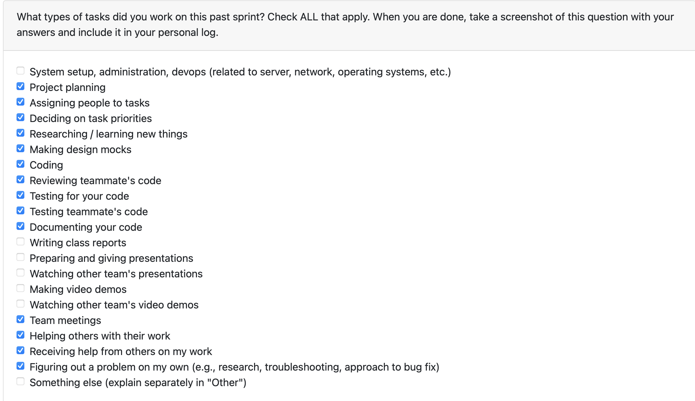

**Weekly Goals Recap**

My goals for this week were to add a mechanism for batch analyzing repositories from my compiled CSV dataset. I ran into more problems with this than I thought I would. I hadn't really considered how much work it would take to get our system, which accepts one zip path at a time, to allow batch analysis. After individually downloading each repo onto my computer, I then found out that our system requires a .git folder to be present in the zip. So I wrote a script to clone each repository locally. Then another to delete each repo after analysis (as this would take up absurd amounts of space). Then I discovered I'd also need to zip each cloned repo for our system to accept it. This whole process ended up turning into a week-long ordeal. But by the end I created a 4-step workflow of 1. clone_repos 2. zip_repos 3. analyze_repos 4. wipe_repos. I'm very happy with the end result.

Besides that, I did some other work around the project, including making our load_zip logic much more robust and filtering out non-human readable files from project-tree output.

**Pull Requests I made this week**

[Add Repo Dataset](https://github.com/COSC-499-W2025/capstone-project-team-20/pull/191)

[Feature/clone and wipe repos ](https://github.com/COSC-499-W2025/capstone-project-team-20/pull/192)

[Filter Unwanted Files in ZipParser Tree Generation](https://github.com/COSC-499-W2025/capstone-project-team-20/pull/196)

[fix: make load_zip more robust](https://github.com/COSC-499-W2025/capstone-project-team-20/pull/201)

[Implement zip_repos and analyze_repos](https://github.com/COSC-499-W2025/capstone-project-team-20/pull/212)

**Code Review I did this week**

[Feature/code metrics analyzer](https://github.com/COSC-499-W2025/capstone-project-team-20/pull/206)

[feat: User Selection and Configuration from Git History](https://github.com/COSC-499-W2025/capstone-project-team-20/pull/208)

**Goals for the Week Ahead**

My main focus this week is still working on ML project classification (i.e. judging what a project is for). Earlier this week I got all of our analysis together and realized I didn't have as much as I thought we did. There's been quite a few PR's made so I could take a look at what we have now. But I am guessing it'll be a lot of running around the project, adding variables to the Project class, trying to gather the data I'll need for a model to be useful. 

Also, I realized my first implementation of the Repo dataset was extremely primitive (I didn't need to be selecting them by hand). I've since learned GitHub exposes a 'topics' API that I could use to make the process much more pain-free. I'll probably expand that dataset now that I know it doesn't need to take hours of manual data entry. 

### Term 1 Week 13: November 24th - November 30th

**Tasks worked on** 

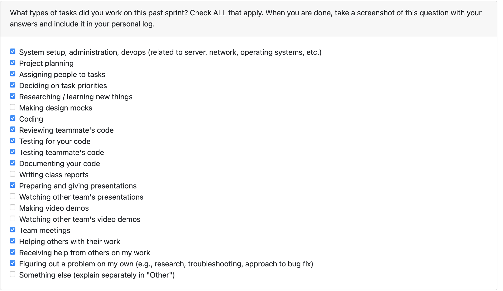

**Weekly Goals Recap**

This week, our whole team was pretty focused on making our project more cohesive as a unit. There was inevitably a lot of room for improvement in this area, which is only natural. I'm really very happy with the work that we put in as a team. Quite proud of what we've got going into this milestone. I think our system is quite robust for the development stage we're in. Looking forward to presenting what we've got to the class. 

My contributions to this big-push was adding mechanisms for the display, storage, retrieval, and deletion of generated resume insights. This needed to be done in order to satisfy 2 of the 20 requirements for Milestone #1, so that had to be prioritized for the time being. Additionally, I wrote a CI Github Actions script that automatically runs our pytest suite on every pull request. 

Besides the couple PRs I made, I think my main contribution to the team was in reviewing code. Due to the sheer number of pull requests that were made, I did my best to review as many as time allowed for. I felt that this is where I could be the most helpful, as my ML implementation would not be done by this Sunday either way.

**Pull Requests I made this week**

[Store, Print, Retrieve, Delete Resume Insights](https://github.com/COSC-499-W2025/capstone-project-team-20/pull/248)

[Add ci workflow for pytest ](https://github.com/COSC-499-W2025/capstone-project-team-20/pull/235)

**Code Review I did this week**

[Fixed new implementation for resume insights generator](https://github.com/COSC-499-W2025/capstone-project-team-20/pull/232)

[Feature/cli skill analysis](https://github.com/COSC-499-W2025/capstone-project-team-20/pull/210)

[feat: Aggregate users share of contribution based on LOC](https://github.com/COSC-499-W2025/capstone-project-team-20/pull/209)

[Feature/skill evidence analyzer](https://github.com/COSC-499-W2025/capstone-project-team-20/pull/207)

[auto assign workflow attempt](https://github.com/COSC-499-W2025/capstone-project-team-20/pull/255)

[Added in full project storage to database.](https://github.com/COSC-499-W2025/capstone-project-team-20/pull/254)

[feat: Project ranker + individual contrib store + summaries](https://github.com/COSC-499-W2025/capstone-project-team-20/pull/253)

[UPDATED: Fixed a bug where improper test counts were showing](https://github.com/COSC-499-W2025/capstone-project-team-20/pull/251)

[Feature/framework detection](https://github.com/COSC-499-W2025/capstone-project-team-20/pull/236)

[Bug/skill overanalysis](https://github.com/COSC-499-W2025/capstone-project-team-20/pull/243)

**Goals for the Week Ahead**

If time allows I'd like to get my ML project classification done by the end of next week. Of course, I will have to temper my expectations, as this last week of school is looking quite busy. Having at least a first pass in main would be nice, given how long I've devoted to this specific topic. The whole process has been a pretty entertaining cycle of working on that -> realize we're not storing enough analysis for it to be useful -> go help out elsewhere in the project to try and fix that problem -> repeat. But such is the nature of software development!

### Term 1 Week 14: December 1st - 7th

**Tasks worked on** 

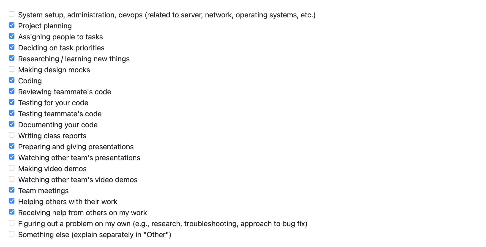

**Weekly Goals Recap**

This week, our team was focused on preparing for the Milestone #1 Deadline, which took priority over my specified goals for the week. Me and Sven spent a lot of time cleaning up our ProjectAnalyzer class, which had a lot of inefficiencies. Branden did a great job testing my PR for this, and was very helpful spotting bugs I didn't see. All in all, we pulled it all together and I'm very happy with our final product for Milestone #1. I'm happy enough to keep tinkering with ML over the winter break.

**Pull Requests I made this week**

[Restore and Update Language Detector](https://github.com/COSC-499-W2025/capstone-project-team-20/pull/264)

[Cleanup temp_dir creation in ProjectAnalyzer](https://github.com/COSC-499-W2025/capstone-project-team-20/pull/268)

**Code Review I did this week**

[feat: Correctly identify sub-projects within zip + RIG automation](https://github.com/COSC-499-W2025/capstone-project-team-20/pull/273)

[Moved print statement out of extract_metadata in the metadata extractor. Removed suppress_output methods and calls from project analyzer](https://github.com/COSC-499-W2025/capstone-project-team-20/pull/267)

[Feature/framework detection](https://github.com/COSC-499-W2025/capstone-project-team-20/pull/236)

**Goals for the Winter Break**

Sit back, relax and prepare for the new semester 😎

### Term 2 Week 2: January 12th - January 18th
**Screenshot of Tasks Worked On:**

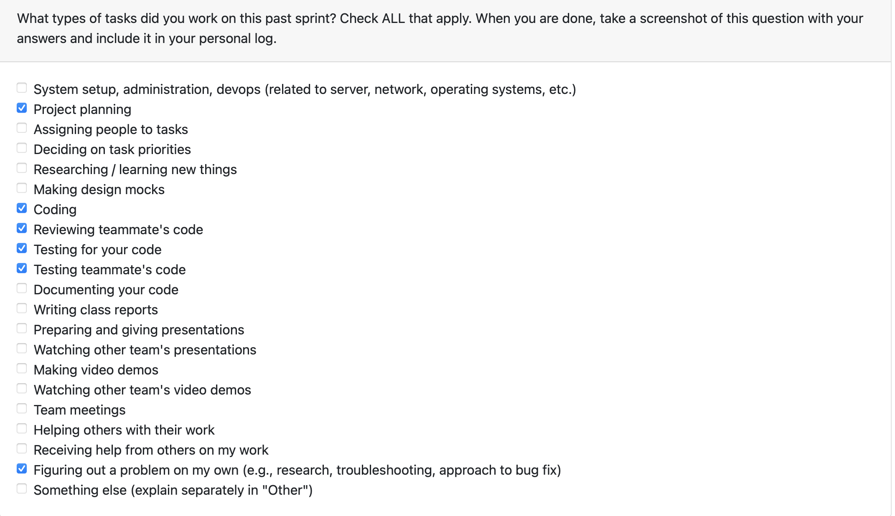

**Coding Tasks:**

Over the winter break, I decided to take on resume generation. In that time, I laid the groundwork for this by creating Report and ReportProject dataclasses, and ReportManager and ReportProjectManager manager classes. The next step was actually generating the resumes, which is what I've been working on this week. Unfortunately, I'm a bit in the weeds with the implementation here. As it involves a technology I was not previously familar with (LaTeX). Unfortunately, I won't be ready to PR my implementation this week. If anything, it will have to be next week. 

**Reviewing or Collaboration Tasks:**

I manually tested and reviewed the following PRs this week. 

[Feature/setup fast api](https://github.com/COSC-499-W2025/capstone-project-team-20/pull/311)

[fix: Correct the display of collab status within git analysis](https://github.com/COSC-499-W2025/capstone-project-team-20/pull/305)

[progressbar but awesome](https://github.com/COSC-499-W2025/capstone-project-team-20/pull/302)

**Brief Description of Last Week Connecting This Week:**

Over the break, I laid the groundwork for resume generation. My work this week continued this, although I don't yet have a PR to show for it.

**Plan/Goals for Upcoming Week:**

In the upcoming week, I want to have some initial resume generation functionality merged into main. 

**Any issues or Blockers That I Encountered This Week and How I Addressed/Plan to Address Them:**

My main blocker this week was my unfamiliarity with so much of the nitty gritty of resume generation. For example, LaTeX. Another example is the actual resume templates themselves. In all honesty, I am completely unfamiliar with what an industry standard resume might look like. What seperates a good resume from a bad one. Etc. It's not often I encounter so many roadblocks in my weekly quest to get a PR merged for this class, not that I'm looking for excuses. There's not much to address here, it's just led to me taking longer than I expected with this particular task.

### Term 2 Week 3: January 19th - January 25th
**Screenshot of Tasks Worked On:**

**Coding Tasks:**

This week I developed an incremental PR for the resume generation feature. Implementing the ReportExporter class, which will handle the exporting of Report objects to PDF format for resume/portfolio generation. 

[Feature/resume generator](https://github.com/COSC-499-W2025/capstone-project-team-20/pull/333)

**Testing or Debugging Tasks:**

I wrote extensive unit tests for my PR this week, linked above.

**Reviewing or Collaboration Tasks:**

I manually tested and reviewed the following PRs this week. 

[Mini Frontend!!!!!!!!](https://github.com/COSC-499-W2025/capstone-project-team-20/pull/331)

**Brief Description of Last Week Connecting This Week:**

This week, I completed the work that I started last week. Namely, implementing a LaTeX resume template, allowing for the input of dynamic variables (using Jinja2), and implementing the ReportExporter class which will enable resume generation. 

**Plan/Goals for Upcoming Week:**

In the upcoming week, I intend to continue working on the resume generation feature. The backbone for which is mainly set up now. I will just need to develop a way for the user to trigger a resume generation event in the ProjectAnalyzer class.

**Any issues or Blockers That I Encountered This Week and How I Addressed/Plan to Address Them:**

N/A

### Term 2 Week 4: January 26th - February 1st
**Screenshot of Peer Testing 1:**

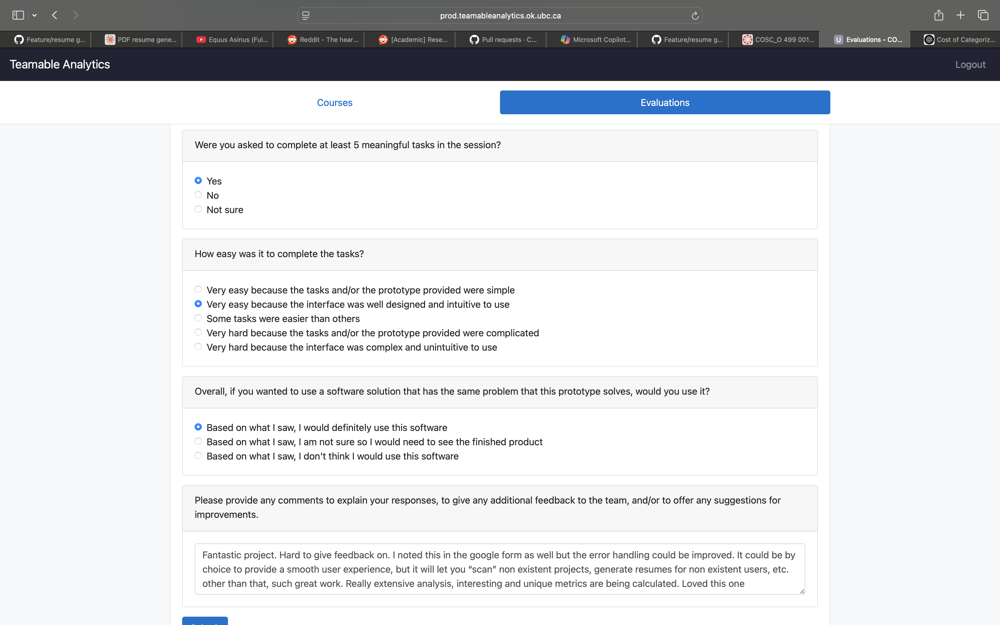
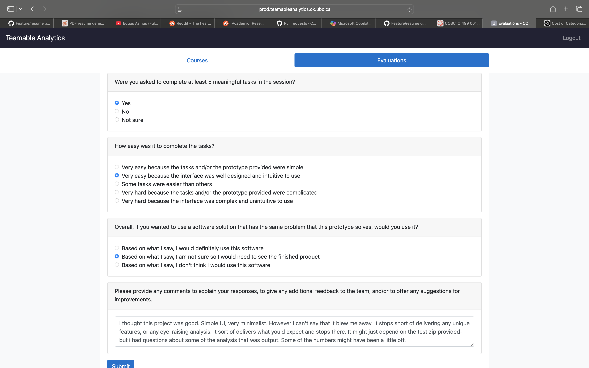

**Coding Tasks:**

This week I followed up on last week's incremental PR for the resume generation feature. Resume generation is now fully functional. Resumes can be generated from the ProjectAnalyzer menu (from an existing Report object), and exported to PDF.

[Feature/Resume Generation - 2](https://github.com/COSC-499-W2025/capstone-project-team-20/pull/348)

**Testing or Debugging Tasks:**

I wrote extensive unit tests for my PR this week, linked above.

**Reviewing or Collaboration Tasks:**

I manually tested and reviewed the following PRs this week. 

[Feature/edit info about portfolio items (M2 R27)](https://github.com/COSC-499-W2025/capstone-project-team-20/pull/340)

**Brief Description of Last Week Connecting This Week:**

Last week, I implemented a LaTeX resume template, allowing for the input of dynamic variables (using Jinja2), and implementing the ReportExporter class which will enable resume generation. 

This week I completed the resume generation feature, which is now fully functional. Resumes can now be generated and exported to PDF.

**Plan/Goals for Upcoming Week:**

In the upcoming week, I intend to add features that will allow the user to create Report objects, and set configs such as name, phone number, and email (both of which are prerequisites for generating a resume)

**Any issues or Blockers That I Encountered This Week and How I Addressed/Plan to Address Them:**

N/A

### Term 2 Week 5: February 2nd - February 8th

**Screenshot of Tasks Worked On:**

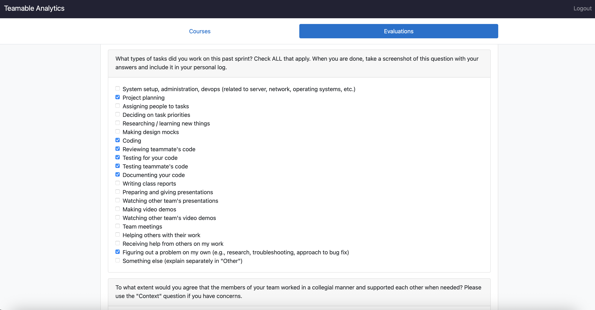

**Coding Tasks:**

This week I worked on two substantial PRs. The first focused on tidying up the resume generation process. While resume generation was fully functional, users could not yet create report objects in order to generate a resume. My first PR solved this issue. My second PR implemented thumbnail selection for a project, satisfying Milestone 2, Requirement 26.

[Associate Image as Thumbnail](https://github.com/COSC-499-W2025/capstone-project-team-20/pull/356)

[Feature/create report](https://github.com/COSC-499-W2025/capstone-project-team-20/pull/355)

**Testing or Debugging Tasks:**

I wrote extensive unit tests for my PR this week, linked above.

**Reviewing or Collaboration Tasks:**

I manually tested and reviewed the following PRs this week. 

[Feature/Fully Editing Resumes! (M2 R28)](https://github.com/COSC-499-W2025/capstone-project-team-20/pull/357)

[Feature/profile info edit](https://github.com/COSC-499-W2025/capstone-project-team-20/pull/353)

[Enhance badge engine with share normalization & badges](https://github.com/COSC-499-W2025/capstone-project-team-20/pull/352)

**Brief Description of Last Week Connecting This Week:**

Last week, I completed the resume generation feature, which is now fully functional. Resumes can now be generated and exported to PDF.

This week I tidied up the resume generation process. Users could not yet create report objects in order to generate a resume. I put up a PR solving this issue, and additionally, put up another PR implementing thumbnail selection for a project.

**Plan/Goals for Upcoming Week:**
In the upcoming week, I intend to add features that will allow for the deletion of Report objects, as well as bug hunting the Resume Generation process. I've made an issue for one crucial bug [Reports without Resume Insights are Still Created](https://github.com/orgs/COSC-499-W2025/projects/9?pane=issue&itemId=155415536&issue=COSC-499-W2025%7Ccapstone-project-team-20%7C358). So i'd like to fix that, as well as any others I encounter to really try and finalize this feature.

**Any issues or Blockers That I Encountered This Week and How I Addressed/Plan to Address Them:**

N/A

### Term 2 Week 6: February 9th - February 15th

**Coding Tasks:**

This week, I made two PRs. One implemented an integrated test suite to fully test the resume generation feature (including full LaTeX resume generation). The other implemented the deletion of report items.

[tests/create test_resume_gen_integration.py](https://github.com/COSC-499-W2025/capstone-project-team-20/pull/369)

[Feature/delete report](https://github.com/COSC-499-W2025/capstone-project-team-20/pull/373)

**Testing or Debugging Tasks:**

I wrote extensive unit tests for my PR this week, linked above.

**Reviewing or Collaboration Tasks:**

I manually tested and reviewed the following PRs this week. 

[Incremental ZIP Overriding Creation date fix](https://github.com/COSC-499-W2025/capstone-project-team-20/pull/374)

[ability to edit rankings and dates](https://github.com/COSC-499-W2025/capstone-project-team-20/pull/341)

**Brief Description of Last Week Connecting This Week:**

Last week, I tidied up the resume generation process, allowing users to create reports and select thumbnails for a project.

This week, I  implemented an integrated test suite to fully test the resume generation feature and the deletion of report items.

**Plan/Goals for Upcoming Week:**

As we have just about hit the requirements for Milestone 2, my plan for this week is to address some bugs that have been put on the backburner to try and polish our system.

**Any issues or Blockers That I Encountered This Week and How I Addressed/Plan to Address Them:**

N/A

### Term 2 Week 7: February 16th - February 22nd

**Coding Tasks:**

This week, I made four PRs. Each addressed pre-existing bugs in our system. This includes a fix for the progress bar, consolidating git contributors by email (removing duplicates), a check that reports cannot be created without previously generated resume insights for each project, and a fix that ensures and tests that projects are incrementally analyzed and not overwritten.

[fix: fix progress bar behaviour](https://github.com/COSC-499-W2025/capstone-project-team-20/pull/397)

[Fix/consolidate git contributors](https://github.com/COSC-499-W2025/capstone-project-team-20/pull/394)

[Fix/reports enforce resume insights](https://github.com/COSC-499-W2025/capstone-project-team-20/pull/392)

[Fix/incremental zips](https://github.com/COSC-499-W2025/capstone-project-team-20/pull/391)

**Testing or Debugging Tasks:**

I wrote extensive unit tests for my PR this week, linked above.

**Reviewing or Collaboration Tasks:**

I manually tested and reviewed the following PRs this week. 

[Frontend to backend integration for Projects (also deleted streamlit)](https://github.com/COSC-499-W2025/capstone-project-team-20/pull/389)

[Implement LaTex Portfolio Generator](https://github.com/COSC-499-W2025/capstone-project-team-20/pull/381)

**Brief Description of Last Week Connecting This Week:**

Last week, I implemented an integrated test suite to fully test the resume generation feature and the deletion of report items.

This week, I went bug hunting in preparation for Milestone 2 and it's presentation.

**Plan/Goals for Upcoming Week:**

As Milestone 2 approaches, I will look to remain flexible and help out however I can in finalizing our system for the Milestone. I believe some substantial PRs are coming tonight, so I'm not quite sure what this will look like yet. If nothing else jumps out at me, perhaps I'll help out integrating our React frontend with our backend.

**Any issues or Blockers That I Encountered This Week and How I Addressed/Plan to Address Them:**

N/A

### Term 2 Week 8: February 23rd - March 1st

**Screenshot of Tasks Worked On:**

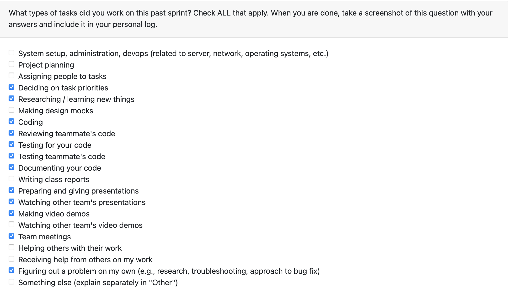

**Coding Tasks:**

This week, I made a PR implementing a new profile-setup page for the frontend. The feature checks if the user has stored necessary fields for report generation (name, phone, email). If they have, the page is bypassed. If they have not, this page allows them to enter the required information. 

Additionally, there were requested changes for my consolidate git contributors PR, so I spent quite a bit of time fixing that up as well.

[Profile Setup Page](https://github.com/COSC-499-W2025/capstone-project-team-20/pull/415)

[Fix/consolidate git contributors](https://github.com/COSC-499-W2025/capstone-project-team-20/pull/394)

**Testing or Debugging Tasks:**

I wrote extensive unit tests for my PR this week, linked above.

**Reviewing or Collaboration Tasks:**

I manually tested and reviewed the following PRs this week. 

[Compare Projects (Req23)](https://github.com/COSC-499-W2025/capstone-project-team-20/pull/410)

[Implemented run all analyzers to the frontend for portfolio/resume generation](https://github.com/COSC-499-W2025/capstone-project-team-20/pull/409)

Additionally, we had the Milestone 2 presentation this week, where I talked about Resume Generation. At the time of writing, we have not filmed our Milestone 2 video as a team. But I'll be helping out there as well.

**Brief Description of Last Week Connecting This Week:**

Last week, I went bug hunting in preparation for Milestone 2 and it's presentation.

This week, I added a page to our front-end, allowing the user to set required fields for report generation. (Profile Setup)

**Plan/Goals for Upcoming Week:**

Now that Milestone 2 is upon us, I would like to see the requirements for Milestone 3 before committing to anything in particular. However, I imagine I'll be continuing my work on the Frontend. 

**Any issues or Blockers That I Encountered This Week and How I Addressed/Plan to Address Them:**

N/A

### Term 2 Week 9: March 2nd - March 8th

**Screenshot of Tasks Worked On:**

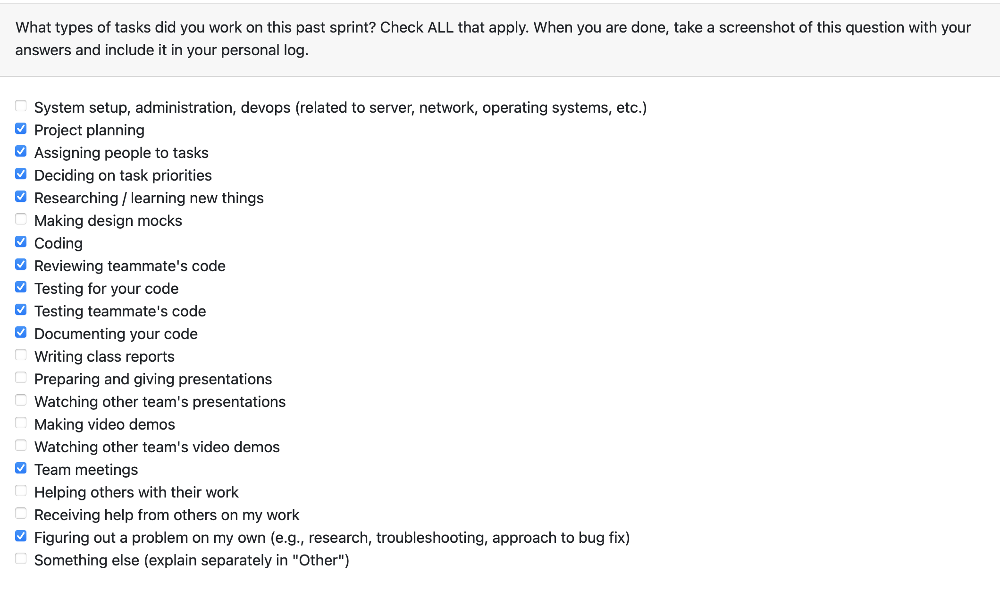

**Coding Tasks:**

This week, I made a PR implementing a new settings page for the frontend. This page has three submenus. 1. Profile, for users to change their name/email/phone/github/linkedin (all information displayed on resume/portfolios). 2. Privacy (gives users the option to grant/revoke consent) 3. Data (gives users the option to delete all stored project data). 

[Feature/settings page](https://github.com/COSC-499-W2025/capstone-project-team-20/pull/438)

**Testing or Debugging Tasks:**

I wrote extensive unit tests for my PR this week, linked above.

Additionally, I made a PR installing Vitest and React Testing Library, and another adding tests for my profile-setup page from last week, now that we have a frontend component testing framework.

[tests: install vitest and RTL](https://github.com/COSC-499-W2025/capstone-project-team-20/pull/431)

[tests: add tests for ProfileSetup.jsx](https://github.com/COSC-499-W2025/capstone-project-team-20/pull/437)

**Reviewing or Collaboration Tasks:**

I manually tested and reviewed the following PRs this week. 

[Add a Reports tab, merging resume and portfolio tabs](https://github.com/COSC-499-W2025/capstone-project-team-20/pull/436)

[Updated the consent requirement in our API and added more tests for full coverage](https://github.com/COSC-499-W2025/capstone-project-team-20/pull/428)

**Brief Description of Last Week Connecting This Week:**

Last week, I added a profile-setup page to our frontend, allowing the user to set required fields for report generation.

This week, I added a settings page to our frontend, allowing the user to edit required fields for report generation, as well as grant/revoke consent and clear all data. I also installed Vitest and React Testing Library so that we could start writing component tests for our frontend.

**Plan/Goals for Upcoming Week:**

The plan this week is to continue working on our frontend. As there are still no finalized Milestone 3 requirements, this would be my best guess as to what we should be focusing on. 

**Any issues or Blockers That I Encountered This Week and How I Addressed/Plan to Address Them:**

N/A

### Term 2 Week 10: March 9th - March 15th

**Screenshot of Tasks Worked On:**

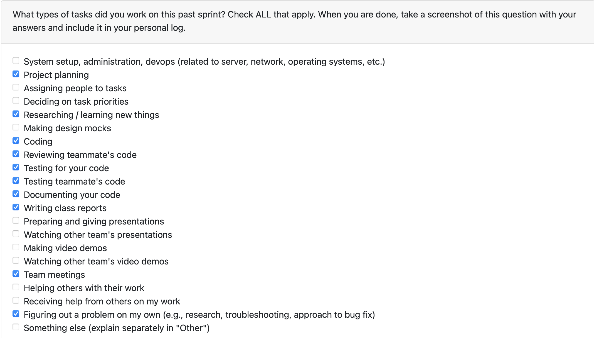

**Coding Tasks:**

This week, I spent an extensive amount of time hunting for inefficiencies in our analysis methods. Upload zip had been taking an absurd amount of time for quite a while. This included setting a timer for each method in the chain of method calls when uploading zips. I managed to get the total time taken from ~157 seconds to just ~15 seconds (with the zip i was using for testing).

I made a huge number of changes, all of which I've documented in my PRs below. But funnily enough, the lesson I've learned is to CACHE. EVERYTHING. Almost every major inefficiency had to do with writing/reading things one at a time.

[Performance/efficiency refactor](https://github.com/COSC-499-W2025/capstone-project-team-20/pull/453)
[Performance/refactor contribution analyzer](https://github.com/COSC-499-W2025/capstone-project-team-20/pull/455)

In addition, I did a few tasks related to our frontend, in an effort to get our frontend to an acceptable place in time for peer testing.

[Feature/prompt consent in frontend](https://github.com/COSC-499-W2025/capstone-project-team-20/pull/471)
[Feature/Design Resolve Contributors Modal](https://github.com/COSC-499-W2025/capstone-project-team-20/pull/475)

**Testing or Debugging Tasks:**

I wrote extensive frontend component tests for the following PRs.

[Feature/prompt consent in frontend](https://github.com/COSC-499-W2025/capstone-project-team-20/pull/471)
[Feature/Design Resolve Contributors Modal](https://github.com/COSC-499-W2025/capstone-project-team-20/pull/475)

In addition, I adjusted the affected unit tests related to my performance refactoring.

**Reviewing or Collaboration Tasks:**

I manually tested and reviewed the following PRs this week. 

[Fixed our merge conflicts that were in main.](https://github.com/COSC-499-W2025/capstone-project-team-20/pull/463)
[Split the reports tab into seperate ...](https://github.com/COSC-499-W2025/capstone-project-team-20/pull/465)
[Feature/portfolio web page](https://github.com/COSC-499-W2025/capstone-project-team-20/pull/447)
[Feature/badges frontend](https://github.com/COSC-499-W2025/capstone-project-team-20/pull/442)

**Brief Description of Last Week Connecting This Week:**

Last week, I added a settings page to our frontend, and installed Vitest and React Testing Library so that we could start writing component tests for our frontend.

This week, I spent an extensive amount of time hunting for inefficiencies in our analysis methods. I also added some interactive prompts in our frontend (prompting for consent, prompting to confirm cancellation of analysis), and designed and extended the "merge contributors" modal that Branden implemented.

**Plan/Goals for Upcoming Week:**

The plan this week is to continue working on our frontend to get it tidied up in time for Peer Testing, and ultimately Milestone 3.

**Any issues or Blockers That I Encountered This Week and How I Addressed/Plan to Address Them:**

N/A

### Term 2 Week 11: March 16th - March 22nd

**Coding Tasks:**

This week, I implemented live resume display and editing. Resumes are now recreated for the user in HTML, and are editable in place before the export to PDF is finalized. All changes are persisted to the database, so the user can come back to it. 

Additionally, I implemented a display feature in the Projects page, so that all stored project info is now displayed to the user. Previously, only the JSON representation of a project was being displayed. I tidied up the display to make it feel more intentional.

[Feature/project display](https://github.com/COSC-499-W2025/capstone-project-team-20/pull/492)

[Feature/live resume display and editing](https://github.com/COSC-499-W2025/capstone-project-team-20/pull/490)

**Testing or Debugging Tasks:**

I wrote extensive frontend component tests for the following PRs.

[Feature/project display](https://github.com/COSC-499-W2025/capstone-project-team-20/pull/492)

[Feature/live resume display and editing](https://github.com/COSC-499-W2025/capstone-project-team-20/pull/490)

**Reviewing or Collaboration Tasks:**

I manually tested and reviewed the following PRs this week. 

[Add report_kind to reports (resume|portfolio)](https://github.com/COSC-499-W2025/capstone-project-team-20/pull/494)

[Add badge heatmap UI and tests](https://github.com/COSC-499-W2025/capstone-project-team-20/pull/493)

[feat: Implemented private/public edit mode in frontend](https://github.com/COSC-499-W2025/capstone-project-team-20/pull/485)

[Feature/portfolio private public api](https://github.com/COSC-499-W2025/capstone-project-team-20/pull/484)

**Brief Description of Last Week Connecting This Week:**

Last week, I spent an extensive amount of time hunting for inefficiencies in our analysis methods. I also added some interactive prompts in our frontend (prompting for consent, prompting to confirm cancellation of analysis), and designed and extended the "merge contributors" modal that Branden implemented.

This week, I implemented live resume display and editing. Resumes are now recreated in HTML, and are editable in place before export to PDF. Additionally, I implemented a display feature in the Projects page, so that all stored project info is now displayed to the user.

**Plan/Goals for Upcoming Week:**

The plan for this week is to add the finishing touches to our project. I'll need to adjust the LaTeX template of our Resume to have an awards feature, and add a section in the frontend to add experience, education, and awards.

**Any issues or Blockers That I Encountered This Week and How I Addressed/Plan to Address Them:**

N/A

### Term 2 Week 12: March 23rd - March 29th

**Screenshot of Tasks Worked On:**

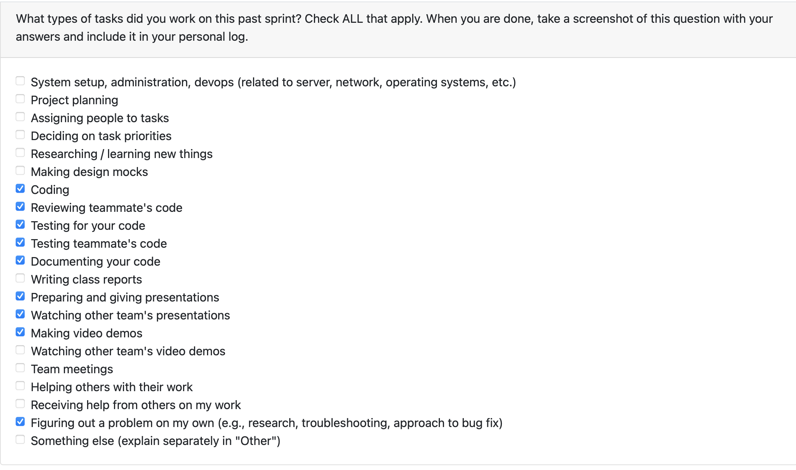

**Coding Tasks:**

This week, I made 3 PRs. The first adds an Awards section to the Resume Template, as well as frontend functionality to add Experience, Education and Awards to Resumes. 

The second adds detection of Resumes that have exceeded one page, and a confirmation modal asking the user if they'd like to continue, or go back to edit the Resume. This was quite an interesting task. LaTeX processes each character differently, so coming up with a solution to know for sure when a Resume has exceeded the first page was not obvious to me. In the end, our system generates the Resume, checks if it is over one page, and then prompts the user. If the user wants to go back to shorten the Resume, the Resume is silently deleted. 

The third adds the option to select your Git Contributor on a per project basis. Previously there wasn't a way to do this from the frontend, and so analysis was broken unless you used the CLI to select your Git Contributor. The system first tries to use the email given in ProfileSetup as your Git Contributor automatically. If that fails, a modal appears upon analysis, asking you to select your Contributor. This is per-project, for the case that the user may have used two different identities across two diffent projects. I also added a way to change this at any time in Settings.

[Add Experience, Education, Awards to Resumes](https://github.com/COSC-499-W2025/capstone-project-team-20/pull/502)

[Add Detection and Confirmation Modal for Resumes Exceeding One Page](https://github.com/COSC-499-W2025/capstone-project-team-20/pull/508)

[feat: Select or Update Git Contributors](https://github.com/COSC-499-W2025/capstone-project-team-20/pull/510)

**Testing or Debugging Tasks:**

I wrote extensive frontend component tests for the following PRs.

[Add Experience, Education, Awards to Resumes](https://github.com/COSC-499-W2025/capstone-project-team-20/pull/502)

[Add Detection and Confirmation Modal for Resumes Exceeding One Page](https://github.com/COSC-499-W2025/capstone-project-team-20/pull/508)

[feat: Select or Update Git Contributors](https://github.com/COSC-499-W2025/capstone-project-team-20/pull/510)

**Reviewing or Collaboration Tasks:**

I manually tested and reviewed the following PRs this week. 

[Fixed date bug in the frontend](https://github.com/COSC-499-W2025/capstone-project-team-20/pull/512)

[Feature/skill display](https://github.com/COSC-499-W2025/capstone-project-team-20/pull/506)

[Playwright tests](https://github.com/COSC-499-W2025/capstone-project-team-20/pull/504)

**Brief Description of Last Week Connecting This Week:**

Last week, I implemented live resume display and editing. Resumes are now recreated in HTML, and are editable in place before export to PDF. Additionally, I implemented a display feature in the Projects page, so that all stored project info is now displayed to the user.

This week, I added an Awards section to the Resume Template, as well as frontend functionality to add Experience, Education and Awards to Resumes. Additionally, I added detection of Resumes that have exceeded one page, and a confirmation modal asking the user if they'd like to continue. Finally, I added detection of Git Contributor using the user's email, and a prompt for the user to select their Git Contributor on a per project basis, in the case that the detection failed, as well as a Settings tab to change this at any time.

**Plan/Goals for Upcoming Week:**

The plan this week is to kick back, relax, maybe even touch some grass.

**Any issues or Blockers That I Encountered This Week and How I Addressed/Plan to Address Them:**

Our presentation this week was not as well-rehearsed as our group would've liked. This was because we were unable to use our pre-presentation meeting to rehearse, as Lex did not show up, and did not do their part for the slides. So we had to come up with the slides and their part of the script in a panic, minutes before the presentations. I am proud of the way our team addressed this and showed teamwork to resolve this. The rest of us remained calm and collected, delegated tasks efficiently, and got right to work despite the time crunch.

### Term 2 Week 13: March 30th - April 5th

**Coding Tasks:**

This week, I made 3 PRs. The first enables "Open Public Page" mode in web portfolios. The user can now export their portfolios to a new page, once made public. Setting the web portfolio to private will immediately retract the portfolio. This feature also implemented Slug-based URLs, which is my favourite small detail. Publishing generates a readable slug from the report title to use used for the portfolio's URL. (e.g. my-swe-portfolio). The slug is stable. Re-publishing won't change it. Appends a short suffix (e.g. ef2f) if there's a collision.

The second made some fixes to the way documentation score was being displayed, and changed the way we calculate documentation score for a more comprehensive analysis. It now takes into account README presence, and README quality, along with comment ratio. It also made some fixes and improvements to skill detection. Certain frameworks that were commonly being falsely detected (e.g. Unity) were dialed in to be more accurate and reduce false positives. Certain frameworks like Vite and ESLint that do not really represent resume-worthy skills have been removed, and missing frameworks like Tailwind and Flutter have been added.

The third PR added the new activity heatmap that Sven made into the "Open Public Page" mode for web portfolios. 

[Open Web Portfolio Into a New Page](https://github.com/COSC-499-W2025/capstone-project-team-20/pull/535)

[Fixes made to Skill Detection, Documentation Score](https://github.com/COSC-499-W2025/capstone-project-team-20/pull/536)

[Feat/heatmap public portfolio](https://github.com/COSC-499-W2025/capstone-project-team-20/pull/539)

**Testing or Debugging Tasks:**

I wrote extensive frontend component tests for the following PRs.

[Open Web Portfolio Into a New Page](https://github.com/COSC-499-W2025/capstone-project-team-20/pull/535)

[Fixes made to Skill Detection, Documentation Score](https://github.com/COSC-499-W2025/capstone-project-team-20/pull/536)

[Feat/heatmap public portfolio](https://github.com/COSC-499-W2025/capstone-project-team-20/pull/539)

**Reviewing or Collaboration Tasks:**

I manually tested and reviewed the following PRs this week. 

[Add portfolio activity heatmap with full-history + date range filtering](https://github.com/COSC-499-W2025/capstone-project-team-20/pull/537)

[Feature/badge share](https://github.com/COSC-499-W2025/capstone-project-team-20/pull/540)

**Brief Description of Last Week Connecting This Week:**

Last week, I added an Awards section to the Resume Template, as well as frontend functionality to add Experience, Education and Awards to Resumes. Additionally, I added detection of Resumes that have exceeded one page, and a confirmation modal asking the user if they'd like to continue. Finally, I added detection of Git Contributor using the user's email, and a prompt for the user to select their Git Contributor on a per project basis, in the case that the detection failed, as well as a Settings tab to change this at any time.

This week, I created 3 PRs. The first had to do with exporting our web portfolio to a seperate page, enabling "Open Public Page" mode. The second fixed a key bug in the way our documentation scores were being displayed, and improved the logic of those scores, as well as refining skill detection. The third added our new heatmap that Sven made to the "Open Public Page" mode for the web portfolio.

**Plan/Goals for Upcoming Week:**

The plan this week is to count my lucky stars.

**Any issues or Blockers That I Encountered This Week and How I Addressed/Plan to Address Them:**

N/A

