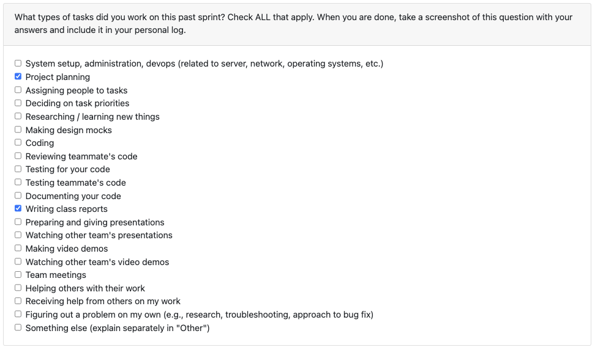
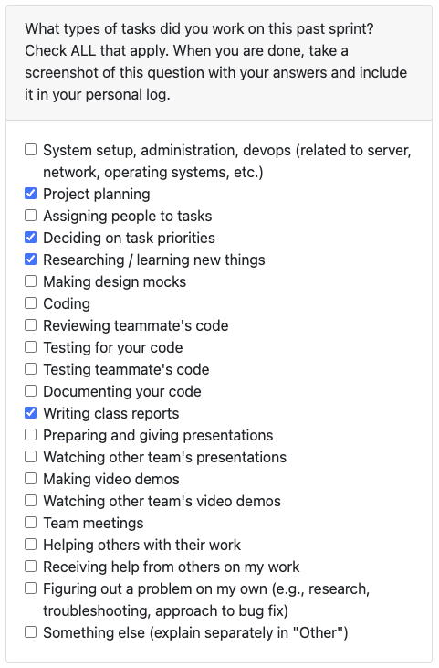
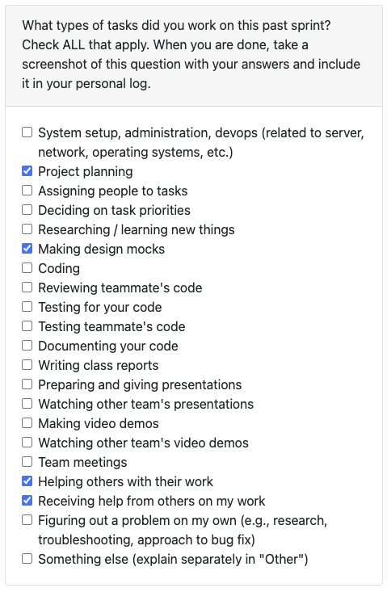
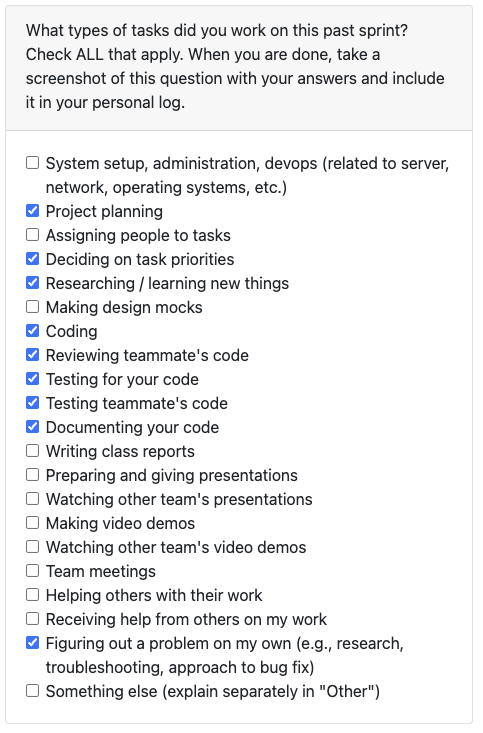

# Joy Weekly Individual Logs

## Week 3: September 15-21 2025

**Types of Tasks Worked On**

**Recap of Goals**

- Issue [#1](https://github.com/COSC-499-W2025/capstone-project-team-20/issues/1)

This week, our team collectively worked on determining an initial set of functional and non-functional requirements based on the given project specification.

In class discussion with other teams allowed for greater clarity on both the scope of the project, as well as areas of our requirements that could be improved upon. Feedback given was used to increase clarity and specificity of requirements listed.

We additionally outlined methods for testing each requirement, the target user groups, as well as a few short usage scenarios, which will provide a good starting point for the upcoming project proposal.

## Week 4: September 22-28 2025

**Types of Tasks Worked On**

**Recap of Goals**

- Issue [#3](https://github.com/COSC-499-W2025/capstone-project-team-20/issues/3)
- Issue [#16](https://github.com/COSC-499-W2025/capstone-project-team-20/issues/16)

At the beginning of the week, our team collaborated to create a system architecture diagram based on our current understanding and expectations of the system to be developed. We interacted with four other teams to provide and receive feedback on our respective diagrams (insights provided on the Canvas quiz).

The remainder of the sprint focused on preparing our project proposal document which is in progress, but set to be completed on time. To help facilitate progress and completion of tasks, I set up issues on our project board corresponding to the various sections of the proposal document.

## Week 5: September 29-October 5 2025

**Types of Tasks Worked On**

**Recap of Goals**

The main goal our team worked on this week was creating Level 0 and 1 Data Flow Diagrams of our system to further clarify and flush out the design of major processes and their interactions with one another.

Discussions with other teams to give and receive feedback on our diagrams provided even more clarity, and it was helpful to see a general consensus between teams regarding the major components the system should include.

There are no associated issues on our project board this week.

## Week 7: October 13-19 2025

**Types of Tasks Worked On**

**Recap of Goals**

- Issue [#81](https://github.com/COSC-499-W2025/capstone-project-team-20/issues/81)
- Issue [#82](https://github.com/COSC-499-W2025/capstone-project-team-20/issues/82)

This week I started an initial implementation towards Issue [#51](https://github.com/COSC-499-W2025/capstone-project-team-20/issues/51) by creating sub issues for language detection functionality and associated tests. The [pull request](https://github.com/COSC-499-W2025/capstone-project-team-20/pull/84) associated with those features is pending review, due to being put up quite late in the week.

This feature made the most sense to tackle with a TDD approach because the expected behaviour of the feature is still testable without data or a working implementation of our file parser. Once the file parser is implemented, it should be easy enough to integrate and update the existing functionality.

In the upcoming week I plan on continuing implementation towards Issue #51 with sub-issues for framework detection, refactoring, and integrating as necessary. I also plan on figuring out how to better break down features because 1 feature != 1 PR, and I want to get work out in a timely manner so it can be reviewed by others without the sunday scaries.
