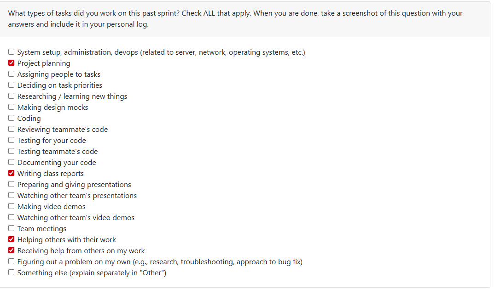

## Kaan Weekly Logs

### Week 1

Log Checkbox:

### Weekly Goals

    This week our team planned out functional and non-functional requirements for the project that was assigned to the entire class. We created
    these requirements, that we thought would be appropriate for the project, and presented the requirements to three other groups in our class
    to see how different people have interpreted the necessary requirements for the projects, and to learn from others' perspectives.

    After meeting with our separate groups, we reconvened with out group to discuss what we have learned from other groups' requirements that would
    positively alter the requirements that we had for the project. We took note of these changes to edit our requirements later on, and polish it for
    later submission.

    Our group later discussed the changes that we wanted to reflect on our updated requirements document online, came up with an updated version of our draft. We also submitted our updated draft for evaluation. 