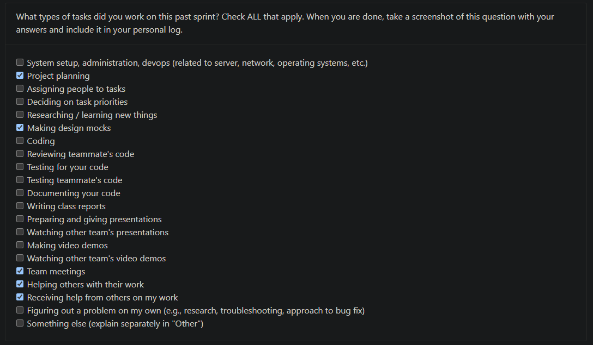
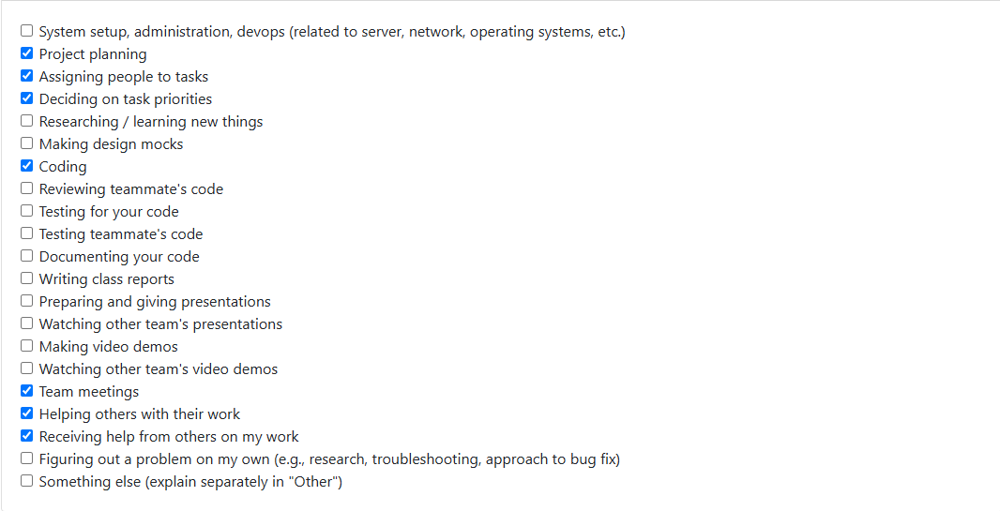
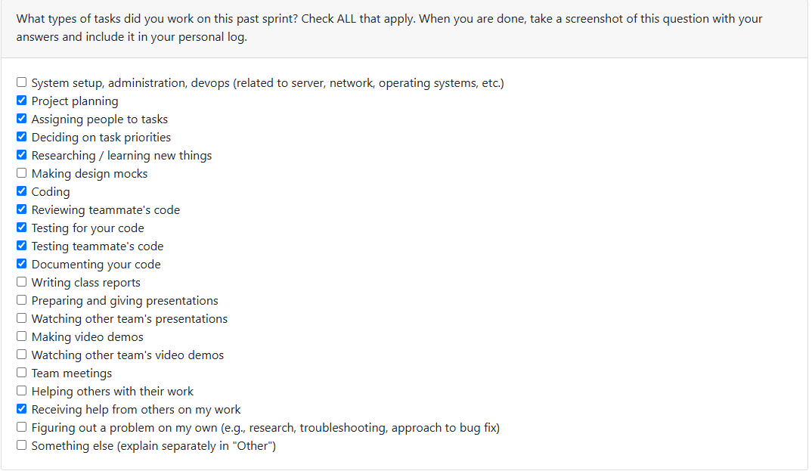
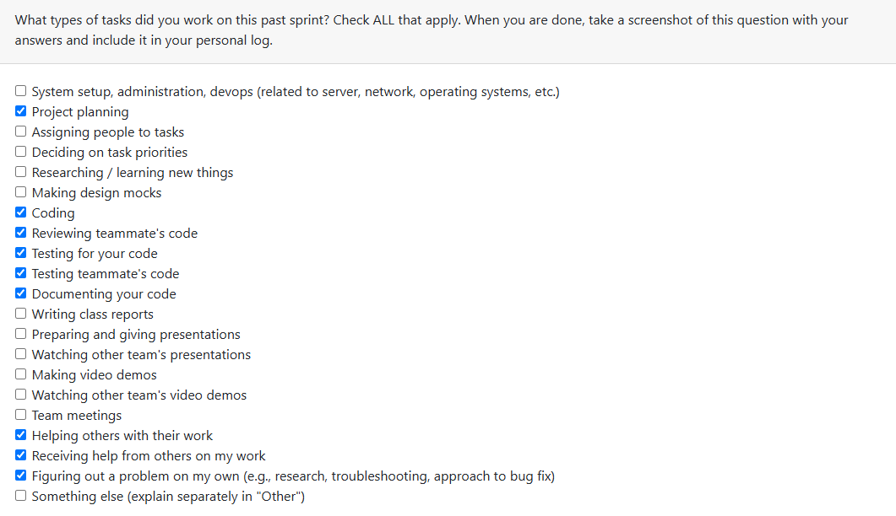
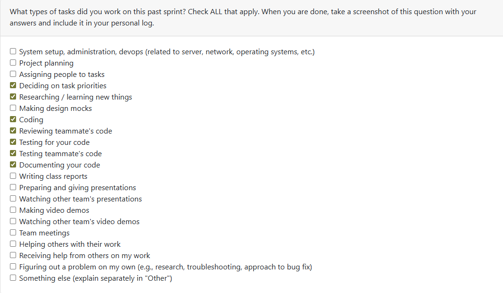

## Kaan Weekly Logs

### Week 3

Log Checkbox:

### Weekly Goals

    This week our team planned out functional and non-functional requirements for the project that was assigned to the entire class. We created
    these requirements, that we thought would be appropriate for the project, and presented the requirements to three other groups in our class
    to see how different people have interpreted the necessary requirements for the projects, and to learn from others' perspectives.

    After meeting with our separate groups, we reconvened with out group to discuss what we have learned from other groups' requirements that would
    positively alter the requirements that we had for the project. We took note of these changes to edit our requirements later on, and polish it for
    later submission.

    Our group later discussed the changes that we wanted to reflect on our updated requirements document online, came up with an updated version of our draft. We also submitted our updated draft for evaluation. 

### Week 4

Log Checkbox:

### Weekly Goals

    Our team collaborated to design a system architecture diagram based on our current understanding of the project. The diagram was refined through group work and further improved after gathering feedback from several other teams during class discussions.

    We have also been developing our project proposal. To ensure progress, we divided the different sections among team members so that responsibilities are clear and evenly managed. My focus has been on drafting the "Use Cases" portion of the document.

    Overall, the effort has involved planning the project structure, assigning and prioritizing tasks, contributing to shared reports, and supporting one another throughout the work. 

### Week 5

Log Checkbox:

### Weekly Goals

    Our team worked on developing a DFD graph for our project this week. We created a level 0 and a level 1 DFD, in collaboration with everyone through sketches as well as using a lucidchart and talking online while developing the DFD. We presented our DFD to others in class as well as giving feedback to other groups, and saw that everyone's DFD's were pretty much similar while having some minor differences in the names for the procedures, the data flows, or sometimes even having different processes.

    Overall, everyone worked really well together and we created a pretty well reveived DFD for the week.

### Week 6

Log Checkbox:

### Weekly Goals

    Our team divided the work that we had to do for Milestone 1 into different issues. And we discussed how these issues would be prioritized, as well as distributed among us. We also used our collected knowledge from all the previous sessions where we had presented our system architecture, DFD, and requirements to other groups, and created a final version of those.

    I created a final version of our DFD and updated the README, as well as parsing through the issues in order to start coding on a specific task for next week.

### Week 7

Log Checkbox:

### Weekly Goals

    The team started working on separate bits of code for the program this week. We had divided the issues in accordance to which ones should be prioiritized for the requirements shared in milestone 1. I chose to develop on issue [COSC-499-W2025/capstone-project-team-20#52](https://github.com/COSC-499-W2025/capstone-project-team-20/issues/52), which was to develop a system that would read the metadata to assess which skills were used in a project in chronological order. This was not without minor conflict, as in the time of me doing this, the main scanning, and parsing of files hadn't been developed yet, but the task was already assigned to someone else. That is why for my contributions for the week, I had to be creative and just make the code so that it would be very open to future changes and adaptations, so that when the parsing functionality is completed it can be adapted with ease.

    I also did a lot of review of my team-mate's code, as well as providing changes to my own code, based on their feedback. It was a reall efficient week to start development, and I feel that we have made a strong and efficient start to this process.

### Week 8

Log Checkbox:

### Weekly Goals

This week, I worked on implementing and reviewing several features tied to our ongoing project metadata and analytics system. My main focus was on building the chronological skill timeline and Project dataclass modules, which are used to structure and store project-level data in a consistent format. I wrote the SkillEvent class, helper methods like _to_date, and a build_timeline function that compiles events across projects into an ordered chronological list. I also added comprehensive unit tests to verify serialization and date handling logic.

In addition to coding, I completed multiple code reviews for Dylan’s and Branden’s pull requests:

- Reviewed Dylan’s PR implementing the Project and ProjectManager classes, which handle project storage, retrieval, and metadata persistence in the database.

- Reviewed Branden’s PR for the ProjectMetadataExtractor, ensuring the handling of missing timestamps, division-by-zero cases, and normalization of summary key names.

- Suggested improvements like adding pagination support for scalable queries, and replacing print() statements with structured logging.

We also created several new issues for future development, including:

- 114: Add a “Fun Fact” and badge system for project analytics — a gamified approach similar to “Spotify Wrapped,” where users receive badges and fun summaries based on project statistics (e.g., “Gigantanamamous” for very large projects).

- 115: Extend get_all() with pagination and streaming support for scalability in large datasets.

These additions aim to make our analytics more engaging, scalable, and user-friendly.

What I struggled with this week was time allocation between implementation and review — several PRs came in close together, and balancing detailed feedback with my own development work was challenging. However, I found that combining test validation in Docker and manual inspection of PR logic made reviews much faster and more effective.

For the upcoming week, I plan to work on Issue #114, implementing the first version of the Fun Fact and Badge System for project analytics. This will involve designing badge thresholds, assigning them dynamically based on metadata, and preparing a lightweight data model that the frontend can use to display badges and fun summaries. I’ll also continue supporting reviews on related analytics or UI PRs as others start implementing their parts.

### Week 9

Log Checkbox:

Couldn't reach evaluations for this week, as they were inaccessible.

### Weekly Goals

This week, I created the entire Skill Analyzer subsystem, which included the implementation of the `SkillExtractor`, `FolderSkillAnalyzer`, and `analyze_any` modules. This system serves as the foundation for detecting and evaluating programming languages, frameworks, and tools used across different projects in the repository.

I developed the core `SkillExtractor` logic from scratch to analyze both real filesystem paths and in-memory project trees, recognize programming languages, frameworks, and libraries through manifests (such as `package.json`, `pyproject.toml`, `pom.xml`, and others), and compute heuristic proficiency scores for each detected skill.  
I also designed and implemented the heuristic model that calculates proficiency using factors like typing usage, testing density, and docstring presence in Python projects, along with advanced detection rules for frameworks, data tools, and build systems.

In addition, I wrote comprehensive unit tests for each module to ensure correctness and maintainability:
- Verified that the `FolderSkillAnalyzer` exposed the correct public API and generated accurate analysis results.  
- Tested that `analyze_any` properly coordinated both Git and non-Git folder analysis paths.  
- Confirmed that the `SkillExtractor` consistently detected multiple languages, frameworks, and build tools in both filesystem and in-memory test environments.