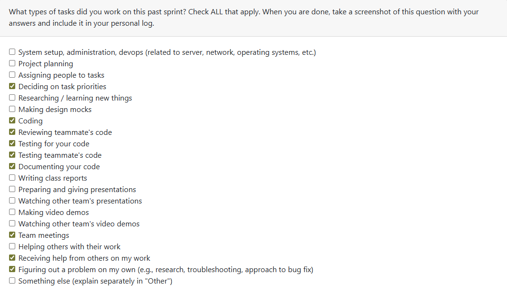
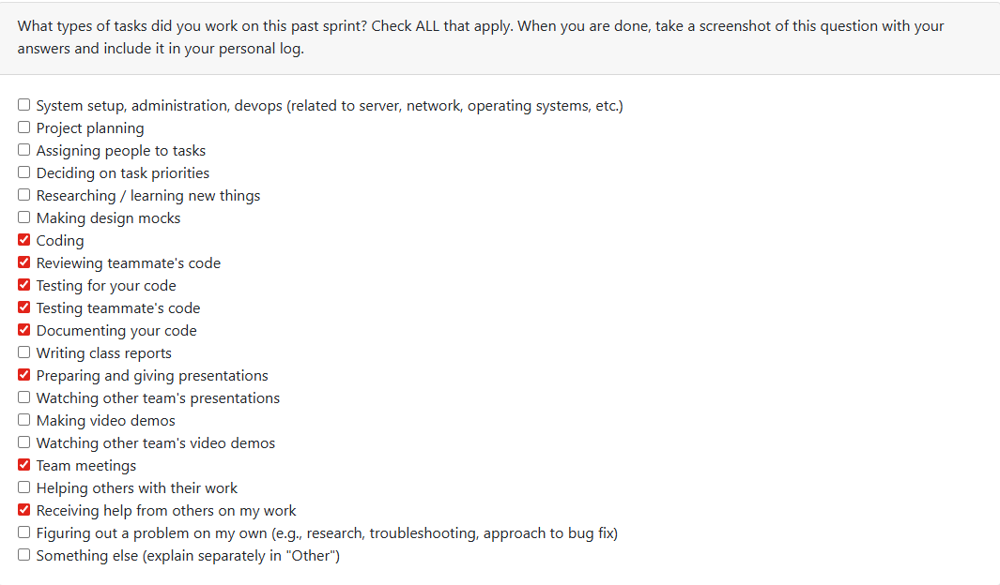
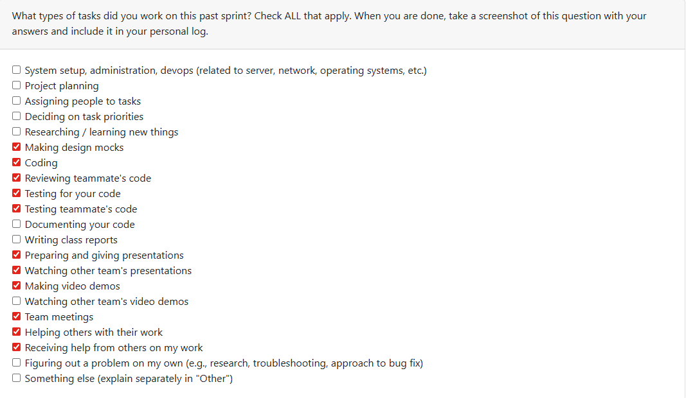
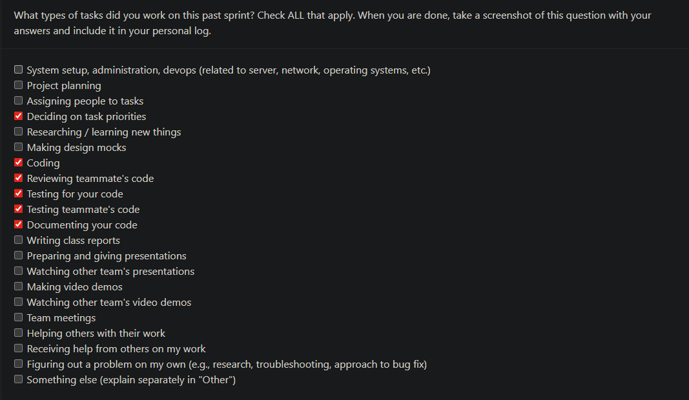
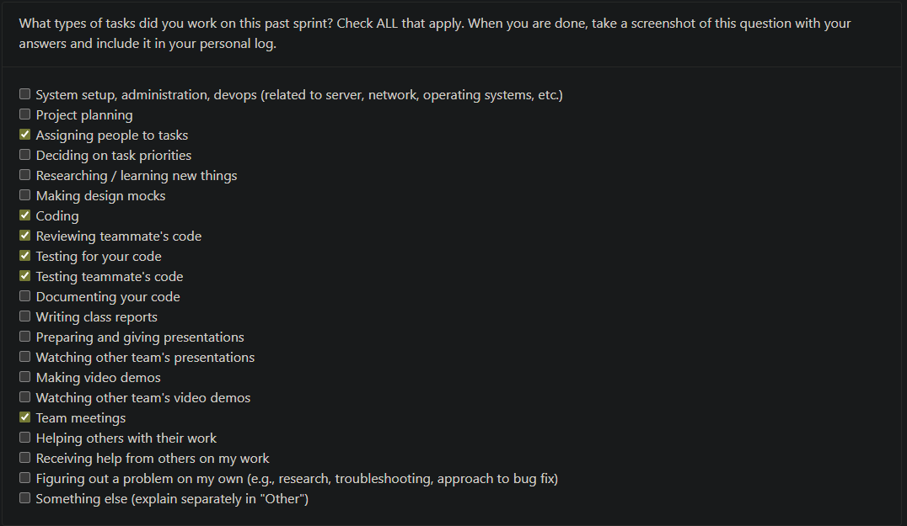

## Kaan Weekly Logs

### Week 3

Log Checkbox:

### Weekly Goals

    This week our team planned out functional and non-functional requirements for the project that was assigned to the entire class. We created
    these requirements, that we thought would be appropriate for the project, and presented the requirements to three other groups in our class
    to see how different people have interpreted the necessary requirements for the projects, and to learn from others' perspectives.

    After meeting with our separate groups, we reconvened with out group to discuss what we have learned from other groups' requirements that would
    positively alter the requirements that we had for the project. We took note of these changes to edit our requirements later on, and polish it for
    later submission.

    Our group later discussed the changes that we wanted to reflect on our updated requirements document online, came up with an updated version of our draft. We also submitted our updated draft for evaluation. 

### Week 4

Log Checkbox:

### Weekly Goals

    Our team collaborated to design a system architecture diagram based on our current understanding of the project. The diagram was refined through group work and further improved after gathering feedback from several other teams during class discussions.

    We have also been developing our project proposal. To ensure progress, we divided the different sections among team members so that responsibilities are clear and evenly managed. My focus has been on drafting the "Use Cases" portion of the document.

    Overall, the effort has involved planning the project structure, assigning and prioritizing tasks, contributing to shared reports, and supporting one another throughout the work. 

### Week 5

Log Checkbox:

### Weekly Goals

    Our team worked on developing a DFD graph for our project this week. We created a level 0 and a level 1 DFD, in collaboration with everyone through sketches as well as using a lucidchart and talking online while developing the DFD. We presented our DFD to others in class as well as giving feedback to other groups, and saw that everyone's DFD's were pretty much similar while having some minor differences in the names for the procedures, the data flows, or sometimes even having different processes.

    Overall, everyone worked really well together and we created a pretty well reveived DFD for the week.

### Week 6

Log Checkbox:

### Weekly Goals

    Our team divided the work that we had to do for Milestone 1 into different issues. And we discussed how these issues would be prioritized, as well as distributed among us. We also used our collected knowledge from all the previous sessions where we had presented our system architecture, DFD, and requirements to other groups, and created a final version of those.

    I created a final version of our DFD and updated the README, as well as parsing through the issues in order to start coding on a specific task for next week.

### Week 7

Log Checkbox:

### Weekly Goals

    The team started working on separate bits of code for the program this week. We had divided the issues in accordance to which ones should be prioiritized for the requirements shared in milestone 1. I chose to develop on issue [COSC-499-W2025/capstone-project-team-20#52](https://github.com/COSC-499-W2025/capstone-project-team-20/issues/52), which was to develop a system that would read the metadata to assess which skills were used in a project in chronological order. This was not without minor conflict, as in the time of me doing this, the main scanning, and parsing of files hadn't been developed yet, but the task was already assigned to someone else. That is why for my contributions for the week, I had to be creative and just make the code so that it would be very open to future changes and adaptations, so that when the parsing functionality is completed it can be adapted with ease.

    I also did a lot of review of my team-mate's code, as well as providing changes to my own code, based on their feedback. It was a reall efficient week to start development, and I feel that we have made a strong and efficient start to this process.

### Week 8

Log Checkbox:

### Weekly Goals

This week, I worked on implementing and reviewing several features tied to our ongoing project metadata and analytics system. My main focus was on building the chronological skill timeline and Project dataclass modules, which are used to structure and store project-level data in a consistent format. I wrote the SkillEvent class, helper methods like _to_date, and a build_timeline function that compiles events across projects into an ordered chronological list. I also added comprehensive unit tests to verify serialization and date handling logic.

In addition to coding, I completed multiple code reviews for Dylan’s and Branden’s pull requests:

- Reviewed Dylan’s PR implementing the Project and ProjectManager classes, which handle project storage, retrieval, and metadata persistence in the database.

- Reviewed Branden’s PR for the ProjectMetadataExtractor, ensuring the handling of missing timestamps, division-by-zero cases, and normalization of summary key names.

- Suggested improvements like adding pagination support for scalable queries, and replacing print() statements with structured logging.

We also created several new issues for future development, including:

- 114: Add a “Fun Fact” and badge system for project analytics — a gamified approach similar to “Spotify Wrapped,” where users receive badges and fun summaries based on project statistics (e.g., “Gigantanamamous” for very large projects).

- 115: Extend get_all() with pagination and streaming support for scalability in large datasets.

These additions aim to make our analytics more engaging, scalable, and user-friendly.

What I struggled with this week was time allocation between implementation and review — several PRs came in close together, and balancing detailed feedback with my own development work was challenging. However, I found that combining test validation in Docker and manual inspection of PR logic made reviews much faster and more effective.

For the upcoming week, I plan to work on Issue #114, implementing the first version of the Fun Fact and Badge System for project analytics. This will involve designing badge thresholds, assigning them dynamically based on metadata, and preparing a lightweight data model that the frontend can use to display badges and fun summaries. I’ll also continue supporting reviews on related analytics or UI PRs as others start implementing their parts.

### Week 9

Log Checkbox:

### Weekly Goals

This week, I created the entire Skill Analyzer subsystem, which included the implementation of the `SkillExtractor`, `FolderSkillAnalyzer`, and `analyze_any` modules. This system serves as the foundation for detecting and evaluating programming languages, frameworks, and tools used across different projects in the repository.

I developed the core `SkillExtractor` logic from scratch to analyze both real filesystem paths and in-memory project trees, recognize programming languages, frameworks, and libraries through manifests (such as `package.json`, `pyproject.toml`, `pom.xml`, and others), and compute heuristic proficiency scores for each detected skill.  
I also designed and implemented the heuristic model that calculates proficiency using factors like typing usage, testing density, and docstring presence in Python projects, along with advanced detection rules for frameworks, data tools, and build systems.

In addition, I wrote comprehensive unit tests for each module to ensure correctness and maintainability:
- Verified that the `FolderSkillAnalyzer` exposed the correct public API and generated accurate analysis results.  
- Tested that `analyze_any` properly coordinated both Git and non-Git folder analysis paths.  
- Confirmed that the `SkillExtractor` consistently detected multiple languages, frameworks, and build tools in both filesystem and in-memory test environments.

### Week 10-11

Log Checkbox:

Couldn't reach evaluations for this week.

### Weekly Goals

This week, I continued building out the analytics layer around the Skill Analyzer subsystem and started implementing a profile-level badge system.

On the skills side, I refactored the original monolithic `skill_extractor.py` into a set of cohesive, testable components, including the `SkillExtractor`, `SkillEvidenceScanner`, `CodeStatsCollector`, `ProficiencyEstimator`, and associated data models and patterns. This compartmentalization makes the pipeline easier to extend and reason about, while preserving all existing detection capabilities for languages, frameworks, tools, and build systems. I also finalized the proficiency scoring logic, ensuring that Python proficiency incorporates code structure, typing usage, testing density, and documentation signals, and that frameworks, data tools, and infrastructure stacks receive consistent heuristic scores.

In parallel, I collaborated with the team to design and partially implement a badge system that runs on top of the existing project analytics. This includes deriving project snapshots (metadata, language share, categories, and inferred skills), assigning badges based on thresholds (e.g., size, duration, test/docs balance, and stack composition), and wiring persistence so badges can be stored per project for later aggregation at the user profile level. The system is functional at the backend level but still in progress in terms of full integration and UI exposure.

Finally, I reviewed and merged several teammates’ changes into the main branch, focusing on consistency with the new modular Skill Analyzer architecture, ensuring that their contributions integrated cleanly with the updated APIs and that the overall analytics flow remained stable and maintainable.

### Week 12

Log Checkbox:

### Weekly Goals

This week, I focused heavily on stabilizing and restructuring the Skill Analyzer pipeline for our Milestone 1 demo, delivering three major PRs that reshape how we extract, present, and persist project-level analytics.

The first major task was refactoring the Skill Analyzer output so it aligns with the educational goals of the platform. I removed the misleading “proficiency” and “confidence” metrics, redesigned the user-facing output to emphasize languages, frameworks, and tools actually used in the project, and added interpretable feedback categories (testing discipline, documentation habits, modularity, and language depth). This makes the skill report much more actionable for students and instructors.

The second PR expanded the project data model by introducing new derived metrics—including LOC, comment ratio, test ratio, function metrics, primary languages by LOC, and all four feedback dimensions. I updated the `Project` class, serialization logic, and the database schema to support these fields. I then integrated SkillAnalyzer’s output into the persistence layer so that a full snapshot of project analytics is automatically stored and can be retrieved later without re-running analysis.

The third PR wired these changes into the Project Analyzer CLI, ensuring that skill analysis now populates the database cleanly, updates existing entries through upsert logic, and supports viewing historical results. This creates a unified pipeline from ZIP → analysis → metrics → database → display.

Beyond my own PRs, I reviewed multiple teammate submissions to ensure compatibility with the new modular Skill Analyzer architecture, with special focus on DB consistency, serialization correctness, and cross-module integration. I also attended Friday’s milestone alignment meeting, where we finalized what analytics components must be stable for the Milestone 1 demo and coordinated division of tasks for the upcoming sprint.

### Week 13

Log Checkbox:

### Weekly Goals

This week, I focused on expanding and stabilizing several major analytical features across the Skill Analyzer ecosystem—specifically the badge analysis system, the skill chronology pipeline, and the project chronology extraction improvements. These updates significantly advance our goal of making the analytics interpretable, educational, and fully integrated for the Milestone 1 demo.

The first major deliverable was implementing the Badge Feature. I built a rules-based badge assignment system that derives awards directly from the project’s analytics snapshot, using metrics such as language distribution, test ratio, comment density, file structure depth, and collaboration indicators. I also added badge aggregation logic to support comparisons across multiple projects, and made sure it integrates cleanly into the CLI outputs. This gives students motivational, achievement-style feedback grounded in real code quality signals.

The second focus was refining the Skill Analysis output to better represent what students actually used and learned in each project. I improved the categorization of languages, frameworks, and tools, cleaned up noisy detections, and integrated this with the new badge system so both features support each other. These refinements make the analytics more accurate, readable, and aligned with the educational goals of the platform.

Alongside that work, I implemented and stabilized the Skill Chronology feature. This involved ensuring that skills are now ordered using actual commit dates, creating a much more realistic timeline of when skills were acquired across a student’s development history. I also updated the Skill Analyzer's output formatting so the chronology displays skill names with their associated dates clearly.

Parallel to this, I improved the Project Chronology to ensure that projects are sorted and displayed based on the earliest meaningful commit timestamps rather than file metadata. This gives the overall developer timeline a far more accurate narrative and supports downstream features like learning progress visualization.

We also had a highly productive meeting on Friday, where we finalized our presentation content and aligned on the final requirements for Milestone 1. As part of team collaboration, I reviewed several PRs from teammates to ensure compatibility with the new badge logic, chronology systems, and updated Skill Analyzer architecture.

Overall, the week significantly strengthened both the backend analytics and the cohesion between features, pushing us much closer to a stable, presentation-ready milestone.

### Week 14

Log Checkbox:

### Weekly Goals

This week centered on Milestone 1 presentations, team coordination, and solidifying the structural foundations of our project as we move into the next phase.

The main achievement of the week was presenting our Milestone 1 features to the class. I walked through the badge system, skill chronology improvements, enhanced analytics pipeline, and overall Skill Analyzer architecture. The presentation highlighted how the system now produces interpretable learning insights based on real project history, and how these features support the educational focus of the platform. After our presentation, I watched the other groups’ demos and completed the evaluation forms, which gave useful perspective on different approaches to project design and communication.

I also helped finalize our team contract. This included defining roles, communication expectations, PR guidelines, accountability structures, and shared standards for documentation and testing. This contract will help keep development consistent and collaborative as the project grows in complexity.

Another key task was distributing the work for the Milestone 1 team demo video. We broke down responsibilities for milestone 1 requirements. This ensures the final video will clearly communicate the value of our system while reflecting contributions from across the team.

Finally, I updated the System Architecture Diagram based on recent design changes. The diagram now more clearly separates presentation, orchestration, and analysis layers, and fixes several connection flow issues that had come up during earlier reviews. This updated version will be used in the demo video and future documentation.

Overall, Week 14 was focused on communicating our progress, aligning the team, and tightening the structural and visual components necessary for a polished Milestone 1 delivery.

### Term 2 Week 2: January 12th-January 18th

Log Checkbox:

### Weekly Goals

This week, I focused on implementing Milestone 2 features for the API layer and collaborating with the team on peer review preparation.

**Coding Tasks:**
I implemented Requirement #299: "Display textual information about a project as a resume item." This involved creating a new REST API endpoint (`GET /resume/{id}`) that retrieves a project's resume information including summary and bullet points. I created a new `ResumeItemResponse` Pydantic schema to ensure type-safe API responses, updated the routes and schemas modules to integrate the endpoint, and added comprehensive unit tests. The implementation leverages the existing `Project` data model and `ProjectManager` for database persistence, allowing frontend applications and external tools to programmatically access formatted project achievements for resume and portfolio generation. This feature builds upon the CLI infrastructure (Option 11: "Retrieve Previous Resume Insights") and extends it to the API layer.

**Testing Tasks:**
I added a full test suite for the new resume endpoint (`tests/test_resume_item_endpoint.py`) with three test cases that verify: successful retrieval of projects with populated resume data, proper 404 error handling when projects don't exist, and graceful handling of empty bullets/summary fields. All tests passed successfully and follow the existing mocking and fixture patterns used across the project.

**Reviewing or Collaboration Tasks:**
I reviewed and evaluated several team pull requests to ensure code quality and architectural consistency. I analyzed which Milestone 2 requirements were best suited for implementation this sprint, considering dependencies and current team capacity. I also helped prepare materials for the upcoming peer review session by assessing the state of our existing codebase.

**Brief Description of Last Week Connecting This Week:**
Unlike the first week of Term 2, I came in ready to contribute code immediately, I didn't realize that development starts immediately after milestone transitions, which is why I didn't make any contributions last week.

**Plan/Goals for Upcoming Week:**
In the upcoming week, I plan to continue implementing Milestone 2 requirements by working on the portfolio display feature (similar to the resume display) and potentially tackling requirement #297 (customize and save custom wording for resume items). I also want to ensure all Milestone 1 deliverables are fully polished before peer review, which may require some refactoring of larger analytical modules. Additionally, I'll continue supporting the team through code reviews and helping unblock any integration issues that arise.

**Any issues or Blockers That I Encountered This Week and How I Addressed/Plan to Address Them:**
The main challenge was team availability this week. On Wednesday, only a couple of team members attended class, and communication in Discord was slower than usual. Unlike last week where Branden was building the foundational API infrastructure, my work was more self-contained (implementing a specific feature on top of existing architecture), which allowed me to progress independently. However, I will be much more active starting from this week to make sure I am helping my group create the best product that we are able to.

### Term 2 Week 3: January 19th-January 25th

Log Checkbox:

### Weekly Goals

This week, I focused on developing the incremental file uploads work and helping the team with PR reviews and follow-up fixes.

**Coding Tasks:**
I iterated on the incremental file uploads flow to make partial uploads more reliable and to improve the handling of chunked payloads during large submissions. I also reviewed existing upload-related code paths to keep the API responses consistent and reduce redundant validation steps that were slowing down the upload process.

**Testing Tasks:**
I ran local verification on the upload path using manual upload scenarios and ensured edge cases like empty chunks and retry behavior behaved correctly. I also double-checked existing unit tests related to file intake to confirm they still passed with the incremental flow adjustments.

**Reviewing or Collaboration Tasks:**
I reviewed multiple teammate PRs, left feedback on API schema consistency, and helped confirm which Milestone 2 tasks should be prioritized for the next sprint. I also coordinated quick follow-up discussions to align on how the upload feature should be presented during peer review.

**Brief Description of Last Week Connecting This Week:**
Last week was about implementing the resume endpoint and preparing for peer review, so this week I shifted toward refining the upload pipeline and supporting the team’s PRs so we could stabilize core features.

**Plan/Goals for Upcoming Week:**
Next week, I plan to continue refining the upload experience from the UI/API integration standpoint and to support the team with any fixes needed for Milestone 2 review. I also want to follow up on any remaining PR feedback to ensure integration stays smooth.

**Any issues or Blockers That I Encountered This Week and How I Addressed/Plan to Address Them:**
The main blocker was aligning on the final upload behavior and how we should handle retries across clients. I documented the expected behavior and plan to validate it with the team during our next sync so the feature remains consistent across the stack.