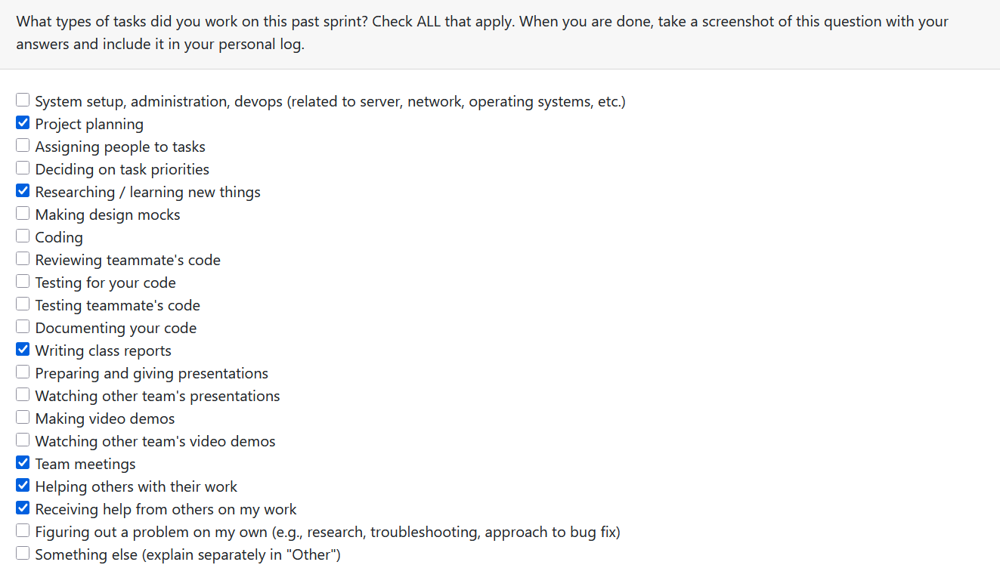
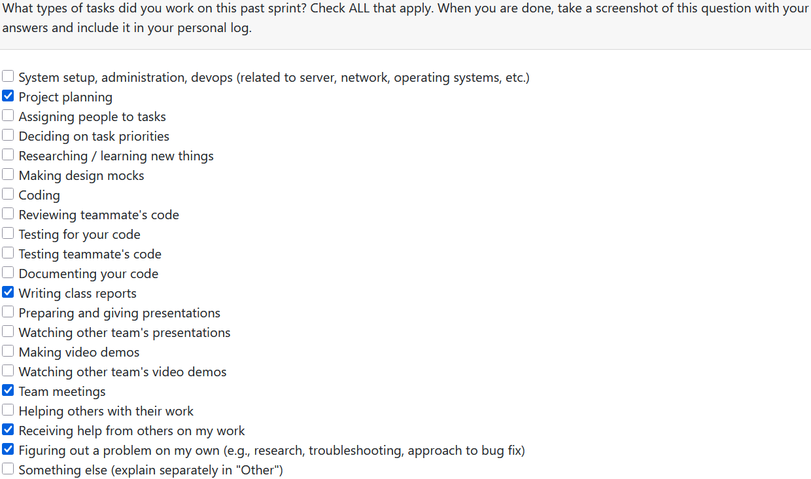

# **Lex's Weekly Logs**

## Week 3

**Types of Tasks Worked On**

**Recap of Goals**

Our goal for this week was to come up with potential functional and non-functional requirements given a basic description of the project. We first discussed what kind of project we could make given the project description, we created a shared google doc and started writing ideas for how we could turn our ideas into functional and non-functional requirements.

We created a discord server in order to communicate effectively while not in class together. We used this and the google doc to collaborate on a finalized first draft for our proposed project requirements. We brought these requirements to the next class, and compared them to what other groups had proposed and listened to feedback.

We used the feedback of other groups to make our project requirements less vague, more realistic, and simpler to understand. We were also inspired by some of the ideas of other groups, such as those who implemented ethical considerations in their requirements.

We explored the github and started on creating a project board to keep track of issues.

## Week 4

**Types of Tasks Worked On**

**Recap of Goals**

This week we created a system architecture diagram and compared it with other groups during lecture period on monday. Personally, I got the chance to look at the diagrams of team 8 and team 6. 

Team 8's architecture diagram was very difficult to parse as they had many different parts with very vague descriptions and without labeling what the inputs and outputs actually contain. One example is the unexplained "Ethical filter" applied to the data after all the processing has already occured and serves no obvious purpose. Another is the AI integration which the group members were not able to explain the purpose of. This diagram helped us understand how we should focus on clarity of function and clearly defined inputs/outputs for our diagram for ease of understanding both within the group and from others.

Team 6's feedback on our diagram was insightful, they raised concerns about scanning the entire computer by default, especially when trying to reach our non-functional speed requirements. Their other concern was our use of a locally hosted database when it did not necessarily have a well defined reason to exist judging by our diagram. We will consider the necessity of a database going forward as well as the clarity of its purpose on our diagram.

Our other goal was to create our project proposal based on our requirements as well as the input from other groups. Ultimately, we mostly based it on our original requirements for the project as it was what we desired to do as a group from the start, clarifying some of the less polished aspects where needed.