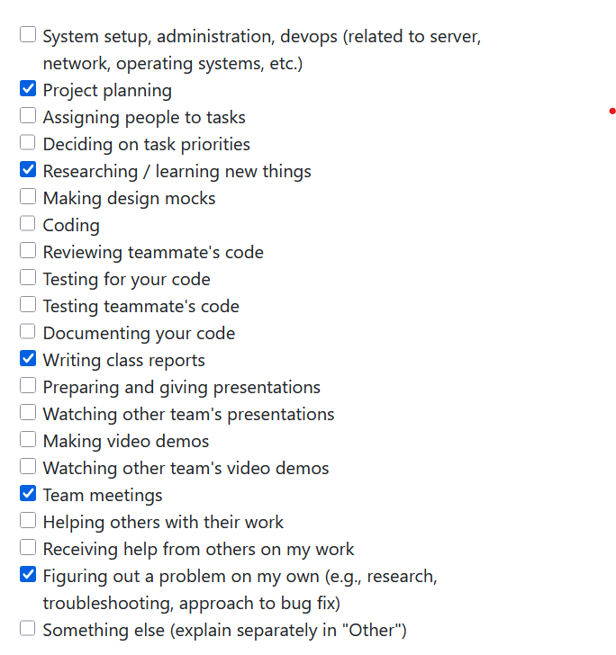
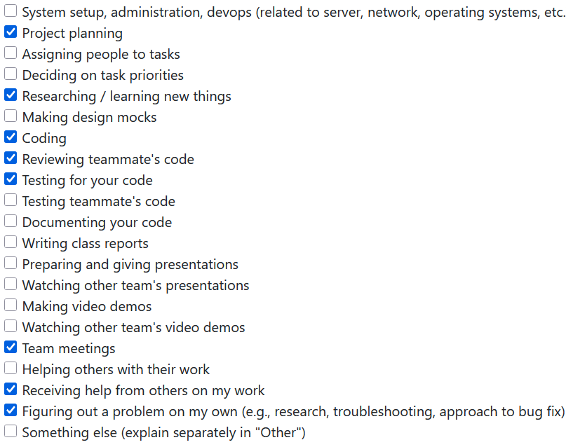
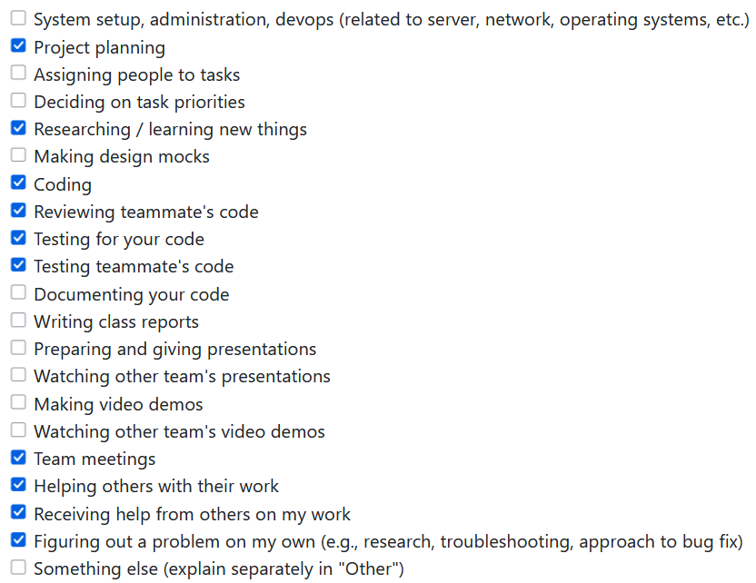
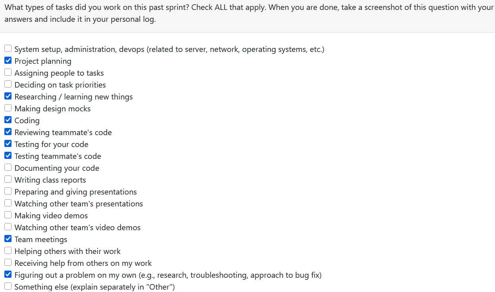
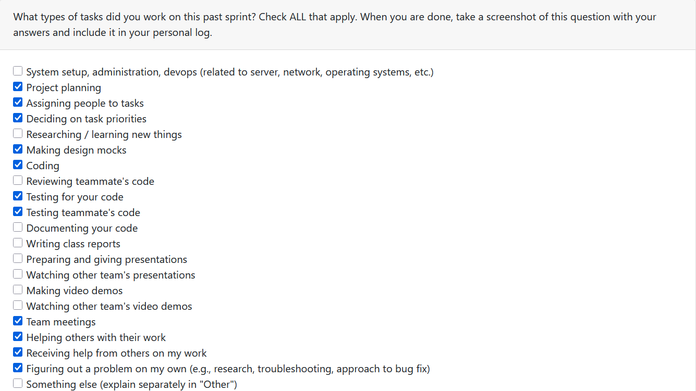
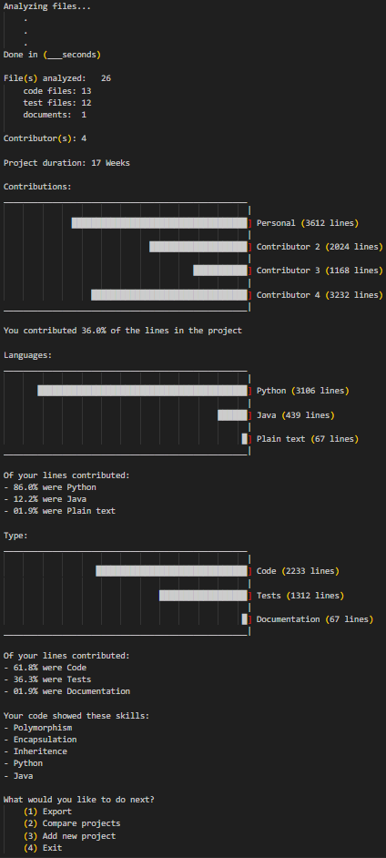

# **Lex's Weekly Logs**

## Week 3

**Types of Tasks Worked On**

**Recap of Goals**

Our goal for this week was to come up with potential functional and non-functional requirements given a basic description of the project. We first discussed what kind of project we could make given the project description, we created a shared google doc and started writing ideas for how we could turn our ideas into functional and non-functional requirements.

We created a discord server in order to communicate effectively while not in class together. We used this and the google doc to collaborate on a finalized first draft for our proposed project requirements. We brought these requirements to the next class, and compared them to what other groups had proposed and listened to feedback.

We used the feedback of other groups to make our project requirements less vague, more realistic, and simpler to understand. We were also inspired by some of the ideas of other groups, such as those who implemented ethical considerations in their requirements.

We explored the github and started on creating a project board to keep track of issues.

## Week 4

**Types of Tasks Worked On**

**Recap of Goals**

This week we created a system architecture diagram and compared it with other groups during lecture period on monday. Personally, I got the chance to look at the diagrams of team 8 and team 6. 

Team 8's architecture diagram was very difficult to parse as they had many different parts with very vague descriptions and without labeling what the inputs and outputs actually contain. One example is the unexplained "Ethical filter" applied to the data after all the processing has already occured and serves no obvious purpose. Another is the AI integration which the group members were not able to explain the purpose of. This diagram helped us understand how we should focus on clarity of function and clearly defined inputs/outputs for our diagram for ease of understanding both within the group and from others.

Team 6's feedback on our diagram was insightful, they raised concerns about scanning the entire computer by default, especially when trying to reach our non-functional speed requirements. Their other concern was our use of a locally hosted database when it did not necessarily have a well defined reason to exist judging by our diagram. We will consider the necessity of a database going forward as well as the clarity of its purpose on our diagram.

Our other goal was to create our project proposal based on our requirements as well as the input from other groups. Ultimately, we mostly based it on our original requirements for the project as it was what we desired to do as a group from the start, clarifying some of the less polished aspects where needed.

## Week 5

**Types of Tasks Worked On**

**Recap of Goals**

Our goal for this week was to create a dataflow diagram (levels 0 and 1), to print and compare to the diagrams of other groups to see how we might be able to improve ours.

As with last week, we struggled a bit with the purpose of our database within the system. The reason why we still included it in our dfd was because it was still part of our requirements that we created so we wanted to stick to it.

Team 2 commented on the database implementation in our DFD, pointing out that we save data to the database and then read from the database in order to organize that data, essencially processing it twice.

Team 10 showed what a DFD could look like for a similar system without the implementation of a database to contend with, and I personally prefer this approach. I hope my team will consider something similar for the project proper.

Not too much going on in the github this week as we did the diagrams on a shared document in an external site so we didnt feel the need to split it into tasks on github.

## Week 6

**Types of Tasks Worked On**

**Recap of Goals**
- Issue [#31](https://github.com/COSC-499-W2025/capstone-project-team-20/issues/31)
My first goal was to take on an issue and plan how to complete it by splitting it into sub-issues of different individual features that make up the completed issue.

In this pursuit I created 4 issues:
- Issue [#55](https://github.com/COSC-499-W2025/capstone-project-team-20/issues/55)
- Issue [#56](https://github.com/COSC-499-W2025/capstone-project-team-20/issues/56)
- Issue [#58](https://github.com/COSC-499-W2025/capstone-project-team-20/issues/58)
- Issue [#59](https://github.com/COSC-499-W2025/capstone-project-team-20/issues/59)
55, 56, 58 are for creating the 3 classes required to create an easily navigable representation of the given file structure, which in this case will be a tree of linked objects (as a folder can have multiple sub-folders)

to accessed the zip file im using "zipfile" from the standard python library

this week i coded and submitted the pr for one of the 4 sub issues:
- Issue [#56](https://github.com/COSC-499-W2025/capstone-project-team-20/issues/56)
The object is essentially a branch node to be used in a tree in place of the directory/folder files in a zipped folder, zip files by default have at least 1 folder sharing a name with the zip file itself.

When the constructor of the object is called it is done so using a "ZipInfo" object (from the python zipfile library) which contains metadata information on an individual file from the zip file.

I didn't really think it made sense to write tests for this when it has no methods currently and will only be called and accessed through other classes during runtime, but I will reassess the necessity of such tests upon completion of the parent issue.

## Week 7

**Types of Tasks Worked On**

**Recap of Goals**
Currently Working on Completing this Issue:
- Issue [#31](https://github.com/COSC-499-W2025/capstone-project-team-20/issues/31)

At the start of the week, these sub-issues remained:
- Issue [#55](https://github.com/COSC-499-W2025/capstone-project-team-20/issues/55)

I became very sick after the Midterm for this course so work has been slow
I started working on issue #58 at the beginning of the week, but didn't finish it until late on Sunday.
When I put up the PR, i noticed someone had already put up a PR for the same issue 3 hours prior despite my existing assignment to it.
I closed the PR without merging as the existing PR had a superior implementation.

I then, in the last few hours, manage to cobble together an implementation of issue #59 (ZipParser) based on some ideas I had already wrote down for its implementation.
I completed the PR, as well as the peer eval on time. Unfortunately though I am late to writing this log (rewriting what I already had written), and whatever additions i may have to make to the team log.

My goals for next week are to finish the tests I began writing for ZipParser, create some additional ZipParser methods (which will replace issue #55 as that issue is no longer necessary due to my implementation), create some tests for ProjectFile if necessary, and begin planning for the next major issue i will tackle.

Issues closed:
- Issue [#58](https://github.com/COSC-499-W2025/capstone-project-team-20/issues/58)
- Issue [#59](https://github.com/COSC-499-W2025/capstone-project-team-20/issues/59)

## Week 8

**Types of Tasks Worked On**

**Recap of Goals**
Was working on completing this issue:
- Issue [#31](https://github.com/COSC-499-W2025/capstone-project-team-20/issues/31)

For this week, these issues remained:
- [COSC-499-W2025/capstone-project-team-20#119](https://github.com/COSC-499-W2025/capstone-project-team-20/issues/119)
- [COSC-499-W2025/capstone-project-team-20#111](https://github.com/COSC-499-W2025/capstone-project-team-20/issues/111)
-[COSC-499-W2025/capstone-project-team-20#127](https://github.com/COSC-499-W2025/capstone-project-team-20/issues/127)
-#97 (may have accidentally deleted this because its not linking? it appears under issue #31 tho)

These were:
- A bug fix in ZipParser so it now correctly handles zip files that contain multiple folders of the same name at different points in the file structure.
- A toString() method for ZipParser to take a root projectFolder object and return a String representation of the tree structure for easy printing, the associated tests for this, and a template for tree traversal for potential future methods
- Tests for the ProjectFolder class, as it lacked them initially due to being a node class, but upon review it had some 'features' within the constructor that warranted testing
- Tests for ZipParser, as it was lacking some due to the last minute implementation last week.

I only managed to review one PR this week as only one (that was not made by me) remained by the time i had put aside to look at them.

I did not manage to find an issue to break up into smaller issues for next week as I had planned to do. However as a team we figured out what times we are all free for team meetings so we can meet and plan out implementation of future features together.

Issues closed:
#31, #119, #111, #127, #97

## Week 9
**Types of Tasks Worked On**

**Recap of Goals**
My goal was to begin work on planning and implementing a progress bar for showing better feedback to the user.
This resulted in the creation of the issue:
- [COSC-499-W2025/capstone-project-team-20#146](https://github.com/COSC-499-W2025/capstone-project-team-20/issues/146)
And the first major sub-issue:
- [COSC-499-W2025/capstone-project-team-20#158](https://github.com/COSC-499-W2025/capstone-project-team-20/issues/158)

I began work on issue #158 to create an object that could be used to display a project bar that would be reuseable by various segments of our program.

Considerable time was spent researching how best to display a loading bar, as most examples of text loading bars did not really look like a smooth continuous bar. I eventually managed to find the unicode block characters, which would prove to be exactly what i was looking for, being able to display a continuous bar as well as divide each bar into 8 different segments by cycling through characters.

One important part of the planning process was figuring out how i could program the class in such a way that it could be tested easily and simply, while i think i failed at simplicity, my tests are very comprehensive and handle many niche edge cases.

I think my implementation could have been a lot simpler; I feel like most things in our program occur too rapidly for a progress bar programmed to look very pretty to be shown off very well.

The next steps for the progress bar are to do individual implementations for the various analyzers and parsers in the project, so that each is able to have a loading bar. Theres also a potential for parallelization that i have been considering in order to have the bar look prettier in motion, but next week im definitely going to focus on perfecting the functionality of the bar through implementation rather than getting caught up in visuals.

Issues closed:
issue [COSC-499-W2025/capstone-project-team-20#158](https://github.com/COSC-499-W2025/capstone-project-team-20/issues/158)

## Week 10
**Types of Tasks Worked On**

**Recap of Goals**
My goal was to continue implementation of:
- [COSC-499-W2025/capstone-project-team-20#146](https://github.com/COSC-499-W2025/capstone-project-team-20/issues/146)

The focus for this week was on progress bar implementation into zip parser, in issue #160

As with a few others of our team members I had a busy week 10 with many midterms, by the time I had free time to implement there were already some changes I needed to make.

Had to fix some existing bugs in ProgressBar that arose from my shoddy job replacing variable names that resulted in some tests failing. I implemented progress bar into zip parser, and then realized some of the code I had already studied and familiarize myself with was completely different from refactoring changes, so i decided to hang back this week and focus more on reviewing the code of teammates in-order to better undertstand what my approach should be going forward. I also found a slight error in existing code that caused a test to fail for some uses but not for others, fixed this in Issue #182.

Things are only getting busier so i really need to focus up for this final stretch of the term.

One issue I am having at the moment is figuring out what to implement. Most of the core features are already implemented or in the process of being implemented, so I'm struggling to determine what to do next. Will bring this up at the next team meeting.

Issues closed:
- Issue #160
- Issue #182 

## Week 12
**Types of Tasks Worked On**

**Recap of Goals**
My original goal was to finish with the progress bar, but after talking with the TA about our progress towards having a demo and completing milestone 1 I decided I needed to switch gears to making sure we are creating good metrics and insights about projects for our users, and better enable them to create a resume using our program.

I started by discussing with the team what kinds of things we still need to do in terms of gathering data, and in what ways we can process that data in order to give the user valuable insights. I am someone who finds it easier to describe things using visuals, and so I created the following mockup of how I have been envisioning the final milestone 1 to look during a run-through and shared with the team:

The team liked what I made and so I got started on creating GraphPrint.py, in order to show a graph visualization of a given set of data so that the user can easily parse metrics and help decide which projects are valuable for a resume. Outside of my mockup I also described to the group how we could show the user a ranking of which projects are best to show on a resume based on the variety of skills shown along with the percentage of the project that you contributed.

The graph code itself took a lot of fiddling to make it look nice, I decided since I was intending for multiple graphs to appear in the output that I should implement some delay to make sure graphs dont appear all at once and overwhelm the user (or have them miss information). For the delay I made it dynamically animate in the terminal so you can see the graph move and the values change, makes the user feel like the program is actively doing something, and is more engaging then watching a bunch of text pop in all at once and overwhelm the user. 

If you can't tell I think HCI is very fun, and I am looking forward to being able to do front-end stuff next term. as an artist I am hoping to take sort of a leadership role with it, at least in terms of making it look nice and feel good to use.

Did some reviews and such as well.

Issues closed:
- Issue [COSC-499-W2025/capstone-project-team-20#219](https://github.com/COSC-499-W2025/capstone-project-team-20/issues/219)