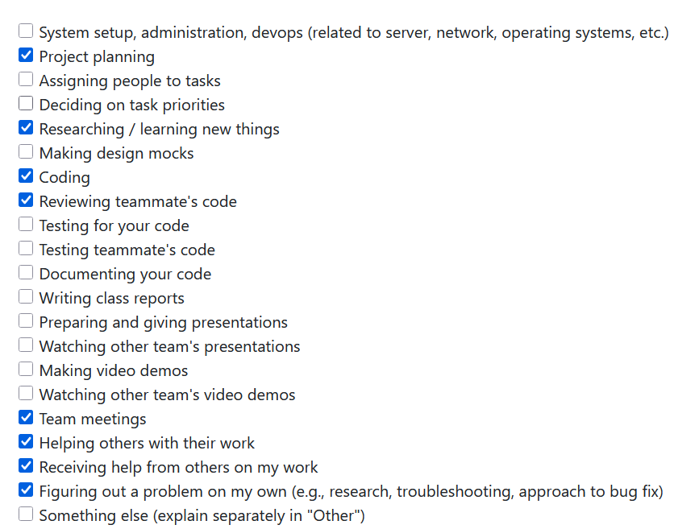

# **Lex's Weekly Logs**

## Week 3

**Types of Tasks Worked On**

**Recap of Goals**

Our goal for this week was to come up with potential functional and non-functional requirements given a basic description of the project. We first discussed what kind of project we could make given the project description, we created a shared google doc and started writing ideas for how we could turn our ideas into functional and non-functional requirements.

We created a discord server in order to communicate effectively while not in class together. We used this and the google doc to collaborate on a finalized first draft for our proposed project requirements. We brought these requirements to the next class, and compared them to what other groups had proposed and listened to feedback.

We used the feedback of other groups to make our project requirements less vague, more realistic, and simpler to understand. We were also inspired by some of the ideas of other groups, such as those who implemented ethical considerations in their requirements.

We explored the github and started on creating a project board to keep track of issues.

## Week 4

**Types of Tasks Worked On**

**Recap of Goals**

This week we created a system architecture diagram and compared it with other groups during lecture period on monday. Personally, I got the chance to look at the diagrams of team 8 and team 6. 

Team 8's architecture diagram was very difficult to parse as they had many different parts with very vague descriptions and without labeling what the inputs and outputs actually contain. One example is the unexplained "Ethical filter" applied to the data after all the processing has already occured and serves no obvious purpose. Another is the AI integration which the group members were not able to explain the purpose of. This diagram helped us understand how we should focus on clarity of function and clearly defined inputs/outputs for our diagram for ease of understanding both within the group and from others.

Team 6's feedback on our diagram was insightful, they raised concerns about scanning the entire computer by default, especially when trying to reach our non-functional speed requirements. Their other concern was our use of a locally hosted database when it did not necessarily have a well defined reason to exist judging by our diagram. We will consider the necessity of a database going forward as well as the clarity of its purpose on our diagram.

Our other goal was to create our project proposal based on our requirements as well as the input from other groups. Ultimately, we mostly based it on our original requirements for the project as it was what we desired to do as a group from the start, clarifying some of the less polished aspects where needed.

## Week 5

**Types of Tasks Worked On**

**Recap of Goals**

Our goal for this week was to create a dataflow diagram (levels 0 and 1), to print and compare to the diagrams of other groups to see how we might be able to improve ours.

As with last week, we struggled a bit with the purpose of our database within the system. The reason why we still included it in our dfd was because it was still part of our requirements that we created so we wanted to stick to it.

Team 2 commented on the database implementation in our DFD, pointing out that we save data to the database and then read from the database in order to organize that data, essencially processing it twice.

Team 10 showed what a DFD could look like for a similar system without the implementation of a database to contend with, and I personally prefer this approach. I hope my team will consider something similar for the project proper.

Not too much going on in the github this week as we did the diagrams on a shared document in an external site so we didnt feel the need to split it into tasks on github.

## Week 6

**Types of Tasks Worked On**

**Recap of Goals**
- Issue [#31](https://github.com/COSC-499-W2025/capstone-project-team-20/issues/31)
My first goal was to take on an issue and plan how to complete it by splitting it into sub-issues of different individual features that make up the completed issue.

In this pursuit I created 4 issues:
- Issue [#55](https://github.com/COSC-499-W2025/capstone-project-team-20/issues/55)
- Issue [#56](https://github.com/COSC-499-W2025/capstone-project-team-20/issues/56)
- Issue [#58](https://github.com/COSC-499-W2025/capstone-project-team-20/issues/58)
- Issue [#59](https://github.com/COSC-499-W2025/capstone-project-team-20/issues/59)
55, 56, 58 are for creating the 3 classes required to create an easily navigable representation of the given file structure, which in this case will be a tree of linked objects (as a folder can have multiple sub-folders)

to accessed the zip file im using "zipfile" from the standard python library

this week i coded and submitted the pr for one of the 4 sub issues:
- Issue [#56](https://github.com/COSC-499-W2025/capstone-project-team-20/issues/56)
The object is essentially a branch node to be used in a tree in place of the directory/folder files in a zipped folder, zip files by default have at least 1 folder sharing a name with the zip file itself.

When the constructor of the object is called it is done so using a "ZipInfo" object (from the python zipfile library) which contains metadata information on an individual file from the zip file.

I didn't really think it made sense to write tests for this when it has no methods currently and will only be called and accessed through other classes during runtime, but I will reassess the necessity of such tests upon completion of the parent issue.

## Week 7

**Types of Tasks Worked On**

**Recap of Goals**
Currently Working on Completing this Issue:
- Issue [#31](https://github.com/COSC-499-W2025/capstone-project-team-20/issues/31)

At the start of the week, these sub-issues remained:
- Issue [#55](https://github.com/COSC-499-W2025/capstone-project-team-20/issues/55)

I became very sick after the Midterm for this course so work has been slow
I started working on issue #58 at the beginning of the week, but didn't finish it until late on Sunday.
When I put up the PR, i noticed someone had already put up a PR for the same issue 3 hours prior despite my existing assignment to it.
I closed the PR without merging as the existing PR had a superior implementation.

I then, in the last few hours, manage to cobble together an implementation of issue #59 (ZipParser) based on some ideas I had already wrote down for its implementation.
I completed the PR, as well as the peer eval on time. Unfortunately though I am late to writing this log (rewriting what I already had written), and whatever additions i may have to make to the team log.

My goals for next week are to finish the tests I began writing for ZipParser, create some additional ZipParser methods (which will replace issue #55 as that issue is no longer necessary due to my implementation), create some tests for ProjectFile if necessary, and begin planning for the next major issue i will tackle.

Issues closed:
- Issue [#58](https://github.com/COSC-499-W2025/capstone-project-team-20/issues/58)
- Issue [#59](https://github.com/COSC-499-W2025/capstone-project-team-20/issues/59)