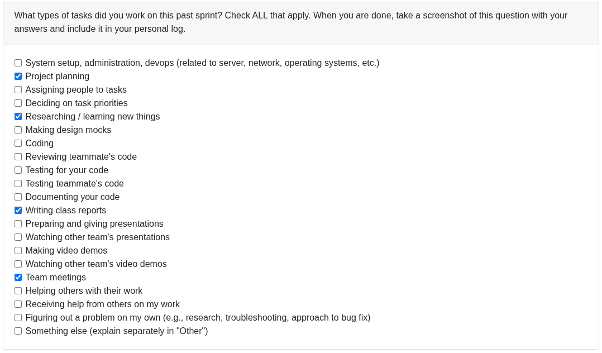
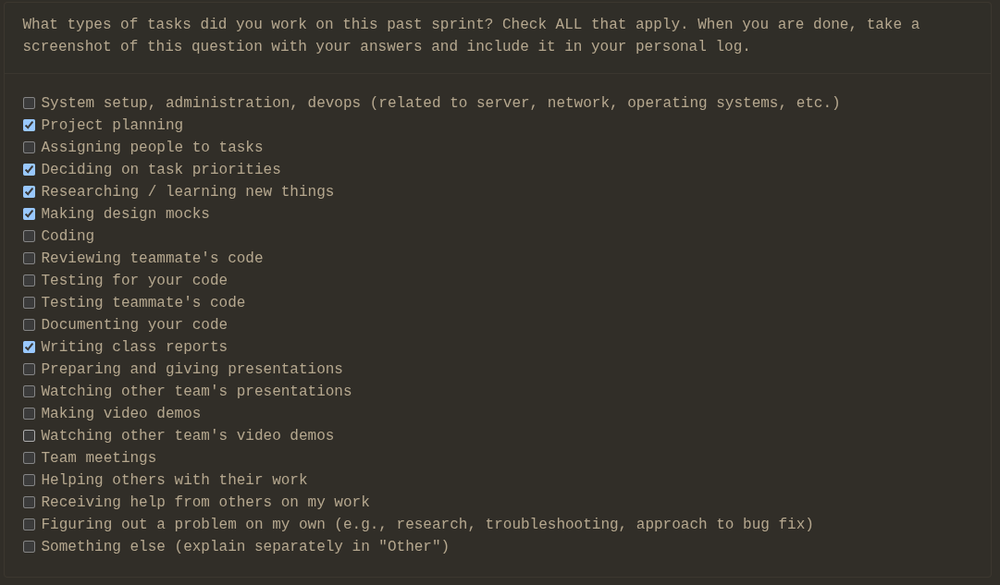
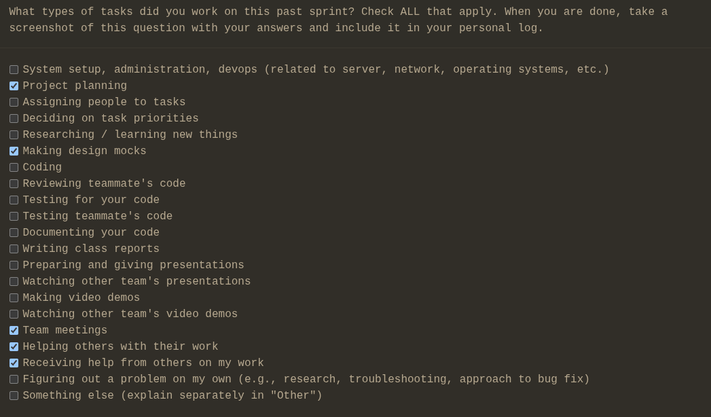
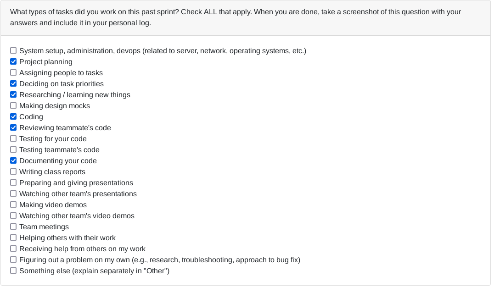
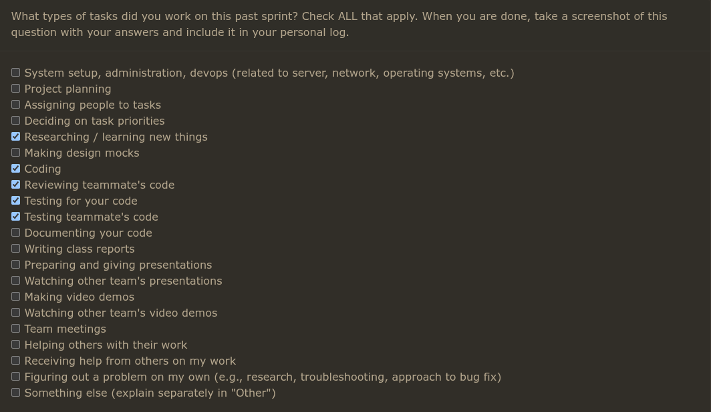
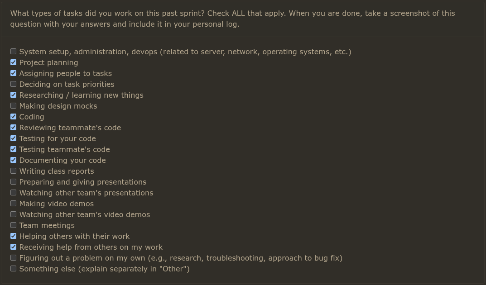

## Week 3: Sep 14-21

### Tasks worked on:

## Weekly Goals Recap:

This week, our team focused on defining requirements for the project and created a rough draft of initial thoughts to which we refined after discussions with the other teams in class to include things that were in our blindspot initially.

## Week 4: Sep 21-28

### Tasks worked on:

## Weekly Goals Recap:

This week, our team made a diagram of our system architecture & shared them with various other teams to get feedback on our design and lean from what other teams are doing to refine our ideas. Additionally, we've been developing our project proposal. As of now we've outlined a proposed solution in addition to several use cases along with the correspondent UML use case diagram which I constructed. We will be working on outlining our workload distribution.

## Week 5: Sep 28-Oct 05

### Tasks worked on:

## Weekly Goals Recap:
This week, our team constructed level 0 & 1 DFD Diagrams to display and compare our data flows with other teams and then improve upon our own based on what we saw other teams ideas (specifically teams 2,6,10); specifics about these teams has been completed in the DFD lvl 1 assignment. With this information we will work on finalizing our requirements and design elements and make a WBS to hopefully get going with development soon.

## Week 6: Oct 05-Oct 12

### Tasks worked on:

## Weekly Goals Recap:
This week, our team worked on adding issues to our project board in accordance with milestone 1 along with respective assignments aswell as polishing up our level 1 DFD and adding it to the repository proper. Additionally, we initialized the base of the repository; I specifically worked on getting our docker container up and running ([Associated PR](https://github.com/COSC-499-W2025/capstone-project-team-20/pull/63))

## Week 7: Oct 12-Oct 19

### Tasks worked on:

### Weekly Goals Recap:
This week, our team finalized the WBS for Milestone 1, converted it into prioritized GitHub issues on the project board, and did minor repo housekeeping; I implemented the ProjectFile node and its tests ([PR #85](https://github.com/COSC-499-W2025/capstone-project-team-20/pull/85)) to support the upcoming ZipParser, extracting core metadata (name, size, type, last modified) from ZipInfo and maintaining a parent reference for tree integration; next week we plan to wire ProjectFile into an initial ZIP parsing flow, further break down parser tasks and test targets

## Week 8: Oct 19-Oct 26

### Tasks worked on:

## Weekly Goals Recap:

This week, My main focus was on distinguishing individual projects from collaborative projects as outlined in [Issue #47](https://github.com/COSC-499-W2025/capstone-project-team-20/issue/47) which were resolved in [Pull #101](https://github.com/COSC-499-W2025/capstone-project-team-20/pull/101). This will become a generalist feature once we integrate document handling but for the moment I handled git based authorships gathered from any projects "/.git" directory to inventory the authors for the purpose of deliniating individual commits from the rest of the team who collaborated. I plan on integrating our new database scheme into this so that we can store these results for persistent storage.

### New Issues:
I also created some new issues this week in response to teammate feedback and future development goals
- [Issue #113](https://github.com/COSC-499-W2025/capstone-project-team-20/issues/113)
- [Issue #123](https://github.com/COSC-499-W2025/capstone-project-team-20/issues/123)
- [Issue #124](https://github.com/COSC-499-W2025/capstone-project-team-20/issues/124)

### Code Reviews:

- **PR #93 - Refactor ConfigManager to inherit from StorageManager (Dylan)**: Reviewed architectural refactoring that improves code reusability and maintains separation of concerns within the system.
- **PR #110 - Tests for ZipParser (Lex)** : Reviewed comprehensive test coverage for the ZipParser component, ensuring proper validation and error handling mechanisms.

### Problems Encountered:

Due to it being the midterm season I've had to divert my attention at times to other classes to study, but otherwise no real issues.

### Looking Ahead:

As I said, I am planning on addressing some minor refactorization in the new ``GitRepoAnalyzer`` class I created this week along with working on our plaintext handling. I would also like if we could get some kind of frontend attached to the application soon so that we can display these statistical findings so I'd like to get going with that hopefully soon.
