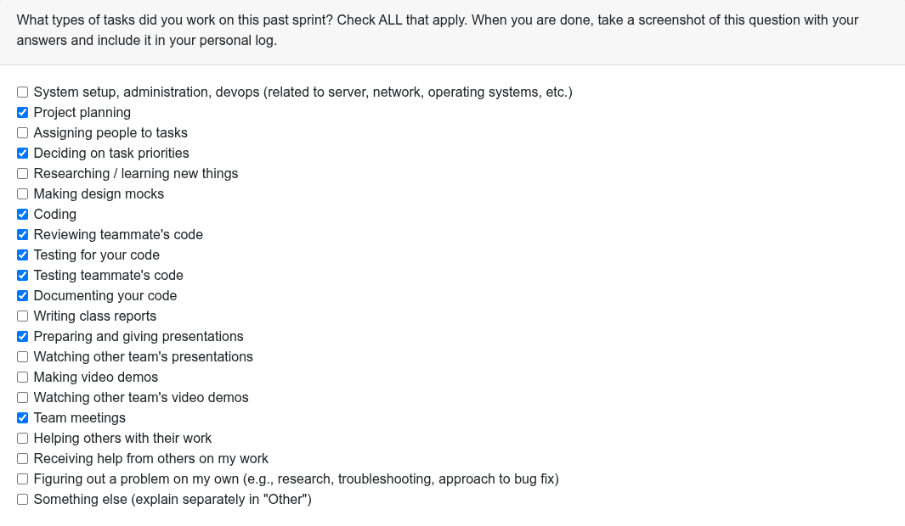
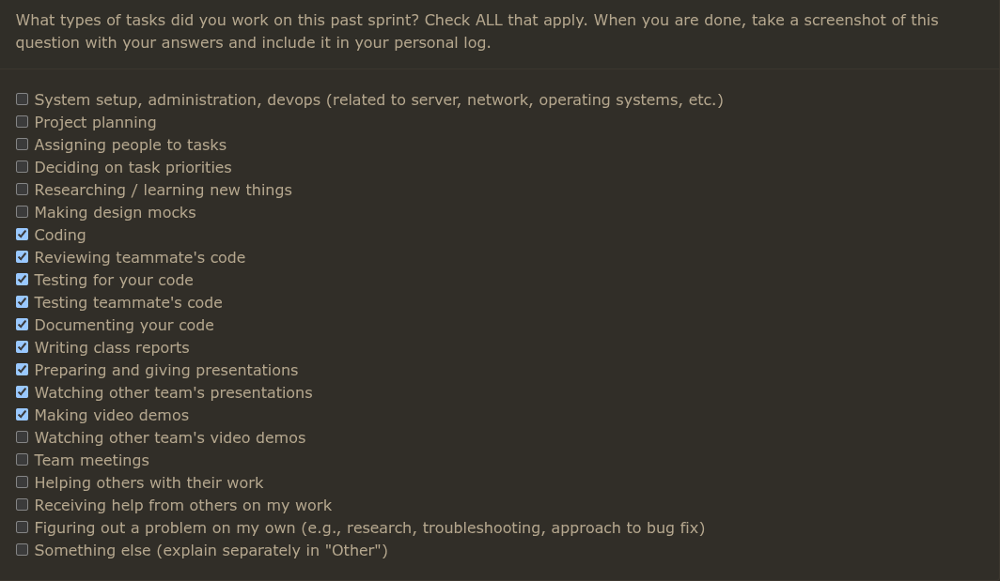
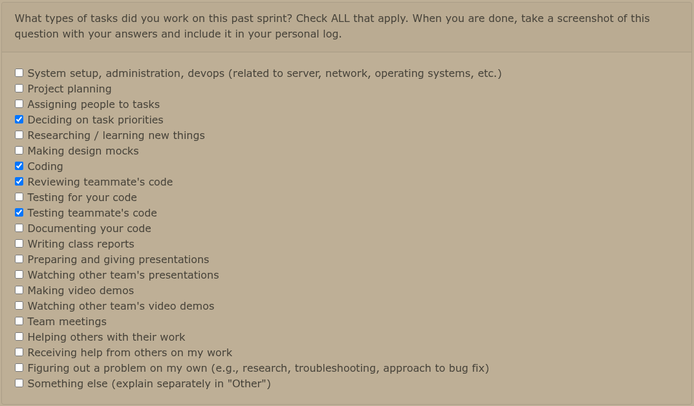
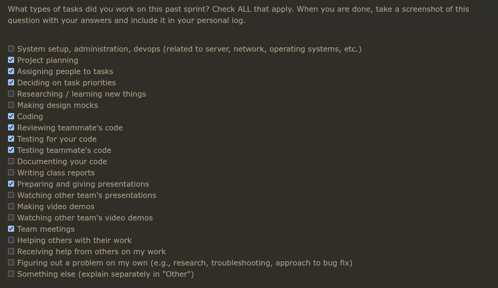
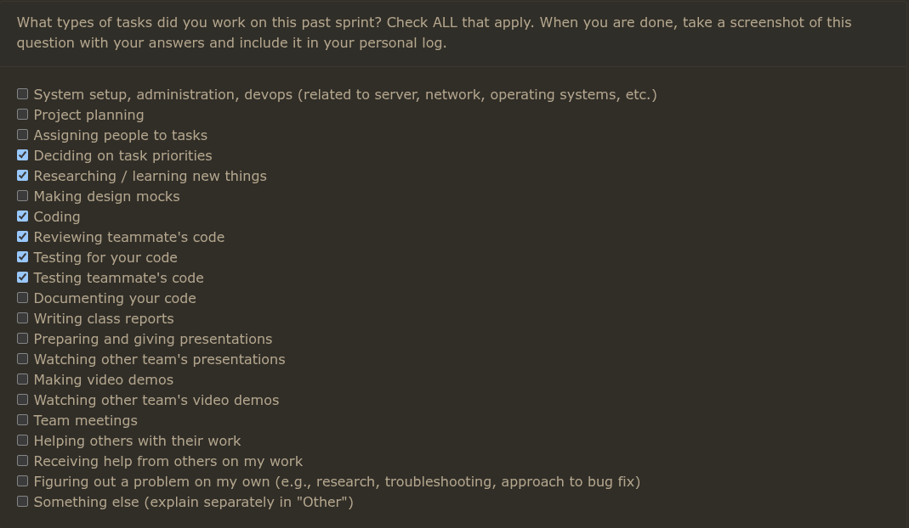

## Week 3: Sep 14-21

### Tasks worked on:

## Weekly Goals Recap:

This week, our team focused on defining requirements for the project and created a rough draft of initial thoughts to which we refined after discussions with the other teams in class to include things that were in our blindspot initially.

## Week 4: Sep 21-28

### Tasks worked on:

## Weekly Goals Recap:

This week, our team made a diagram of our system architecture & shared them with various other teams to get feedback on our design and lean from what other teams are doing to refine our ideas. Additionally, we've been developing our project proposal. As of now we've outlined a proposed solution in addition to several use cases along with the correspondent UML use case diagram which I constructed. We will be working on outlining our workload distribution.

## Week 5: Sep 28-Oct 05

### Tasks worked on:

## Weekly Goals Recap:
This week, our team constructed level 0 & 1 DFD Diagrams to display and compare our data flows with other teams and then improve upon our own based on what we saw other teams ideas (specifically teams 2,6,10); specifics about these teams has been completed in the DFD lvl 1 assignment. With this information we will work on finalizing our requirements and design elements and make a WBS to hopefully get going with development soon.

## Week 6: Oct 05-Oct 12

### Tasks worked on:

## Weekly Goals Recap:
This week, our team worked on adding issues to our project board in accordance with milestone 1 along with respective assignments aswell as polishing up our level 1 DFD and adding it to the repository proper. Additionally, we initialized the base of the repository; I specifically worked on getting our docker container up and running ([Associated PR](https://github.com/COSC-499-W2025/capstone-project-team-20/pull/63))

## Week 7: Oct 12-Oct 19

### Tasks worked on:

### Weekly Goals Recap:
This week, our team finalized the WBS for Milestone 1, converted it into prioritized GitHub issues on the project board, and did minor repo housekeeping; I implemented the ProjectFile node and its tests ([PR #85](https://github.com/COSC-499-W2025/capstone-project-team-20/pull/85)) to support the upcoming ZipParser, extracting core metadata (name, size, type, last modified) from ZipInfo and maintaining a parent reference for tree integration; next week we plan to wire ProjectFile into an initial ZIP parsing flow, further break down parser tasks and test targets

## Week 8: Oct 19-Oct 26

### Tasks worked on:

## Weekly Goals Recap:

This week, My main focus was on distinguishing individual projects from collaborative projects as outlined in [Issue #47](https://github.com/COSC-499-W2025/capstone-project-team-20/issue/47) which were resolved in [Pull #101](https://github.com/COSC-499-W2025/capstone-project-team-20/pull/101). This will become a generalist feature once we integrate document handling but for the moment I handled git based authorships gathered from any projects "/.git" directory to inventory the authors for the purpose of deliniating individual commits from the rest of the team who collaborated. I plan on integrating our new database scheme into this so that we can store these results for persistent storage.

### New Issues:
I also created some new issues this week in response to teammate feedback and future development goals
- [Issue #113](https://github.com/COSC-499-W2025/capstone-project-team-20/issues/113)
- [Issue #123](https://github.com/COSC-499-W2025/capstone-project-team-20/issues/123)
- [Issue #124](https://github.com/COSC-499-W2025/capstone-project-team-20/issues/124)

### Code Reviews:

- **PR #93 - Refactor ConfigManager to inherit from StorageManager (Dylan)**: Reviewed architectural refactoring that improves code reusability and maintains separation of concerns within the system.
- **PR #110 - Tests for ZipParser (Lex)** : Reviewed comprehensive test coverage for the ZipParser component, ensuring proper validation and error handling mechanisms.
- **PR #122 - ZipParser Directory BugFix (Lex)** : In PR #110 I mentioned a potential edge case with directory naming within the zip which has been resolved with this PR

### Problems Encountered:

Due to it being the midterm season I've had to divert my attention at times to other classes to study, but otherwise no real issues.

### Looking Ahead:

As I said, I am planning on addressing some minor refactorization in the new ``GitRepoAnalyzer`` class I created this week along with working on our plaintext handling. I would also like if we could get some kind of frontend attached to the application soon so that we can display these statistical findings so I'd like to get going with that hopefully soon.

## Week 9: Oct 26th-Nov 2nd

### Tasks worked on:
**N/A** Evaluations were not available as they shut down early accidentally

### Weekly Goals Recap:
This week, my primary focus was on implementing a robust document handling system as outlined in **Issue #124**. The objective was to create a flexible and modular tool for extracting plaintext content from common document formats (`.txt`, `.pdf`, `.docx`). The development process involved several architectural refinements to ensure the system was decoupled, testable, and aligned with future development goals.

The final implementation centers on a new `DocumentScraper` module, which orchestrates the extraction process by traversing a directory of files. The core logic is now integrated directly into the main application workflow, where `main.py` calls `ZipParser` to extract a user-provided archive into a temporary directory, and then passes that directory to the `DocumentScraper` for processing. This provides a centralized yet modular approach, with the extracted text aggregated into a lookup table for future use with analytical tools or LLM pipelines.

### New Issues:
I also created a new issue this week to address the user experience of file input, as handling zip files exclusively can be cumbersome for testing and for the end-user.
*   **Issue #151**: Expand accepted input to unzipped files and folders

### Code Reviews:
*   **PR #144 - Concrete Implementation of Language Detector (dylanstephenalexander)**: Reviewed the successful merge of a new language detection feature, enhancing the project's analytical capabilities.
*   **PR #140 - Refactor StorageManager get_all() to return a Generator (dylanstephenalexander)**: Reviewed an open pull request aimed at optimizing memory usage by refactoring `get_all()` to use a generator, which is particularly useful for handling large datasets.

### Problems Encountered:
No significant problems were encountered this week. Development proceeded smoothly, with the main challenge being the iterative refinement of the system's architecture to find the optimal balance between integration and modularity.

### Looking Ahead:
With the foundation for document handling now in place, the immediate next step is to address **Issue #151** by expanding the application's input handling to accept direct file and folder paths. Following that, I plan to explore how to best utilize the aggregated text from the `DocumentScraper`, either by piping it into a stylistic analysis tool or an LLM for deeper insights. I also plan to expand the `document_handler` to support a wider range of file types as needed.

## Week 11: Nov 10th-Nov 16th

### Tasks worked on:
**PR #168 - Refactor and attach code analysis to storage**: Completed comprehensive architectural refactoring of the Git repository analysis workflow, extracting larger methods from `GitRepoAnalyzer` into a utility class `RepoFinder.py`. Repositioned `GitRepoAnalyzer` as a central orchestrator managing the entire find-analyze-persist lifecycle, reducing complexity in `main.py`. Implemented an "upsert" (update/insert) mechanism in `ProjectManager` to prevent duplicate project records in the database. Resolved a `NameError` in PDF document scraping logic by correcting `pypdf` library usage.

_Due to the peer eval window closing on the 9th, I was not able to get a screenshot in time_

### Weekly Goals Recap:
The primary focus this week was on improving the architectural integrity of the codebase through strategic refactoring. The refactoring effort consolidated responsibilities into appropriately scoped modules, transforming `GitRepoAnalyzer` from a monolithic implementation into a clean orchestrator pattern. This separation of concerns enhances testability and maintainability while ensuring the application's data persistence layer remains consistent and free of duplicate entries.

Architectural improvements included replacing flawed integration tests with focused unit tests utilizing `unittest.mock` for component isolation, while retaining real repository fixtures for core Git analysis validation. The implementation addresses issues #113 and #123.

### Code Reviews:
*   **PR #169 - ProgressBar x ZipParser (Lex)**: Reviewed user experience enhancement that introduces a progress bar to the ZipParser extraction process alongside print formatting improvements for a smoother user experience, closing issue #160.

### Problems Encountered:
Initial integration tests were failing due to architectural limitations in the original design. The refactoring addressed these limitations by decomposing monolithic methods and establishing clearer component boundaries, enabling more robust and isolated unit testing.

### Looking Ahead:
With the architectural foundation now solidified through improved separation of concerns and the upsert mechanism preventing data inconsistencies, the next phase will focus on expanding the application's capabilities while maintaining the established modularity and testability standards.

## Week 12: Nov 17th-Nov 24th

### Tasks worked on:

### Weekly Goals Recap:
This week, I completed two significant feature implementations that enhance the application's Git repository analysis capabilities. **PR #208** introduced user selection and configuration functionality, enabling users to identify themselves from a repository's commit history and persist their selection across sessions using the `ConfigManager`. This feature prompts users to select their username(s) from discovered Git authors and stores the selection for future analyses, streamlining the workflow for returning users.

**PR #209** built upon this foundation by implementing contribution aggregation and share calculation based on lines of code (LOC). The new `ContributionAnalyzer` module performs comprehensive Git repository analysis, tracking per-author statistics including lines added/deleted, commit counts, files touched, and categorizing contributions by type (code, tests, documentation). The system aggregates selected users' contributions and calculates their proportional share relative to the entire project, with results displayed through a formatted presentation layer. Both implementations maintain strict separation of concerns, with `ProjectAnalyzer` orchestrating the workflow, `ContributionAnalyzer` handling Git analysis, and `ConfigManager` managing persistent configuration.

### New Issues:
Created several issues to address architectural improvements and user experience enhancements:
*   **Issue #198**: Refactor username selection workflow to improve user experience
*   **Issue #199**: Implement contribution visualization and export functionality
*   **Issue #213**: Enhance contribution categorization heuristics
*   **Issue #214**: Add support for contribution analysis across multiple repositories

### Code Reviews:
*   **PR #206 - Feature/code metrics analyzer (Kaan)**: Reviewed comprehensive code metrics analysis implementation that tracks complexity, maintainability, and code quality indicators across the codebase.
*   **PR #201 - fix: make load_zip more robust (Dylan)**: Reviewed improvements to ZIP file loading that enhance input validation and error handling for malformed or edge-case archive structures.
*   **PR #196 - Filter Unwanted Files in ZipParser Tree Generation (Dylan)**: Reviewed refinements to the ZipParser that implement intelligent filtering to exclude system metadata and unwanted files from the parsed tree structure.
*   **PR #172 - Add core skill domain models and patterns (Kaan)**: Reviewed foundational domain modeling work establishing skill detection patterns and core data structures for the skill analysis subsystem.

### Problems Encountered:
Encountered merge conflicts when integrating test suites due to concurrent development on `main` branch. The conflicts arose from new `clean_path()` tests added to `main` that tested functionality outside the scope of the username selection feature branch. Other than that no real issues with development.

### Looking Ahead:
With the core contribution analysis infrastructure now established, next week's focus will shift toward finalizing the user-facing output report and implementing export functionality to address Issue #199. I also plan to tackle **Issue #151** by expanding the application's input handling to accept direct file and folder paths in addition to ZIP archives, improving the development and testing workflow. Following these user experience enhancements, I intend to explore more sophisticated contribution visualization options and consider implementing the multi-repository analysis capabilities outlined in Issue #214.

# Week 13: Nov 24 - Dec 01

### Tasks worked on:

- Implemented project ranking and resume scoring pipeline:
  - Added `ProjectRanker` to compute a `resume_score` from quality dimensions, project scale, collaboration and recency.
  - Extended the `Project` model to persist `resume_score` and updated `Project.display()` to show the formatted score.
- Refactored `ProjectAnalyzer` to support multi-repo ZIPs and per-repo enrichment:
  - Added `initialize_projects` (uses `RepoProjectBuilder`) to discover repos and create/update `Project` records.
  - Refactored `analyze_skills` to iterate projects extracted from a ZIP, run `SkillAnalyzer` per project, enrich `Project` objects with metrics, calculate `resume_score` via `ProjectRanker`, and persist results.
  - Improved orchestration (`run_all` / menu) so projects can be initialized then analyzed in a single flow.
  - Added a “Summarize Top 3 Projects” option to the Generate Resume Insights flow (menu option inside option 10).
- Contribution workflow fixes:
  - Added `calculate_share` to `ContributionAnalyzer` and updated `analyze_git_and_contributions` orchestration so selected user contribution stats are calculated, formatted, and persisted to `Project.individual_contributions`.
  - Ensured `ProjectAnalyzer` calls the analyzer and persists `individual_contributions` to the DB.
- Storage & persistence:
  - Updated `ProjectManager` schema and `set()` logic to include `resume_score` and to reliably upsert `Project` rows; fixed id handling after insert/update.
- SkillAnalyzer improvements:
  - Fixed several dimension calculations (test ratio usage, modularity handling for zero/max function length, language depth calculations) for more robust metrics consumed by the ranker.
- Tests and QA:
  - Added / updated unit and integration tests to cover the above changes (ProjectRanker tests, ContributionAnalyzer `calculate_share` test, updates to `Project` and `ProjectManager` tests, updated `ProjectAnalyzer` tests).
  - Resolved multiple test failures introduced by the refactor; test suite runs locally after fixes.
- Non-code work:
  - Prepared and refined slides for the Milestone 1 presentation.

---

## Weekly Goals Recap

This week I focused on maturing the analysis pipeline so a `.zip` containing multiple git repositories can be discovered, analyzed, scored, and presented as ranked resume insights. The main objective was to provide a concrete, recruiter-friendly metric (`resume_score`) and ensure that user contribution data (`individual_contributions`) is persisted so resume summaries accurately reflect individual impact.

I also prepared and refined my Milestone 1 presentation slides.

## PRs I reviewed this week
- https://github.com/COSC-499-W2025/capstone-project-team-20/pull/255
- https://github.com/COSC-499-W2025/capstone-project-team-20/pull/246
- https://github.com/COSC-499-W2025/capstone-project-team-20/pull/242
- https://github.com/COSC-499-W2025/capstone-project-team-20/pull/236
- https://github.com/COSC-499-W2025/capstone-project-team-20/pull/235

## PRs I opened this week
- https://github.com/COSC-499-W2025/capstone-project-team-20/pull/253

## New issue(s) I filed
- https://github.com/COSC-499-W2025/capstone-project-team-20/issues/258

## Problems Encountered
- Initial test regressions after the refactor because several tests assumed the old orchestration; I iteratively adapted tests and tightened mocks for filesystem/zip interactions to keep the suite deterministic.
- Small surprises around `Path`/zip existence checks in tests required additional mocking in a few places.
- Need to be mindful of DB schema differences: `resume_score` was added and existing databases will require either migration or a fresh DB for a smooth upgrade.

## Looking Ahead
- Finalize documentation and update README with the recommended workflow:
  1. Initialize / Re-scan Projects
  2. Analyze Skills
  3. Generate Resume Insights (optionally "Top 3")
- Implement a small DB migration helper or document migration steps so existing users do not encounter schema conflicts.
- Add an optional auto-enrich flag for Generate Resume Insights so users can choose to auto-run analysis when generating insights (UX decision: auto-run vs explicit).
- Explore visualization/export (Issue #199) to allow exporting summarized resume bullets and metrics for top projects.
- Continue finalizing Milestone 1 slides and prepare presenter notes.

# Week 14: Dec 01 - Dec 08

### Tasks worked on:
- **PR #273 - Correctly identify sub-projects within zip + RIG automation**: Implemented a "just-in-time" analysis workflow that automatically calculates and sorts projects by `resume_score` in the background when generating insights. This ensures the most relevant projects are always presented first without manual user intervention. Also fixed a bug in the `ResumeInsightsGenerator` that caused the "total files" count to be incorrect.
- **Milestone 1 Presentation**: Prepared and recorded my portion of the Milestone 1 video demonstration, focusing on the functionality and impact of the `resume_score` feature.

### Weekly Goals Recap:
This week, the primary focus was on enhancing the user experience and finalizing key deliverables for Milestone 1. The main achievement was the implementation of an automated, just-in-time scoring mechanism in **PR #273**, which streamlines the process of generating resume insights by ensuring projects are always scored and sorted by relevance. This removes a manual step for the user and presents a polished, prioritized list of projects.

In parallel, I completed my contribution to the Milestone 1 presentation, preparing and recording a video segment that demonstrates the newly implemented `resume_score` and the automated Resume Insights Generator (RIG) workflow.

### PRs I reviewed this week:
- **PR #278 - Updated System Architecture Diagram (kaanspgl)**: Reviewed and approved updates to the system architecture diagram, ensuring it accurately reflects the current state of the project.
- **PR #274 - docs: update README.md with DFD and Team Contract (dylanstephenalexander)**: Reviewed documentation updates, including the addition of the Data Flow Diagram and Team Contract to the repository's README.
- **PR #236 - Feature/framework detection (kaanspgl)**: Reviewed the implementation of a new feature to detect and profile the technologies (frameworks, dependencies, build tools) used in a project.

### PRs I opened this week:
- **PR #273 - feat: Correctly identify sub-projects within zip + RIG automation**: https://github.com/COSC-499-W2025/capstone-project-team-20/pull/273

### Problems Encountered:
No significant technical blockers were encountered this week. The main challenge was coordinating the final pieces of the Milestone 1 presentation and ensuring all feature work was polished and merged in time.

### Looking Ahead:
With Milestone 1 complete, the focus now shifts to refining the existing feature set and planning for the next phase of development. Immediate goals include addressing any feedback from the milestone presentation and continuing to improve the robustness and accuracy of the analysis tools. I also plan to revisit the goal of expanding input handling (Issue #151) to make the application more flexible for different use cases.

# Term 2 Week 2: Jan 13 - Jan 19

### Tasks worked on:
- **PR #305 – Portfolio generation and retrieval option**: Implemented a professionally structured portfolio generator that produces a narrative entry per project (role, timeline, technologies, overview, achievements). Added a new CLI option to retrieve an aggregated portfolio list (sorted by most recent). Persisted entries on the `Project` model and included tests for generation and aggregation.
- **PR #319 – Correct author role detection and insights flow**: Fixed “Solo Developer” misidentification by basing role on total repo authors (`author_count`). Ensured Option 10 (Generate Resume Insights) runs contribution analysis beforehand when author data is missing. Integrated `ContributionAnalyzer.get_all_authors()` to set `author_count` reliably.

### Weekly Goals Recap:
The focus this week was on fulfilling the missing portfolio requirement and improving the reliability of role attribution within portfolio entries. In **PR #305**, I added a portfolio generator aligned with professional guidance and a dedicated “Retrieve Full Portfolio” option that aggregates prior entries for easy review. In **PR #319**, I corrected author role detection by using total repo authors and updated the insights workflow so Option 10 triggers contribution analysis when needed, ensuring portfolio entries reflect actual collaboration status.

### PRs I reviewed this week:
- Reviewed internal changes related to portfolio formatting and analyzer flow (local reviews tied to **#305** and **#319**).

### PRs I opened this week:
- **PR #305 – feat: Portfolio generator + aggregated retrieval option**
  https://github.com/COSC-499-W2025/capstone-project-team-20/pull/305
- **PR #319 – fix: Accurate author role detection + insights flow improvements**
  https://github.com/COSC-499-W2025/capstone-project-team-20/pull/319

### Problems Encountered:
Initially, portfolio entries misattributed the role as “Solo Developer” when running Option 10 directly. The issue stemmed from relying on selected usernames rather than total authors. I resolved it by using `author_count` from `get_all_authors()` and invoking contribution analysis automatically if author data was missing prior to insights generation.

### Looking Ahead:
Next steps include an export feature to write aggregated portfolio output to a Markdown file (in a separate PR), and further refinements to portfolio entry content (e.g., optional repository links when available).

# Term 2 Week 3: Jan 20 - Jan 26

### Tasks worked on:
- **PR #319 – Fix portfolio generation and retrieval**: Addressed a critical bug where generated portfolio entries were not being saved to the database, causing the "Retrieve Full Portfolio" option to fail. Modified `ProjectManager` to correctly persist the new `portfolio_entry` field.
- **PR #319 – Refine terminal output and fix tests**: Initially implemented the `rich` library to format Markdown output in the terminal, but later reverted this change based on team feedback to keep the output raw for frontend consumption.
- **PR #319 – Resolve CI/CD pipeline failures**: Fixed failing unit tests by updating assertions to match the corrected output and managed dependencies in `requirements.txt` to resolve `ModuleNotFoundError` errors in the GitHub Actions workflow.

### Weekly Goals Recap:
This week's primary goal was to resolve the bugs preventing the portfolio generation feature from working as intended. In **PR #319**, I fixed the core issue by updating the database manager to correctly save portfolio entries, ensuring they persist between sessions. I also addressed several testing and CI/CD failures that arose from the changes, including updating test assertions and managing project dependencies. The feature is now stable and functions according to the requirements.

### PRs I reviewed this week:
- **PR #333 – Feature/resume generator**: Reviewed the implementation of the new resume generator feature.
- **PR #332 – Test files for Requirement 34**: Reviewed the addition of new test files.
- **PR #331 – Mini Frontend!!!!!!!!**: Reviewed the initial implementation of the Streamlit-based frontend.

### PRs I opened this week:
- **PR #319 – fix: Portfolio generation and data persistence**
  https://github.com/COSC-499-W2025/capstone-project-team-20/pull/319

### Problems Encountered:
The main challenge was a data persistence bug where portfolio entries appeared to save in memory but were lost when re-read from the database. This was solved by updating the `ProjectManager` schema and column definitions. A secondary issue arose when our CI pipeline failed due to a missing dependency, which was resolved by updating the `requirements.txt` file.

### Looking Ahead:
With the portfolio feature now stable, the immediate plan is to prepare for the upcoming peer testing on Wednesday. After that, the focus will shift to expanding our LaTeX functionality to enable users to generate and export their resumes or portfolios as PDF documents.

# Term 2 Week 4: Jan 27 - Feb 2

### Tasks worked on:
- **Peer Testing**: I ran peer testing sessions this week to see how users interacted with our app. I gathered feedback on what was working and what wasn't.
- **Feedback Analysis & Issue Creation**: I analyzed the notes from the testing sessions and created new GitHub issues to track the problems we found. This included:
    - **Issue #343**: Making the CLI menu easier to navigate.
    - **Issue #344**: Expand Badge System with More Achievements
    - **Issue #345**: Improving error handling for missing user data.

### Weekly Goals Recap:
My goal this week was to get real-world feedback on our project and turn that feedback into a clear action plan. The testing sessions showed us exactly where users were getting stuck. Based on that, I created issues #343, #344, and #345, which will guide our work for the next sprint. We now have a solid plan based on direct user input.

### PRs I reviewed this week:
- **PR #341**: I reviewed the resume editing feature which allowed the score to be changed by the user

### PRs I opened this week:
- None. My focus was on peer testing and planning our next steps.

### Problems Encountered:
We found a few key problems during testing. Users had a hard time finding features in the menu, which shows we need to make it more intuitive. We also found a bug where the app crashes if it tries to load a user that isn't in the current dataset. These discoveries give us clear problems to solve.

### Looking Ahead:
Now that the issues are created, the plan is to start working on them. My immediate focus will be on fixing the navigation and error-handling bugs, as they have the biggest impact on the user experience.

# Term 2 Week 5: Feb 3 - Feb 9

### Tasks worked on:
- **Portfolio Generation Feature**: The majority of my effort this week was dedicated to developing a new portfolio generation feature. This turned out to be more complex than anticipated, leading to some significant challenges that I am still working to resolve.
- **Bug Fix for User Handling (Issue #345)**: While grappling with the portfolio feature, I shifted focus to a smaller, critical bug that was identified during peer testing. I successfully implemented a fix for the error handling of non-existent users in the data source, ensuring the application no longer crashes when switching between data sets.
- **Pull Request Creation**: I created a pull request for the bugfix (#345) so that this improvement could be merged while I continue to work on the larger feature.

### Weekly Goals Recap:
My primary goal for the week was to make substantial progress on the new portfolio generation branch. Unfortunately, due to its complexity going a bit haywire, I was not able to complete it as planned. However, to maintain momentum and continue contributing, I pivoted to resolving Issue #345. I successfully fixed the bug and submitted a pull request, so while my main goal was delayed, I was still able to deliver a valuable fix for the team.

### PRs I reviewed this week:
- **PR #341**: I re-reviewed the resume editing feature to ensure it was ready for merging after some updates.

### PRs I opened this week:
- **PR #363**: Opened a pull request to fix the error handling for non-existent users in the data source (Issue #345).

### Problems Encountered:
The main problem this week was with the portfolio generation feature, which became unexpectedly complex and difficult to implement. This took up a significant amount of my time and has temporarily blocked my progress on that front. Instead of getting stuck, I decided to switch to a more manageable task to ensure I could still make a tangible contribution.

### Looking Ahead:
My immediate priority is to continue tackling the portfolio generation feature, breaking down the problem into smaller parts to find a clear path forward. I will also monitor the feedback on my bugfix PR (#346) and address any comments to get it merged quickly.

# Term 2 Week 6: Feb 10 - Feb 16
<!---->

### Tasks worked on:
- **Portfolio Generation Feature (continued)**: Continued the portfolio generation work from last week and finalized the LaTeX portfolio export path. This includes structured `PortfolioDetails` data, a new `portfolio.tex` template, and end-to-end export support.
- **Menu Workflow Update**: Added a new menu option to export portfolios directly from reports, aligning the user flow with the existing resume export process.
- **Testing & Stabilization**: Updated automated tests around exporter behavior and data persistence, and manually verified the full report → resume → portfolio path.

### Weekly Goals Recap:
My goal this week was to complete the portfolio generation implementation that was blocked last week. That goal was achieved: the new template and export path now work end‑to‑end, and the workflow has been integrated into the main menu. I also ensured tests were updated and validated manually.

### PRs I reviewed this week:
- **PR #373**: Reviewed the portfolio generation feature PR.

### PRs I opened this week:
- **PR #373**: Opened a pull request for the portfolio generation feature, including the new LaTeX template and menu integration.

### Problems Encountered:
This was a continuation from last week, where the earlier branch had become difficult to maintain. Rebuilding the work cleanly took some time, but it removed blockers and allowed the feature to be completed without additional regressions.

### Looking Ahead:
As next week is reading week I'm aiming to address some of our finalizing pieces for this milestone that we discussed in our latest team meeting.
