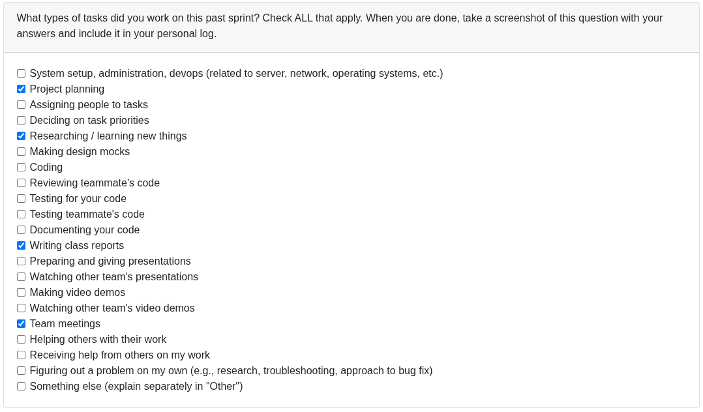

## Sep 14-21

### Tasked worked on:

## Weekly Goals Recap:

This week, our team focused on defining requirements for the project and created a rough draft of initial thoughts to which we refined after discussions with the other teams in class to include things that were in our blindspot initially.
