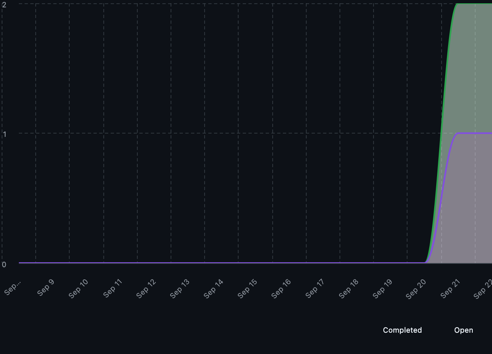
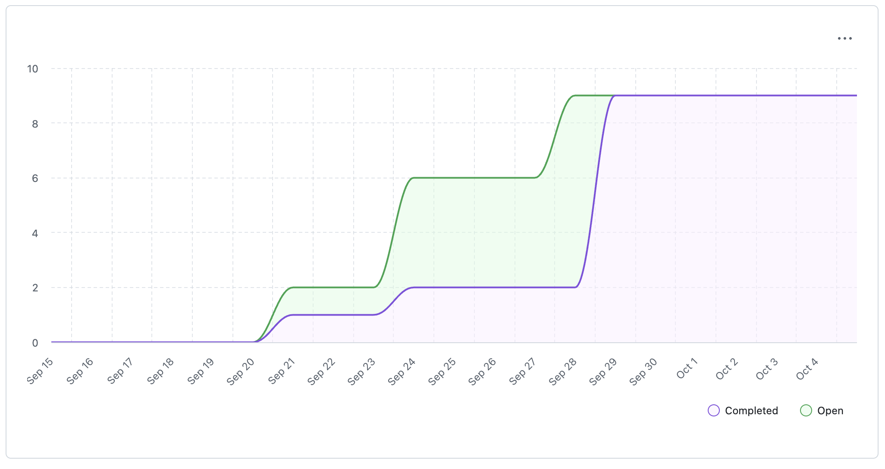
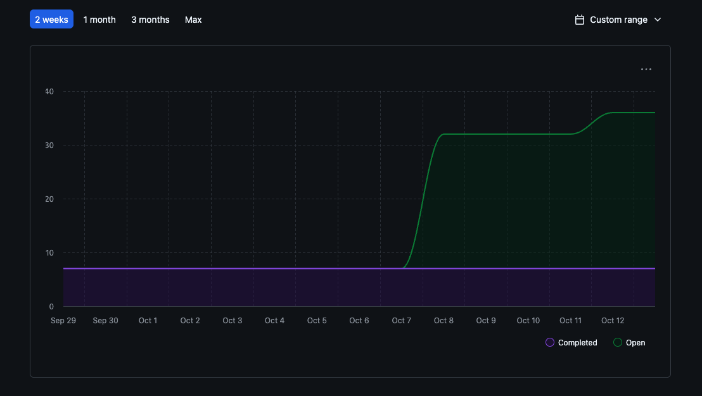

## Team 20 Weekly Log

### Table of contents
- [Term 2 Week 5(February 2nd - February 8th)](#term-2-week-5-february-2nd---february-8th)
- [Term 2 Week 4(January 25th - February 1st)](#term-2-week-4-january-26th---february-1st)
- [Term 2 Week 3(January 19th - January 25th)](#term-2-week-3-january-19th---january-25th)
- [Term 2 Week 2 (January 12th - January 18th)](#term-2-week-2-january-12th---january-18th)
- [Week 14 (December 1st - December 7th)](#week-14-december-1st---december-7th)
- [Week 13 (November 24th - November 30th)](#week-13-november-24th---november-30th)
- [Week 12 (November 17th - November 23rd)](#week-12-november-17th---november-23rd)
- [Week 11 (November 10th - November 16th)](#week-11-november-10th---november-16th)
- [Week 9 (October 27th - November 2nd)](#week-9-october-27th---november-2nd)
- [Week 8 (October 20th - October 26th)](#week-8-october-20th---october-26th)
- [Week 7 (October 13th - October 19th)](#week-7-october-13th---october-19th)
- [Week 6 (October 6th - October 12th)](#week-6-october-6th-october-12th)
- [Week 5 (September 29 - October 5th)](#week-5-september-29-october-5th)
- [Week 4 (September 22-28)](#week-4-september-22-28)
- [Week 3 (September 15-21)](#week-3-september-15-21)

### Week 3 (September 15-21)

**Work Performed:**

- Created initial project requirements in a Google Doc, covering:
    - Functional requirements
    - Non-functional requirements
    - Ways to test these requirements
    - Target user groups
    - Usage scenarios
- Received feedback from 3 other groups in this class and refined our requirements for clarity, specificity, and measurability.
- Updated GitHub Project Board with these takes (Issue #1)

***No milestone goals as of now***

**Completed Tasks**

**In Progress Tasks**

**Burnup Chart**

### Week 4 (September 22-28)

**Work Performed:**

- Created a system architecture diagram, which covered 4 layers:
    - Presentation Layer
    - Application Layer
    - Communication Layer
    - Database Layer
- Received feedback from 4 other groups (Team 5, 6, 8, and 11)
- Created our project proposal, which includes:
    - Project Scope and Usage Scenario (Issue [COSC-499-W2025/capstone-project-team-20#10](https://github.com/COSC-499-W2025/capstone-project-team-20/issues/10))
    - Proposed solution (Issue [COSC-499-W2025/capstone-project-team-20#11](https://github.com/COSC-499-W2025/capstone-project-team-20/issues/11))
    - Use Cases (Issue [COSC-499-W2025/capstone-project-team-20#12](https://github.com/COSC-499-W2025/capstone-project-team-20/issues/12))
    - UML Case Diagram (Issue [COSC-499-W2025/capstone-project-team-20#13](https://github.com/COSC-499-W2025/capstone-project-team-20/issues/13))

**There are no milestone goals as of now**

**Completed Tasks:**

**In Progress Tasks:**

**Burnup Chart:**

### Week 5 (September 29-October 5th)

**Work Performed:**

- Created a Data Flow Diagram Level 0, which included:
    - User and Database entities
    - A Local Crawler Process
    - Simple data flow between the 2 entities and the process
- Created a Data Flow Diagram Level 1, which included:
    - Further processes for the DFD Level 0
    - Data stores for the Database entity
    - A deeper look into the data flow between all entities and processes
- Recieved feedback from 3 groups (Teams 2, 5, and 10)
- Gave feedback to 3 groups (Teams 2, 5, and 10)

**There are no milestone goals as of now**

**Completed Tasks:**

- No tasks have been added, no extra completed tasks

**In Progress Tasks:**

- No tasks have been added, no extra in progress tasks

**Burnup Chart:**

- **No Burnup Chart required this week**

### Week 6 (October 6th-October 12th)

**Work Performed:**

Added all Milestone 1 issues to project board, features included in the project plan for this milestone are:
- issue [COSC-499-W2025/capstone-project-team-20#34](https://github.com/COSC-499-W2025/capstone-project-team-20/issues/34)
- issue [COSC-499-W2025/capstone-project-team-20#35](https://github.com/COSC-499-W2025/capstone-project-team-20/issues/35)
- issue [COSC-499-W2025/capstone-project-team-20#36](https://github.com/COSC-499-W2025/capstone-project-team-20/issues/36)
- issue [COSC-499-W2025/capstone-project-team-20#37](https://github.com/COSC-499-W2025/capstone-project-team-20/issues/37)
- issue [COSC-499-W2025/capstone-project-team-20#38](https://github.com/COSC-499-W2025/capstone-project-team-20/issues/38)
- issue [COSC-499-W2025/capstone-project-team-20#39](https://github.com/COSC-499-W2025/capstone-project-team-20/issues/39)
- issue [COSC-499-W2025/capstone-project-team-20#40](https://github.com/COSC-499-W2025/capstone-project-team-20/issues/40)
- issue [COSC-499-W2025/capstone-project-team-20#41](https://github.com/COSC-499-W2025/capstone-project-team-20/issues/41)
- issue [COSC-499-W2025/capstone-project-team-20#42](https://github.com/COSC-499-W2025/capstone-project-team-20/issues/42)
- issue [COSC-499-W2025/capstone-project-team-20#43](https://github.com/COSC-499-W2025/capstone-project-team-20/issues/43)
- issue [COSC-499-W2025/capstone-project-team-20#44](https://github.com/COSC-499-W2025/capstone-project-team-20/issues/44)
- issue [COSC-499-W2025/capstone-project-team-20#45](https://github.com/COSC-499-W2025/capstone-project-team-20/issues/45)
- issue [COSC-499-W2025/capstone-project-team-20#46](https://github.com/COSC-499-W2025/capstone-project-team-20/issues/46)
- issue [COSC-499-W2025/capstone-project-team-20#47](https://github.com/COSC-499-W2025/capstone-project-team-20/issues/47)
- issue [COSC-499-W2025/capstone-project-team-20#48](https://github.com/COSC-499-W2025/capstone-project-team-20/issues/48)
- issue [COSC-499-W2025/capstone-project-team-20#49](https://github.com/COSC-499-W2025/capstone-project-team-20/issues/49)
- issue [COSC-499-W2025/capstone-project-team-20#50](https://github.com/COSC-499-W2025/capstone-project-team-20/issues/50)
- issue [COSC-499-W2025/capstone-project-team-20#51](https://github.com/COSC-499-W2025/capstone-project-team-20/issues/51)
- issue [COSC-499-W2025/capstone-project-team-20#52](https://github.com/COSC-499-W2025/capstone-project-team-20/issues/52)
- issue [COSC-499-W2025/capstone-project-team-20#53](https://github.com/COSC-499-W2025/capstone-project-team-20/issues/53)

This includes all basic features and requirements for milestone 1. We have started prioritizing which tasks need to be finished first to build on before the Milestone 1 deadline. With prioritizing, we have assigned issues to each team member that we will be working on.

**Completed Tasks:**
- No tasks fully completed this week. We just entered all tasks as issues and assigned them to team members.

**In Progress Tasks:**
- Issue [COSC-499-W2025/capstone-project-team-20#30](https://github.com/COSC-499-W2025/capstone-project-team-20/issues/30)
- Issue [COSC-499-W2025/capstone-project-team-20#54](https://github.com/COSC-499-W2025/capstone-project-team-20/issues/54)
    - This is an extra task for reading and refreshing ourselves on docker and how to use it. All team members are assigned to this task.
- Issue [COSC-499-W2025/capstone-project-team-20#31](https://github.com/COSC-499-W2025/capstone-project-team-20/issues/31)
- Issue [COSC-499-W2025/capstone-project-team-20#42](https://github.com/COSC-499-W2025/capstone-project-team-20/issues/42)
- Issue [COSC-499-W2025/capstone-project-team-20#48](https://github.com/COSC-499-W2025/capstone-project-team-20/issues/48)

**Burnup Chart:**

### Week 7 (October 13th - October 19th)

**Work Performed:**

- Branden Kennedy (42474551): Worked on The ConsentManager, closing Issues #30, #75, and #76. I also helped convert the WBS to a diagram, and added it into our repo's media folder and README, helping close issues [COSC-499-W2025/capstone-project-team-20#32](https://github.com/COSC-499-W2025/capstone-project-team-20/issues/32) and Issue #48.
- Dylan Alexander (16394025): Worked on ConfigManager, closing issue #43 (Milestone 1 requirement 6) and it's subissues #71, #72 and #73. I also wrote us up a work breakdown structure, which Branden turned into a very lovely diagram.
- Necmi Kaan Sapoglu (17014796): Worked on issue [COSC-499-W2025/capstone-project-team-20#52](https://github.com/COSC-499-W2025/capstone-project-team-20/issues/52), which was on producing an analysis of skills in a chronological manner, closing the issue after further review with the team's constructive criticism, and wrote tests for it which were successful. Tested and evaluated other people's code for pr approvals.
- Sven Annist (42486720): Implemented the ProjectFile class (src/ProjectFile.py) and comprehensive unit tests (tests/test_project_file.py), closing issue #58. Key work included extracting file metadata from zipfile.ZipInfo (name, size, inferred file_type, last_modified), and validating against directory entries. [PR 85](https://github.com/COSC-499-W2025/capstone-project-team-20/pull/85) [Issue 58](https://github.com/COSC-499-W2025/capstone-project-team-20/issues/58)
- Lex Nash (84668540): Did some work on the ProjectFile class (src/ProjectFile.py) -> [COSC-499-W2025/capstone-project-team-20#52](https://github.com/COSC-499-W2025/capstone-project-team-20/issues/58). Implemented ZipParser (src/ZipParser.py) which takes a file path to a zip file, opens said zip file, and parses every file and folder, creating a tree representation of the file structure out of ProjectFile and ProjectFolder objects -> [COSC-499-W2025/capstone-project-team-20#52](https://github.com/COSC-499-W2025/capstone-project-team-20/issues/59)

**Features included in the project plan for this milestone are:**
- Issues #30 up to and including Issue [COSC-499-W2025/capstone-project-team-20#82](https://github.com/COSC-499-W2025/capstone-project-team-20/issues/82)

**Burnup chart:**

[Week 7 burnup chart](teamWeeklyLogsImages/week_7_burnup_chart.png)

**Table View of Completed Tasks on Project Board:**

[Week 7 completed tasks project board](teamWeeklyLogsImages/week_7_completed_tasks.png)

**Table View of In-Progress Tasks on Project Board:**

[Week 7 In-Progress Tasks on Project Board](teamWeeklyLogsImages/week_7_in_progress_tasks.png)

**Test Report:**

[Week 7 Test Report](teamWeeklyLogsImages/week_7_test_report.png)

### Week 8 (October 20th - October 26th)

**Work Performed:**
- Branden Kennedy (42474551): Worked on extracting project metadata, specifically file sizes, dates, average sizes. This closed issue [COSC-499-W2025/capstone-project-team-20#99](https://github.com/COSC-499-W2025/capstone-project-team-20/issues/99). I also worked on decomposing Issue #34 into multiple subissues (as its quite a large issue). Lastly, I tested and reviewed other team member's code, thoroughly reviewing PR's.
- Necmi Kaan Sapoglu (17014796): Worked on enhancing the project analytics and skill tracking functionality. Completed Issue #52, which introduced the SkillEvent class and helper methods for creating a chronological list of skills across projects. This feature allows project data to be structured and analyzed over time. Also completed Issue #78, implementing the Project dataclass for storing metadata such as project name, folder path, timestamps, and technical metrics. This dataclass forms the foundation for how projects are persisted and analyzed throughout the system. I also reviewed other other team member's code through PR's and provided review. I will be starting the new issues that I created for next week.
- Lex Nash (84668540): Completed the rest of the sub issues under issue [COSC-499-W2025/capstone-project-team-20#31](https://github.com/COSC-499-W2025/capstone-project-team-20/issues/31). For this week this included issue #97 (tests for ZipParser), issue #127 (tests for ProjectFolder), issue #111(ZipParser.toString() which takes a root ProjectFolder and returns a String representation of every file and directory within the zipped folder and tests), and a bug fix (issue #119). Reviewed a single PR as that was all that was there at the time. Need to decide on tasks for next week.
- Dylan Alexander (16394025): Worked on refactoring ConfigManager into a StorageManager base class, Implemented Project dataclass, Implemented ProjectManager for storage of Project objects into the database, and did some refactoring of the database manager classes, adding docstrings and typehints where they were previously missing. I've linked these PRs and the code reviews I did this week in my personal log.
- Sven Annist (42486720): Worked on distinguishing individual projects from collaborative projects, as outlined in Issue #47, which was resolved in PR #101. This involved analyzing git-based authorship data extracted from project "/.git" directories to inventory authors and delineate individual commits from collaborative contributions. Additionally, created new issues for future development in response to team feedback (Issues #113, #123, and #124). I also conducted code reviews on PR #93 (Dylan's ConfigManager refactoring to StorageManager) and PR #110 (Lex's ZipParser tests)

**Features included in the project plan for this milestone are:**
- Issues #30 up to and including Issue [COSC-499-W2025/capstone-project-team-20#111](https://github.com/COSC-499-W2025/capstone-project-team-20/issues/111)

**Continuing tasks from last week and plan for the next week:**
- Issue [COSC-499-W2025/capstone-project-team-20#34](https://github.com/COSC-499-W2025/capstone-project-team-20/issues/34) is being decomposed into multiple subissues. Issue #99 is a subissue of #34 and has been closed. This week, further decomposition of the task will happen and they will be worked on, so it is continuing through to this week.
- Issue #96 Future adaptation of the chronological list of skills feature. This will involve extending the current timeline logic to incorporate project context and improved data visualization.

**Burnup chart:**

[Week 8 burnup chart](teamWeeklyLogsImages/week-8-burnup-chart.png)

**Table View of Completed Tasks on Project Board:**

[Week 8 completed tasks project board](teamWeeklyLogsImages/week-8-completed-tasks.png)

**Table View of In-Progress Tasks on Project Board:**

[Week 8 In-Progress Tasks on Project Board](teamWeeklyLogsImages/week-8-in-progress.png)

**Test Report:**

[week 8 test report](teamWeeklyLogsImages/week-8-test-report.png)

### Week 9 (October 27th - November 2nd)

**Work Performed:**
- Branden Kennedy (42474551): Worked on a FileCategorizer, including tests and ymls for categories.yml and ignored_directories.yml, as well as adding more items to languages.yml. This issue ended up being very extensive, also refactoring the ProjectMetadataExtractor to use the FileCategorizer. Closes Issue [COSC-499-W2025/capstone-project-team-20#100](https://github.com/COSC-499-W2025/capstone-project-team-20/issues/100). I also did multiple PR reviews and discussed with other team members about immediate future plans and what we can work on next to keep things running smoothly.

- Necmi Kaan Sapoglu (17014796): Created the complete Skill Analyzer subsystem for the project, implementing the `SkillExtractor`, `FolderSkillAnalyzer`, and `analyze_any` modules. This feature enables the system to detect programming languages, frameworks, and tools used within uploaded repositories, and to assign heuristic proficiency scores based on code structure, testing density, and typing or documentation usage. I also designed and implemented the proficiency scoring model and integrated Docker/Compose test commands to make the system reproducible in all environments. Comprehensive unit tests were written to verify the accuracy of the analyzer, and I finalized the PR with full documentation and module-level explanations. Closes Issue [COSC-499-W2025/capstone-project-team-20#36](https://github.com/COSC-499-W2025/capstone-project-team-20/issues/36).

- Lex Nash (84668540): Created the ProgressBar.Bar class and associated tests, a progress bar object takes a total size in bytes of a group of files, and displays a progress bar which you can then update with the size of files you have finished analyzing to update the progress bar. The progress bars are designed to be quite precise as it uses unicode block characters to be able to divide each character width segment of the bar into 8 sub-segments. The plan going forward is to individually implement the progress bar into different parts of the project that involve looping through files. Closes issue [COSC-499-W2025/capstone-project-team-20#158](https://github.com/COSC-499-W2025/capstone-project-team-20/issues/158).

- Dylan Alexander (16394025): Overhauled and fully implemented the Language Detector. Updated the ZIP parser to handle out-of-order/missing/empty directories, and correctly parse file paths containing spaces or semicolons. Refactored the ZIP parser to eliminate code duplication. Updated the Project dataclass to account for the storage of metrics our system computes. Refactored the get() and get_all() methods in StorageManager to return a generator for improved efficiency.

- Sven Annist (42486720): Implemented a comprehensive document handling system to address Issue #124, enabling the application to extract and process plaintext content from various document formats (.txt, .pdf, .docx). This involved creating a new, reusable DocumentScraper module responsible for orchestrating the text extraction process and a document_handler utility for format-specific parsing. The system was architected to be modular and testable, with the final implementation integrated directly into the main application workflow. main.py now calls ZipParser to extract a user-provided archive, then passes the resulting directory to the DocumentScraper to aggregate text content into a lookup table for future analysis.

**Features included in the project plan for this milestone are:**
- Issues #30 up to and including Issue [COSC-499-W2025/capstone-project-team-20#151](https://github.com/COSC-499-W2025/capstone-project-team-20/issues/151)

**Continuing tasks from last week and plan for the next week:**
- Issue [COSC-499-W2025/capstone-project-team-20#142](https://github.com/COSC-499-W2025/capstone-project-team-20/issues/142) for Branden. It was just started sunday and the issue that will be worked on this week, but it was started sunday so i am classifying it as a "continuing task"
- Issue [COSC-499-W2025/capstone-project-team-20#36](https://github.com/COSC-499-W2025/capstone-project-team-20/issues/36) for Kaan. I will be continuing this issue next week to expand the Skill Analyzer’s language coverage and ensure full compatibility with the Skill Detector by defining additional standards for classification and scoring.

**Burnup chart:**

[Week 9 burnup chart](teamWeeklyLogsImages/week-9-burnup-chart.png)

**Table View of Completed Tasks on Project Board:**

[Week 9 completed tasks](teamWeeklyLogsImages/week_9_completed_tasks.png)

**Table View of In-Progress Tasks on Project Board:**

[Week 9 In-Progress tasks](teamWeeklyLogsImages/week_9_in_progress.png)

**Test Report:**

[Week 9 Test Report](teamWeeklyLogsImages/week_9_test_report.png)

### Week 11 (November 10th - November 16th)

**Work Performed:**
- Branden Kennedy (42474551): This week, I implemented the Project Analyzer and cleaned up main.py. The project analyzer synthesizes all of our analyzers into one location. It shows a simple menu where you can select which analyzer youd like to use, use all of them, analyze a new zipped folder, or exit the application. Closing Issue #142. I also implemented a full test suite for the project analyzer and did multiple PR reviews.

- Necmi Kaan Sapoglu (17014796): This week I compertmantalized the monolith of a feature I had which was the skill extractor, also making minor tweaks where necessary to make sure that the pr would be easier to review and incremental under issue [COSC-499-W2025/capstone-project-team-20#36](https://github.com/COSC-499-W2025/capstone-project-team-20/issues/36). I also started working on the badge feature and implemented the basic qualifications of a badge as well as developing the system itself to be functional, working on issue #114. I also did multiple PR reviews of my team mates codes.

- Lex Nash (84668540): This week I implemented a progress bar into ZipParser, closing issue #160 and fixed a slight issue in another teammate's code, causing a test to fail, closing issue #182. Other than that I have been mostly focusing on reviewing teammate's code this week as I need to understand refactoring changes and new analysis tools in order to properly implement loading bars for them.

- Dylan Alexander (16394025):

- Sven Annist (42486720): Executed a comprehensive architectural refactoring of the Git repository analysis workflow. Repositioned GitRepoAnalyzer as a central orchestrator instead of a utility unit, significantly reducing complexity in main.py and improving overall code organization. Implemented an "upsert" (update/insert) mechanism in ProjectManager to prevent duplicate project record creation in the database. Additionally resolved a NameError in PDF document scraping logic by correcting pypdf library usage. Conducted a code review on PR #169 (ProgressBar x ZipParser). Closes Issues COSC-499-W2025/capstone-project-team-20#113 and COSC-499-W2025/capstone-project-team-20#123.

**Features included in the project plan for this milestone are:**
- Issues #30 up to and including

**Continuing tasks from last week and plan for the next week:**

Issue [COSC-499-W2025/capstone-project-team-20#114](https://github.com/COSC-499-W2025/capstone-project-team-20/issues/36) for Kaan. I will be continuing this issue next week to expand the badge system and integrate it so that it works in tandem with the rest of the program.

Issue [COSC-499-W2025/capstone-project-team-20#146](https://github.com/COSC-499-W2025/capstone-project-team-20/issues/146) for Lex. Finishing off the sub issues needed for this, including refactoring changes to allow a wider range of uses for the progress bar.

**Burnup chart:**

[Week 11 burnup chart](teamWeeklyLogsImages/week-11-burnup-chart.png)

**Table View of Completed Tasks on Project Board:**

[Week 11 completed tasks](teamWeeklyLogsImages/week_11_completed_tasks.png)

**Table View of In-Progress Tasks on Project Board:**

[Week 11 In-Progress tasks](teamWeeklyLogsImages/week_11_in_progress.png)

**Test Report:**

[Week 11 Test Report](teamWeeklyLogsImages/week_11_test_report.png)

### Week 12 (November 17th - November 23rd)

**Work Performed:**
- Branden Kennedy (42474551): Implemented a Resume Insights Generator to use our analyzers to output resume bullet points, project summary, and a menu to navigate which repository the user would like to generate insights for. Closed Issues [COSC-499-W2025/capstone-project-team-20#202](https://github.com/COSC-499-W2025/capstone-project-team-20/issues/202), #203, #204, #215. Developed an extensive test suite for the resume insight generator. I also completed multiple PR reviews as first and second reviewer.

- Necmi Kaan Sapoglu (17014796): Delivered three major pull requests focused on stabilizing and restructuring the Skill Analyzer subsystem for Milestone 1. The first PR refactored the public skill-analysis output by removing the misleading proficiency/confidence scores and replacing them with a resume-friendly, interpretable format centered on languages, frameworks, tools, and feedback dimensions (testing discipline, documentation habits, modularity, language depth). The second PR extended the `Project` data model and SQLite schema to store derived metrics such as total LOC, comment/test ratios, average functions per file, primary languages by LOC, and all four feedback dimensions. Updated serialization and deserialization logic were implemented to persist these fields across sessions. The third PR completed the integration by wiring SkillAnalyzer results directly into the project persistence pipeline, ensuring that analysis now automatically updates a project's stored metrics via upsert and can be surfaced later through the “Display Previous Results” menu. Additionally, I reviewed and tested several teammate PRs to ensure consistency with the new modular architecture, and attended Friday’s milestone-alignment meeting to help finalize our Milestone 1 demo goals.

- Lex Nash (84668540): implemented methods to display a graph of information to the user to help them easily and quickly visualize the varied data we are extracting from their projects. The issue corresponding to this feature is issue [COSC-499-W2025/capstone-project-team-20#219](https://github.com/COSC-499-W2025/capstone-project-team-20/issues/219). Includes tests and example code to show a potential output. Reviewed multiple pull requests. In general im focusing on prettying-up the output of the program and extracting useful metrics from data. my pr this week: #221.

- Dylan Alexander (16394025): Implemented a 4-stage workflow that clones, zips, analyzes and deletes repositories, while persisted their associated Project objects for use with Machine learning. Added a repo_dataset CSV file to our configurations. Filtered out binary files and other non-human readable files from the Print Project Tree function. Modified the load_zip function to make it more robust, allowing for commas, backslashes, other niche edge cases in zip file names.

- Sven Annist (42486720): Implemented comprehensive user identification and contribution analysis features across two pull requests. **PR #208** enables users to select and persist their username(s) from Git commit history using an interactive prompt system integrated with `ConfigManager` for session persistence. **PR #209** introduced the `ContributionAnalyzer` module that performs single-pass Git repository analysis, tracking per-author statistics (lines added/deleted, commits, files touched) and categorizing contributions by type (code/tests/docs). The system aggregates selected users' contributions and calculates their proportional project share with formatted output display. Developed extensive test suites covering unit, integration, and serialization testing for both features. Created Issues #198, #199, #213, and #214 which will be closed by awaiting review PRs. Conducted four code reviews including Dylan's ZIP parser robustness improvements (PR #201, #196) and Kaan's code metrics analyzer and skill domain models (PR #206, #172).

**Features included in the project plan for this milestone are:**
- Issues #30 up to and including Issue #219

**Continuing tasks from last week and plan for the next week:**

**Burnup chart:**

[Week 12 burnup chart](teamWeeklyLogsImages/week_12_burnup_chart.png)

**Table View of Completed Tasks on Project Board:**

[Week 12 completed tasks](teamWeeklyLogsImages/week_12_completed_tasks.png)

**Table View of In-Progress Tasks on Project Board:**

[Week 12 In-Progress tasks](teamWeeklyLogsImages/week_12_in_progress.png)

**Test Report:**

[Week 12 Test Report](teamWeeklyLogsImages/week_12_test_report.png)

### Week 13 (November 24th - November 30th)

**Work Performed:**
- Branden Kennedy (42474551): Refactored ProjectMetadataExtractor and FileCategorizer to improve accuracy, consistency, and output quality for the ResumeInsightsGenerator. ensured category/metadata summaries are structured consistently. improved handling of file collection and timestamp/size aggregation. FileCategorizer received updates on classification rules and a fix for innaccurate category assignments. ResumeInsightsGenerator is now aligned with these updates. I also worked on full project storage to the database. Now, all projects metadata is stored into the database. this allows the ResumeInsightsGenerator, "Display Previous Results" option, and other classes to use cached results, improving efficiency. Expanded Project.py schema to support category counts, author_contributions, commit metadata, language lists, file categories, timestamps, and project status. Now, the ProjectAnalyzer writes all extracted metadata to the database, and ensures categories, language shares, author stats, and timestamps are saved. I also worked on code review, reviewing multiple PRs, as well as our team's google slides presentation. Participated in Fridays meeting to finalize milestone presentation and the last sprint for milestone 1.

- Necmi Kaan Sapoglu (17014796): Delivered multiple major PRs advancing the analytics pipeline for Milestone 1. Implemented the new Badge Analysis system with rules-based badge assignment and project-level badge aggregation. Refined the Skill Analyzer output for clearer, more accurate skill detection and alignment with badge metrics. Completed the Skill Chronology feature using commit-based timestamps and improved the Project Chronology so projects are ordered by actual commit history rather than file metadata. Integrated all updates into the CLI and ensured compatibility across modules. Reviewed teammate PRs for consistency with the revised architecture, and participated in Friday’s highly productive meeting to finalize the milestone presentation and sync upcoming sprint tasks.

- Lex Nash (84668540): Programmed a github workflow to automatically assign 2 reviewers for each pull request, first it shuffles the list, second it removes the user who submitted the pr from the candidates, third it orders the users from least to greatest amount of (open) pull request reviews currently assigned to, then finally it picks the first two users and assigns them to review the pull request. Has not had the opportunity to be tested as of yet, since you cant exactly test this workflow before merging it, but if all goes well we'll have a very useful feature that should help productivity. Programming this involved learning a lot of new things, but I intended to challenge myself and believe I have done well. I participated in the team meeting and have tasked myself with cleaning up the program's output for the video demo after all the current major features are implemented.

- Dylan Alexander (16394025): Implemented mechanisms for the display, storage, retrieval, and deletion of generated resume insights to satisfy 2 of the 20 requirements for Milestone 1. Developed a CI GitHub Actions workflow that automatically runs our pytest suite on every pull request. Reviewed numerous pull requests (10 at the time of writing) to help the team merge the large backlog into main in time for the presentation.

- Sven Annist (42486720): Implemented multi-repo ranking and resume scoring in **PR #253**: added `ProjectRanker` and `resume_score`, refactored `ProjectAnalyzer` to initialize per-repo projects and enrich them (including a "Summarize Top 3 Projects" option), persisted individual contribution summaries via `ContributionAnalyzer.calculate_share`, updated `ProjectManager` upsert/schema handling, added tests, and filed **Issue #258**. Reviewed PRs **#255**, **#246**, **#242**, **#236**, **#235** and continued Milestone 1 slide prep.

**Features included in the project plan for this milestone are:**

**Continuing tasks from last week and plan for the next week:**

**Burnup chart:**

[Week 13 burnup chart](teamWeeklyLogsImages/week_13_burnup_chart.png)

**Table View of Completed Tasks on Project Board:**

[Week 13 completed tasks](teamWeeklyLogsImages/week_13_completed_tasks.png)

**Table View of In-Progress Tasks on Project Board:**

[Week 13 In-Progress tasks](teamWeeklyLogsImages/week_13_in_progress_tasks.png)

**Test Report:**

[Week 13 Test Report](teamWeeklyLogsImages/week_13_test_report.png)

### Week 14 (December 1st - December 7th)

**Work Performed:**
- Branden Kennedy (42474551): This week, I coded small refactors that related to unwanted functionality coming from the ProjectMetadataExtractor. I created a new method for printing the metadata & file statistics, which now makes the extract_metadata() method purely for doing that, not printing. This came with other refactors like removing the suppress_output method in our ProjectAnalyzer (this methods sole purpose was to suppress that output from the extract_metadata() method). And then i updated and added tests corresponding to this refactor. For PR reviews, I spent lots of time helping with PR #268, and testing it thoroughly. This took up many hours in my week, but we got it fixed and merged! I also worked on helping setup the presentations for the team, and doing the video editing and splicing together of our video demonstration.

- Necmi Kaan Sapoglu (17014796): This week I presented our Milestone 1 features to the class, walked through the analytics upgrades, and evaluated the other groups’ presentations. I also finalized our team contract, outlining roles, expectations, and workflow standards. We distributed the tasks for creating the Milestone 1 demo video and aligned on who will handle narration, screen captures, and editing. Finally, I updated the system architecture diagram to better reflect our current design and clean up the layer boundaries and arrows.

- Lex Nash (84668540): Team meeting, team presentation, team contract, visual bug fixes, milestone 1 demo video.

- Dylan Alexander (16394025): This week, aside from preparing our presentation, I made two PRs. One related to restoring the implementation of the language detector, which had been affected by the consolidation of our system into the ProjectAnalyzer class. Another for consolidating duplicate temporary directory creation across ProjectAnalyzer into one cached temporary directory. Finally, I updated our DFD to reflect our current system for Milestone 1.

- Sven Annist (42486720): This week, I introduced a "just-in-time" analysis workflow to automatically calculate and cache project scores, ensuring project lists are always sorted by relevance without manual user action. This effort included automated background scoring, pre-sorted project menus for clarity, and corrected the "Top 3" summary option. I fixed a big bug that was happening in a feature branch where projects were unable to be detected individually but I've incorporated multi-project finding. I also fixed a bug in the `ResumeInsightsGenerator` where the "total files" count was incorrect. Beyond coding, I reviewed PRs **#278**, **#274**, and **#236**, worked on preparing for our Milestone 1 presentation, and recorded my portion of the video demo.

**Features included in the project plan for this milestone are:**

**Continuing tasks from last week and plan for the next week:**

**Burnup chart:**

[Week 14 burnup chart](teamWeeklyLogsImages/week_14_burnup_chart.png)

**Table View of Completed Tasks on Project Board:**

[Week 14 completed tasks](teamWeeklyLogsImages/week_14_completed_tasks.png)

**Table View of In-Progress Tasks on Project Board:**

[Week 14 In-Progress tasks](teamWeeklyLogsImages/week_14_in_progress_tasks.png)

**Test Report:**

[Week 14 Test Report](teamWeeklyLogsImages/week_14_test_report.png)

### Term 2 Week 2 (January 12th - January 18th)

**Work Performed:**
- Branden Kennedy (42474551): Set up the initial FastAPI layer by adding a new src/api module with schemas for consent, projects, skills, resume, and portfolio. Implemented the required endpoint routes in routes.py to match Milestone 2 Requirement 32, and made minor updates to requirements.txt, ProjectAnalyzer.py, ConsentManager.py for compatibility and cleanup (PR #311). Added an API test suite (tests/test_api.py) using pytest/TestClient to validate endpoint wiring, response formats, status codes, key error cases, and that routes correctly call their corresponding managers/analyzers (PR #314).

- Necmi Kaan Sapoglu (17014796): I reviewed some PRs, and also implemented a feature for displaying resume items from the recently created API structure. Implemented my changes into that feature, and created testing for the feature. I worked on closing issue number 299.

- Lex Nash (84668540): Reviewed Branden's API code, which required learning about APIs as I had not learned about the topic previously. I fixed some bugs that arose in the progress bar code due to sweeping changes made at the end of last term (pr #302). My main focus has been learning about various modules that could be used for front end development, their advantages and disadvantages, as well as making mockups/prototypes for various pages of the application to bring to the team next meeting to make sure all features are represented.

- Dylan Alexander (16394025): Continued work on Resume Generation. Although I do not have a PR to show for it. I selected a resume template. Made some progress in getting familiar with LaTeX. Currently in the process of figuring out how to dynamically generate resumes with the template, given the user's chosen portfolio. Reviewed 3 PRs. Those being (PR #311), (PR #305), (PR #302).

- Sven Annist (42486720): This week, we added a complete portfolio generation and retrieval flow to the CLI. The portfolio entries now follow a professional structure (role, timeline, technologies, overview, achievements), and the new “Retrieve Full Portfolio (Aggregated)” option displays previously generated entries in a clear, most-recent-first list. We also fixed the author role misidentification by basing collaboration status on total repo authors via `get_all_authors()` and updated the Option 10 workflow to run contribution analysis if author data is missing, ensuring portfolio entries reflect the correct team size. The changes are captured in PRs **#305** and **#319**, along with unit tests for portfolio generation and aggregation. Reviewed #314

**Features included in the project plan for this milestone are:**

**Continuing tasks from last week and plan for the next week:**

**Burnup chart:**

[Term 2 Week 2 burnup chart](teamWeeklyLogsImages/t2_w2_burnup_chart.png)

**Table View of Completed Tasks on Project Board:**

[Term 2 Week 2 completed tasks](teamWeeklyLogsImages/t2_w2_completed.png)

**Table View of In-Progress Tasks on Project Board:**

[Term 2 Week 2 In-Progress tasks](teamWeeklyLogsImages/t2_w2_in_progress.png)

**Test Report:**

[Term 2 Week 2 Test Report](teamWeeklyLogsImages/t2_w2_test_report.png)

### Term 2 Week 3 (January 19th - January 25th)

**Work Performed:**
- Branden Kennedy (42474551): I setup a mini frontend for testing purposes for PR 1 and for our own testing. I used streamlit to re use our ProjectAnalyzer (our CLI) logic where I could, with just a couple implementation changes for input() prompts (Streamlit doesnt have input()). It ended up coming out really well and it works exactly as our CLI does, so now we have an option to test on our mini front end if we'd like! [PR #331](https://github.com/COSC-499-W2025/capstone-project-team-20/pull/331). I also created test files to fulfill requirement 32 of Milestone 2. These test files are for testing multiple repositories in a ZIP, as well as testing multiple repositories, a pdf, and a word document. These two test files were created with my own projects over the years (COSC 111 assignments (Java), COSC 499 Project Analyzer (Python), COSC 310 Task management application (Java, React, SQL), and the 2025 Global Game Jam (Unity)). This is [PR #332](https://github.com/COSC-499-W2025/capstone-project-team-20/pull/332). Also reviewed [PR #333](https://github.com/COSC-499-W2025/capstone-project-team-20/pull/333) and [PR #330](https://github.com/COSC-499-W2025/capstone-project-team-20/pull/330).

- Necmi Kaan Sapoglu (17014796): Implemented the incremental file uploads feature end-to-end, including chunk handling, resumable uploads, and integration with existing validation and storage pipelines. Manually tested upload workflows to verify chunk ordering, retries, and edge cases, while ensuring existing file intake tests still passed. Reviewed teammate PRs related to the upload pipeline.

- Lex Nash (84668540): At team meeting lead discussion assigning all remaining tasks for milestone 2, as well as breaking them down into what we actually have to implement, as well as clarifying questions we want to ask to the TA/prof about certain requirements. Created a UI mockup in Blender where fonts/colours can easily be changed out to do quick prototyping without having to edit code, also serves as a plan for how we will design the front end UI, will be updated in future (contained in logs branch).

- Dylan Alexander (16394025): Developed an incremental PR for the resume generation feature. Implementing the ReportExporter class, which will handle the exporting of Report objects to PDF format for resume/portfolio generation. Reviewed Branden's mini Frontend PR, (PR #331).

- Sven Annist (42486720): This week, I focused on debugging and stabilizing the new portfolio generation feature (PR #319). I resolved a critical bug that prevented portfolio entries from being saved to the database, which now ensures that generated content persists correctly. I also fixed several related unit test and CI/CD pipeline failures, including updating test assertions and managing dependencies to align with the final implementation. Following team feedback, I reverted the terminal output to raw Markdown to better support frontend integration. Additionally, I reviewed pull requests #333 (Resume Generator), #332 (New Test Files), and #331 (Mini Frontend).

**Features included in the project plan for this milestone are:**
All issues up to and including Issue #330

**Continuing tasks from last week and plan for the next week:**
Next week, we are continuuing on tasks mentioned above (resume generation, refactoring) and getting ready for peer testing and feedback. We are also going to be implementing further Milestone 2 features, will discuss on exactly which ones at our meeting.

**Burnup chart:**

[Term 2 Week 3 burnup chart](teamWeeklyLogsImages/t2_w3_burnup_chart.png)

**Table View of Completed Tasks on Project Board:**

[Term 2 Week 3 completed tasks](teamWeeklyLogsImages/t2_w3_completed.png)

**Table View of In-Progress Tasks on Project Board:**

[Term 2 Week 3 In-Progress tasks](teamWeeklyLogsImages/t2_w3_in_progress.png)

**Test Report:**

[Term 2 Week 3 Test Report](teamWeeklyLogsImages/t2_w3_test_report.png)

### Term 2 Week 4 (January 26th - February 1st)

**Work Performed:**
- Branden Kennedy (42474551): This week, I worked on ensuring all the tests and code (both our frontend and CLI) were good and ready for Peer Testing. I edited the questionnaires as needed and made sure the process for all tasks for our peer testing was straight forward and could all be executed as desired. After Peer Testing, I completed Issue [COSC-499-W2025/capstone-project-team-20#296](https://github.com/COSC-499-W2025/capstone-project-team-20/issues/296), Which was Requirement 27 of Milestone 2. I have PR'ed it at [PR #340](https://github.com/COSC-499-W2025/capstone-project-team-20/pull/340). This task required one new file, edits to our ProjectAnalyzer (orchestrator class), and a full test suite, with updates to one other test file.
I also tested and reviewed my own code (both manually and with a test suite), and reviewed [PR #341](https://github.com/COSC-499-W2025/capstone-project-team-20/pull/341).

- Necmi Kaan Sapoglu (17014796): This week, from the feedback that we received from peer testings, I decided on trying to focus on expanding on the badges feature, as well as adding more features for user interactability, and came up with ideas to expand on this with a yearly wrapped type summary of coding activity that could be shared. I started development on this idea. I also reviewed PR #340.

- Lex Nash (84668540): This week I added the ability for the user to edit the resume score as well as the date created and last modified date for projects already in the database. More edits can be added to this new option in future, but was mainly designed to be able to encompass the "correct project chronology" and "reorder project rankings" requirements of Milestone 2. PR: [COSC-499-W2025/capstone-project-team-20#292](https://github.com/COSC-499-W2025/capstone-project-team-20/issues/292)

- Dylan Alexander (16394025): This week I followed up on last week's incremental PR for the resume generation feature. Resume generation is now fully functional. Resumes can be generated from the ProjectAnalyzer menu (from an existing Report object), and exported to PDF. I also reviewed PR #340.

- Sven Annist (42486720): This week, I focused entirely on peer testing to get feedback on our project. The sessions provided valuable insights into where our application shines and where it needs improvement. We learned that while users love the badges feature, they found the menus confusing to navigate and experienced the system breaking when switching between users not present in the loaded dataset. Based on this feedback, we created several new issues (#343, #344, #345) to address the usability and stability problems. I also reviewed PR #341.

**Features included in the project plan for this milestone are:**
All issues up to and including Issue #330

**Continuing tasks from last week and plan for the next week:**
Next week, we are continuuing on tasks mentioned in work performed. We will be diving further into Milestone 2, with plans to start the front end soon enough here to get our API's attached.

**Burnup chart:**

[Term 2 Week 3 burnup chart](teamWeeklyLogsImages/t2_w4_burnup_chart.png)

**Table View of Completed Tasks on Project Board:**

[Term 2 Week 3 completed tasks](teamWeeklyLogsImages/t2_w4_completed.png)

**Table View of In-Progress Tasks on Project Board:**

[Term 2 Week 3 In-Progress tasks](teamWeeklyLogsImages/t2_w4_in_progress.png)

**Test Report:**

[Term 2 Week 3 Test Report](teamWeeklyLogsImages/t2_w4_test_report.png)

### Term 2 Week 5 (February 2nd - February 8th)

**Work Performed:**
- Branden Kennedy (42474551): This week, I worked on implementing full interactive resume editing. The focus waas in improving and restructuring the resume generation and editing system. i implemented a full interactive reporteditor that supports edits to header, projects, education, experience, and technical skills. these changes persist. Resume export now generates from the edited report. i also seperated resume editing into a new menu option and updated/consolidated tests to match the new architecture. This closed issue #297 and it was [this PR](https://github.com/COSC-499-W2025/capstone-project-team-20/pull/357). I also have reviewed 3 PRs so far, [Kaan's PR](https://github.com/COSC-499-W2025/capstone-project-team-20/pull/353), [Dylan's PR](https://github.com/COSC-499-W2025/capstone-project-team-20/pull/355), and [Lex's PR](https://github.com/COSC-499-W2025/capstone-project-team-20/pull/341).

- Necmi Kaan Sapoglu (17014796): 

- Lex Nash (84668540):

- Dylan Alexander (16394025): This week I worked on two substantial PRs. The first focused on tidying up the resume generation process. While resume generation was fully functional, users could not yet create report objects in order to generate a resume. My first PR solved this issue. My second PR implemented thumbnail selection for a project, satisfying Milestone 2, Requirement 26. Additionally, I reviewed 3 PRs this week. Most notably, Branden's PR Linked here: [Feature/Fully Editing Resumes! (M2 R28)](https://github.com/COSC-499-W2025/capstone-project-team-20/pull/357). I had to request changes a few times, and restore the Resume Generation function/tests, so this took much longer than the review process normally does. However the feature works wonderfully now and the architecture is really clean. Very happy with the result.

- Sven Annist (42486720): 

**Features included in the project plan for this milestone are:**

**Continuing tasks from last week and plan for the next week:**

**Burnup chart:**

[Term 2 Week 5 burnup chart]()

**Table View of Completed Tasks on Project Board:**

[Term 2 Week 5 completed tasks]()

**Table View of In-Progress Tasks on Project Board:**

[Term 2 Week 5 In-Progress tasks]()

**Test Report:**

[Term 2 Week 5 Test Report]()
