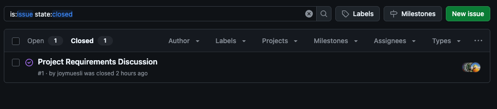
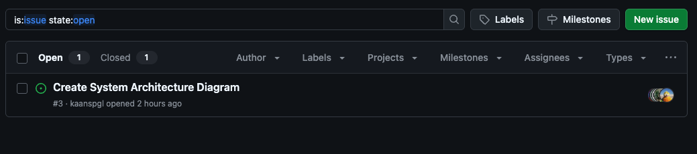

## Team 20 Weekly Log 

### Week 1 (September 14-21)

**Work Performed:**

- Created initial project requirements in a Google Doc, covering:
    - Functional requirements
    - Non-functional requirements
    - Ways to test these requirements
    - Target user groups
    - Usage scenarios
- Received feedback from 3 other groups in this class and refined our requirements for clarity, specificity, and measurability.
- Updated GitHub Project Board with these takes (Issue #1)

***No milestone goals as of now***

**Completed Tasks**

**In Progress Tasks**

