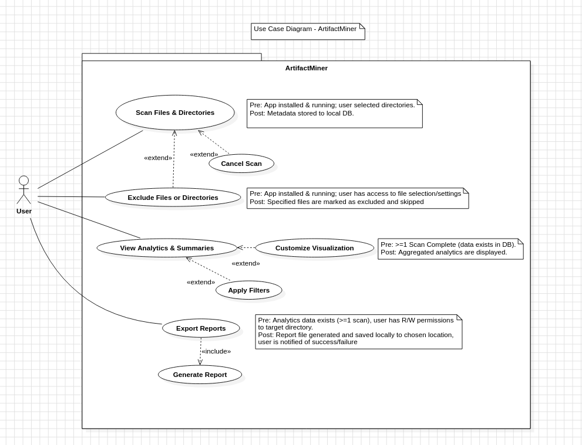

# Features Proposal for Mining Digital Work Artifacts Project Option

**Team Number:** 20

**Team Members:**

- Branden Kennedy (42474551)
- Necmi Kaan Sapoglu (17014796)
- Sven Annist (42486720)
- Joy Musiel-Henseleit (16289167)
-
-

## 1 Project Scope and Usage Scenario

## 2 Proposed Solution
Our solution is a desktop application that allows users to scan any files on their machine. This includes code, images, videos, documents, or other artifacts that the user chooses to have scanned. The system will extract useful information such as metadata and analytics. Users can select which folders, files, or file types to include in the scan, allowing them to exclude select file types. This gives the user control over their data. The system will calculate metrics such as file type distributions, timelines, contribution statistics, longest active projects, most commonly used programming languages, etc. The data that is crawled will be presented in clear tables and visual graphs. The system will also use incremental scanning to only process new or modified files. This will be done with a local database for fast queries and will be able to operate on major operating systems. The user can also export these summaries in CSV or PDF. By keeping the processing local, the system ensures data privacy. Compared to other teams, our application focuses on data privacy and detailed analytics. Other teams have shown that they may develop a web application that requires uploading data to a server. Our desktop solution keeps processing local, ensuring data privacy while still providing analytics and detailed reporting.

## 3 Use Cases

### Use Case 1: Scan Files/Folders

**Primary actor:** User

**Description:** User initiates a scan of selected folders or files to detect supported file types and extract relevant metadata.

**Precondition:** The application is installed and running. The user has selected folders or files.

**Postcondition:** Metadata about the scanned files is stored in the local database.

**Main Scenario:**

1. User selects folders or files to scan.
2. User clicks “Scan.”
3. The system identifies supported file types.
4. The system extracts metadata (file size, type, dates, contributions, etc.).
5. Metadata is stored in the local database.

**Extensions:**

- User cancels the scan midway.
- Unsupported file types are skipped.
- System only scans newly modified files if an incremental scan is chosen.

---

### Use Case 2: Exclude Files or Folders

**Primary actor:** User

**Description:** User specifies files or directories to be ignored during scanning.

**Precondition:** User has selected files or folders.

**Postcondition:** Excluded items are not processed during future scans.

**Main Scenario:**

1. User opens scan settings.
2. User selects files/folders to exclude.
3. User saves preferences.
4. System skips excluded items during the next scan.

**Extensions:**

- User removes exclusions later.
- System prompts if excluded folders overlap with previously included selections.

---

### Use Case 3: View Analytics and Summaries

**Primary actor:** User

**Description:** User views project statistics in table or graph formats.

**Precondition:** At least one scan has been completed and data exists in the database.

**Postcondition:** Data is displayed as tables and/or visual graphs.

**Main Scenario:**

1. User navigates to the analytics dashboard.
2. System queries stored metadata.
3. System generates visualizations (file type distribution, activity timeline, contributions, etc.).
4. User views results.

**Extensions:**

- User applies filters (time range, file type, project).
- User customizes visualization styles.

---

### Use Case 4: Export Reports

**Primary actor:** User

**Description:** User exports project summaries and analytics to external formats.

**Precondition:** User has generated analytics data.

**Postcondition:** A report is saved in the chosen format (CSV, PDF, or resume template).

**Main Scenario:**

1. User clicks “Export.”
2. User selects format (CSV, PDF, resume-style).
3. System generates the report.
4. System saves or shares the file locally.

**Extensions:**

- Export fails due to missing permissions → system notifies user.
- User cancels export before completion.

---

### UML Diagram:

## 4 Requirements, Testing, Requirement Verification

### Technology Stack:

### Test Framework:

| Requirement | Description | Test Cases | Who | H / M / E |  
| --- | --- | --- | --- | --- | 
| Select folders/files to scan | An interface allows users to specify files, folders, or artifacts to include in the scan. Complexity: handling multiple file formats and updating scan configurations accordingly. Potential difficulties include ensuring that user selections are saved and reflected in scans. | <ul><li>1</li><li>2</li></ul> | . | M |
| Exclude folders/files from scanning | Prior to scanning, users will be able to specify files and folders to exclude. Complexity: maintaining exclusion to nested directories. Potential difficulties include performance with complex exclusion rules, and accurately updating exclusions lists. | <ul><li>1</li><li>2</li></ul> | . | M |
| Scan and detect file types | The system scans and identifies supported file types. Complexities: handling large directories and multiple file formats. Potential difficulties include handling of unsupported files and performance with large datasets. | <ul><li>1</li><li>2</li></ul> | . | . |
| Skip excluded files/folders | The system will ensure items marked for exclusion are skipped in all scans. Complexity: ensuring consistency when skipping across nested directories and incremental scans. Potential difficulties include identifying overlapping inclusion/exclusion rules. | <ul><li>1</li><li>2</li></ul> | . | . |
| Extract metadata | The system will extract file metadata such as creation/modification date, size, language usage, contributions. Complexity: parsing various file types, extracting, and aggregating meaningful metrics. Potential difficulties include handling corrupted files. | <ul><li>1</li><li>2</li></ul> | . | . |
| Store metadata in local database | The system will save extracted metadata for querying, filtering, and reporting. Complexity: database schema design, efficient storage of data. Potential difficulties include handling large volumes of data and ensuring data integrity. | <ul><li>1</li><li>2</li></ul> | . | . |
| Incremental scanning | The system will only process new or modified files on subsequent scans. Complexity: accurately tracking file changes and comparing this with previously scanned metadata. Potential difficulties include detecting modifications such as renamed or moved files.  | <ul><li>1</li><li>2</li></ul> | . | . |
| Calculate metrics | . | <ul><li>1</li><li>2</li></ul> | . | . |
| Display summary in tables/graphs | . | <ul><li>1</li><li>2</li></ul> | . | . |
| Search/filter metadata | . | <ul><li>1</li><li>2</li></ul> | . | . |
| Export metadata summaries | . | <ul><li>1</li><li>2</li></ul> | . | . |
| Export reports in templates for resumes/portfolios | . | <ul><li>1</li><li>2</li></ul> | . | . |
